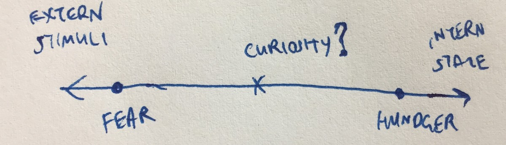
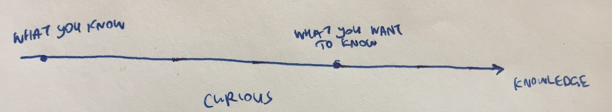
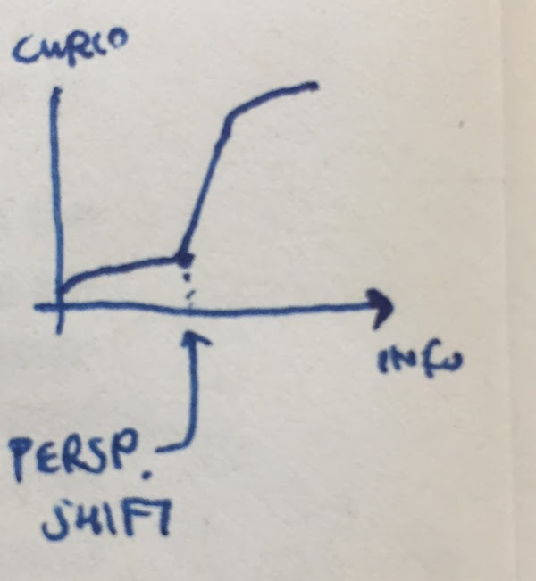

The Psychology of Curiosity
===========================
posted: June 2017
rating: yes

I read [an academic paper on curiosity][paper] by [George Loewenstein][author].
It was surprisingly readable and very insightful.

Why did I read it? Just like [some][papert] think about thinking, others
are curious about curiosity. More specifically, I recently read a [Vox
article][vox] that suggested "The more scientifically curious people are, the
more they are immune to the power of partisan thinking". What follows is mostly
a summary of the article, as well as some sketches I made to help me understand
it better.

Dark side of curiosity (it can be a vice):

- Stories of Pandora's Box, Eve's Garden, Lot's Wife's Pillar.
- St. Augustine: "Ocular Lust"
- Hume: love of knowledge vs. passion for gossip?
- Exploratory non-sanctioned behaviors are often curiosity driven: drugs & sex.

Berlyne's types of curiosity:

- Perceptual curiosity: drive for novel stimuli
- Diversive curiosity: a more general stimulation seeking behavior linked to boredom
- Specific curiosity: desire for a particular piece of information
- Epistemic curiosity: a general human desire for knowledge

Unclear if perceptual & diversive curiosity should be called curiosity, or
something else?

Trait vs. state curiosity:

- Is the distinction meaningful? (eg. Do you usually find the rooms you are in
  to be too bright? vs. Is the room you are in too bright?)
- No strong demographic correlates for trait curiosity.
- State curiosity is way more interesting to study since "an improved
  understanding of state curiosity, in contrast, has the potential to suggest
  practical methods of stimulating curiosity in the broader population."

Curiosity and sex:

- Freud suggests that curiosity is a proxy for sexual curiosity, which is
  suppressed by society.
- In some rare cases, this is manifest as a general curiosity about the world.
- But this theory is non-falsifiable (fuck yeah Popper / eat shit Freud).
- Like sex, curiosity is an intense desire for information, but once attained,
  is often disappointing (see: [postcoitus triste][pct]).

[paper]: http://int-des.com/wp-content/uploads/2013/12/PsychofCuriosity.pdf
[author]: https://en.wikipedia.org/wiki/George_Loewenstein
[vox]: https://www.vox.com/science-and-health/2017/2/1/14392290/partisan-bias-dan-kahan-curiosity
[pct]: https://en.wikipedia.org/wiki/Post-coital_tristesse
[papert]: https://www.media.mit.edu/events/papert/

# Existing explanations for curiosity

1. Curiosity as a drive:

    - Analogy to hunger and thirst: "appetite/thirst for knowledge", curiosity
      can be satisfied.
    - It's per object (eg. satisfied curiosity about invertebrates), unlike food
      where it's a general feeling of satiation.
    - Also unlike food, there's no "tissue need or deficit external to the
      nervous system".
    - "Meta drive", since it's not the drive for the information directly, but
      the drive for the desire to seek information (eg. an ape that opens the
      window to see if there's something interesting there)
    - Also curiosity is easily disrupted by "tissue needs" like hunger and
      thirst.

2. Incongruity theory:

    - Curiosity caused by violated expectations (Piaget, Hebb, Hunt)
    - Sweet spot / optimal level of incongruity. Too much incongruity => fear /
      can't relate / can't incorporate new information.
    - Motivation: to resolve uncertainty. "Human nature abhors a lack of
      predictability and the absense of meaning"
    - Also related to "Need for Cognition" which is more of a personality trait.

3. Competence motive: Curiosity may result from wanting to master one's
   environment. This doesn't super compelling to Loewenstein (and me by
   association).

# Situational causes for state curiosity

Paradox: curiosity seeking behavior doesn't make sense if people are curiosity averse. 

Sweet spot of expectation violation:

- Too little expectation violation => bored.
- Too much expectation violation  => overwhelmed. 
- So the in this model, the goal is to maximize the curiosity level.

Conceptual controversy increases curiosity (experiment where students were put into groups intended to either foster conflict or consensus: 45% of controversy kids gave up recess to watch a film, vs. 18% in consensus group).

# Loewenstein's model: information gap

Information gap: 

- The gap between what you know (objective situation) and what you want to know
  (the reference point).
- Just like material wealth where it's hard to compare cars to swimming pools so
  we use $, knowledge is multidimensional but can be reduced to 1D via bits
  (info theory)
- Also like material wealth, we rarely want to compare to unattainable (eg. the
  rich and famous), but instead to your neighbor.

Quantifying the info gap:

- Sensitivity to both relative and absolute magnitude of the info gap.
- Gap between knowing 4 of 5 Pacific Ocean-bordering US states > gap between
  knowing 49 and 50 of US states.
- Gap between knowing 40 of 50 US states > gap between 4 of 5 Pacific Ocean
  bordering states.
- But some things affect curiosity that doesn't account in the info theoretic
  view of the info gap (eg. facts that bring the plot to life in a murder
  mystery.)
- Precise measurement of the gap is often unnecessary, just a sense of whether
  gap is increasing or decreasing. For research, can rely on self-reports.

# Implications of the gap approach

Subjects prefer more general rules to resolve uncertainty (study: 1. rule
generated list of 5 States vs. 2.  another rule that generated list of 10
states, subjects prefer to learn rule 2.)

More curiosity for insight vs. for incremental problems (study: 1. image-grid
where each cell was part of one animal vs. 2. each cell is its own animal,
subjects open more cells condition 1.)

Two ways of seeing a knowledge gap:

- Little knowledge => focus on what you know.
- More knowledge => focus on what you don't know (ie. the information gap).
- At some point in between, there's a discrete shift on focusing on ignorance
  that makes you more curious.

Paradox: if you don't know much, no real drive to learn more. Also, many people
don't know that they don't know a lot (Related to Dunning–Kruger effect.)

As a novice gains more knowledge the "unknown unknowns" become known unknowns,
which spurs curiosity. As you learn more, the gap closes and you become less
curious. Until there's a leap, your reference point changes realize your
ignorance again.

A good way to cause awareness of the informational gap is via guessing and
feedback. It's difficult to deny the knowledge gap if you guess an answer
incorrectly. 

Combination of guess and feedback increased curiosity (study: one group had to
first guess Easternmost, Northernmost, Southernmost states (w/ immediate
feedback) while the other didn't, and the one that did guess & feedback was more
curious)

# Curiosity inducing stimuli

Situations that increase curiosity:

1. Direct question (eg. a puzzle or riddle)
2. A sequence of events with an unknown resolution, desire to complete a script
   (eg. they went on a walk at night, suddenly they heard a noise). Q: "What
   will happen?" / "Was I right?"
3. Violation of expectations. Q: "Weird, why did that happen?"
4. Possession of information by someone else (eg. someone chuckling as he reads
   a news article). Q: "What does he know?" 
5. Formerly known but forgotten things (eg. that word that was on the top of the
   tongue...). Q: "What was that thing again!"

# Conclusions / misc

Loewenstein calls for more research on state (not trait) curiosity, and more
research on epistemic curiosity.

I should read William James' on scientific curiosity, since it's most relevant
for that Vox article, and also mentioned by Loewenstein as the type of curiosity
that mostly corresponds to specific epistemic curiosity.

I printed the paper, but the last page didn't come out. So I experienced the
recently learned [Zeigarnik effect][zeigarnik]: people remember uncompleted or
interrupted tasks better than completed tasks. I was very curious to see how the
paper ended, so had to finish reading the last page online.

[zeigarnik]: https://en.wikipedia.org/wiki/Zeigarnik_effect

