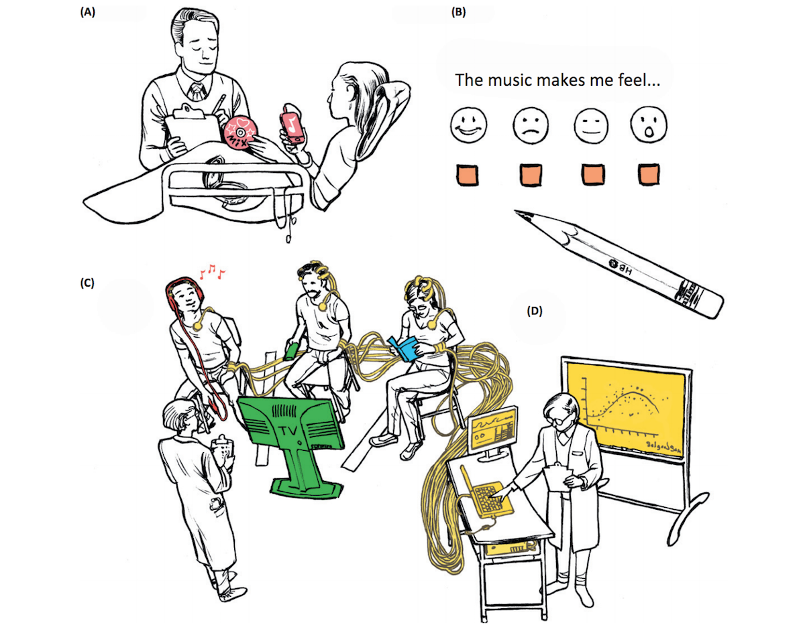

The neurochemistry of music
===
posted: October 23, 2017
rating: yes

I picked up [“The Mozart Effect”](https://www.amazon.ca/Mozart-Effect-Tapping-Strengthen-Creative/dp/0060937203) on a whim, at Powell’s in Portland,
hoping that it would provide some insights (via well conducted scientific
studies) of how music affects the mind and the body. Unfortunately what I found
was a bunch of woo woo with very little substantiation in the scientific realm.
In some of the first words of the book, the author claims that he made a blood
clot in his brain disappear by humming, praying, and envisioning a vibrating
hand on the right side of his skull. The book has already been [widely
discredited][mozart-bs](http://skepdic.com/mozart.html), but I remain fascinated by the effects of music.
I read somewhere that music is possibly the strongest non-chemical intervention
for people, with the possible exception of exercise.

I stumbled on Daniel Levitin, author of a book called ["This is Your Brain on
Music"][brain-music](https://www.amazon.ca/This-Your-Brain-Music-Obsession/dp/0452288525), through a podcast. Burned by The Mozart Effect, I thought
that a less popular, more academic survey might be a quicker way to ramp up, and
found [this paper on his blog](https://daniellevitin.com/levitinlab/articles/2013-TICS_1180.pdf), published in Trends in Cognitive Science.
The paper is a bit challenging for me, being mostly ignorant about
neurophysiology and neurochemistry, but is well written, and includes helpful
glossaries and appendices.

Right off the bat, the authors provide an interesting summary of limitations in
previous music-neuroscience studies:

- Inconsistent experimental methods because of variability in:
  - Type of intervention (passive listening vs performance)
  - Type of music (usually only binary: stimulating vs relaxing)
  - Locus of control (experimenter selected vs participant selected)
  - Social context (individual vs group vs guided intervention)
- No standard means of selecting musical stimuli.
- No nonmusical control group.

The paper also briefly covers some claims related to the Mozart Effect and
admonishes it for lack of control group. Maybe music has a positive effect
because it brings pleasure, and so anything that brings pleasure will have the
same "Mozart Effect"? Rather than doing nothing, group B should be doing
something equally pleasant.

Along similar lines, paper suggests recommends for future research, and includes
a cool diagram:

1. Locus of control may mediate the effectiveness of music interventions and
   therefore its crucial that patients are allowed to choose their own music
2. Subjective ratings of musical features (sad, happy etc) should be recorded by
   the participant instead of relying on experimenter. 
3. include a parallel non music experimental condition to control for mood
   induction, attention capture, intention and valence. In this case music is
   compared with a tv program and a book. 
4. psycho measurements (eg. imaging, biometrics) provide an essential objective
   counterpart to subjective measures in B. 

Nice survey of studies and their findings about whether the musical intervention
increased hormone secretion. This is where a better understanding of
neurochemical systems would help.

- Epinephrine - also known as adrenaline, plays an important role in the
  fight-or-flight response.
- Norepinephrine - also called noradrenaline, general function is to mobilize
  the brain and body for action.
- Interleukin 6 - secreted by T cells and macrophages to stimulate immune
  response.
- Immuniglobulin A - an antibody that plays a crucial role in the immune
  function of mucous membranes.

Is there a more complete list of domains mapping to chemical systems?

An [interesting study](mockel.pdf) compared the effects of silence, a waltz by
J. Strauss, a modern classic by H. W. Henze, and meditative music by R.
Shankar. Meditative music (Shankar) lowered plasma cortisol, noradrenaline and
t-PA concentrations.

How does music regulate all of these things? One possibility the authors suggest
is that music modulates brainstem mediated measures like heart rate, blood
pressure, body temperature, etc. Stimulating music tends to increase
cardiovascular measures, relaxing vise versa. 

One more fascinating tidbit to be explored further: the authors casually drop
this gem: “this follows given that brainstem neurons tend to fire synchronously
with tempo”. This entrainment is described more in [this paper](griffiths.pdf).

Now that I think of it, the brainstem is probably the most interesting part of
the brain in terms of neurological control. According to Wikipedia,

> The brainstem also plays an important role in the regulation of cardiac and
> respiratory function. It also regulates the central nervous system, and is
> pivotal in maintaining consciousness and regulating the sleep cycle. The
> brainstem has many basic functions including heart rate, breathing, sleeping,
> and eating.

Interesting...
