Story of Us by Tim Urban
=========
posted: September 23, 2020
rating: yes
cover: /assets/book-covers/story-of-us.png

Tim Urban describes the evo-devo view of humanity in an entertaining light in this long, illustrated series. It’s cumbersome to read as separate articles, and would be more natural in book or pamphlet form (surely this is coming).

This is a pretty great, digestible format, tying together many ideas into a single coherent almost masterwork. The mental models along the way are really cool, and well illustrated. Unfortunately it hasn’t really gelled together yet. Maybe in the sequel?

# Chapter 1: Fire vs Light

- Genetic forces conspire to make life miserable. “The problem is that genes themselves aren’t alive, they’re just a force of nature—and forces of nature don’t give a shit about anything. Gravity wants to smoosh matter together, so that’s what it does.” (Dawkins, Selfish Gene)
- Your genes are in control of your Primitive Mind (System 1), while your Higher Mind (System 2) has more agency. By default the Primitive Mind is in control, but people are especially good at not letting this happen. (Kahnemann & Tversky, Thinking Fast and Slow)
- **Model: Thought Spectrum**. Rather than viewing as a dual, you can see Primitive vs Higher mind as a spectrum. 

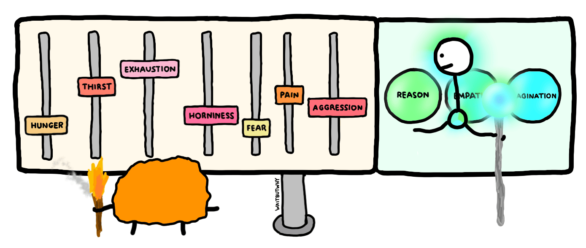

# Chapter 2: Games of Giants

- **Model: Emergence Tower**. Life came about on one of the rungs of the Emergence Tower, a nice concept mentioned in any intro to biology class. Many atoms form a molecule, many of which form proteins, many of which form organelles, etc. The most interesting points along this tower are cells, individuals, and groups.

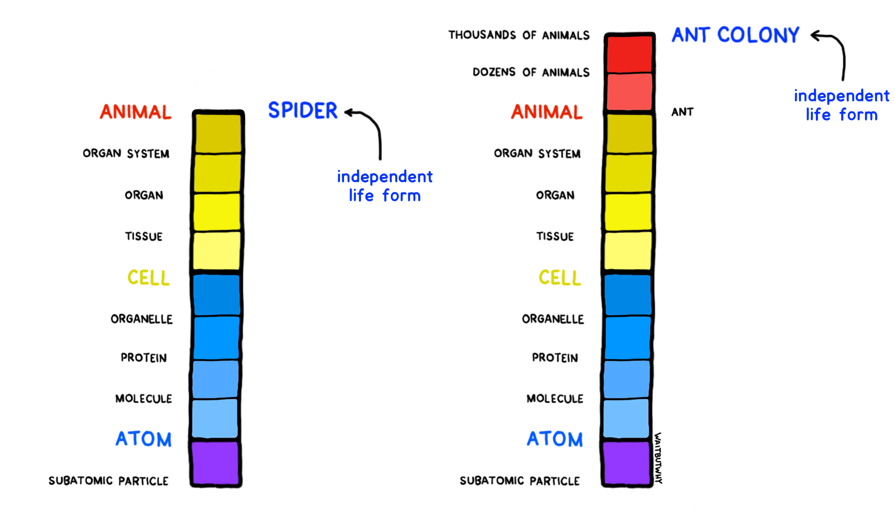

- Some species like bears are most interesting as individuals. Ants are most interesting when considered at a colony (1000s of individuals) level. Humans are interesting on many levels, from individual to billions of individuals.
- Generally speaking, evolution has made people in tribes act “micro-kind and macro-ruthless.” For example, “people who are normally compassionate drop that compassion when thinking and talking about members of a political party they hate”

# Chapter 3: Stories

- Tribes of people have the ability to create stories, and pass these stories from one person to another. These stories carry ideas about values and morals.
- People are also capable of social learning, imagination, and the negative side affect: delusion. 
- The result of these things is that different tribes end up with “endless arrays of behavioural varieties—a million little evolutionary experiments”.
- **Model: Each tribe is then controlled by its story**, and the tribe with the most evolutionarily adaptive story will ultimately win out over the rest. Ultimately, tribe vs. tribe in zero sum “Power Games”.

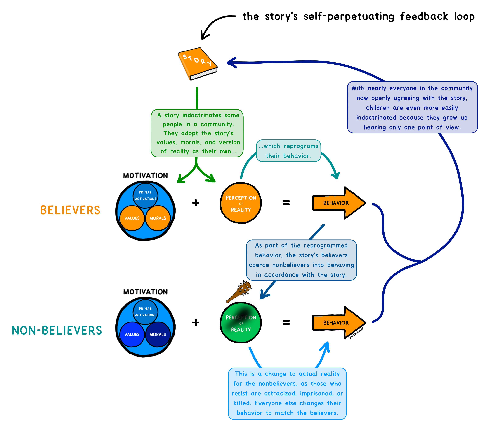

# Chapter 4: Enlightenment

- After being ruled by Tzars, Kings, Dictators, since ancient times, Enlightenment thinkers began to take stock of history and consider alternatives. 
- “In the Power Games, kings, emperors, and warlords were typically focused on some set of goals—personal or national prosperity, defence, etc”. Conversely, “The Constitution described a sacred process—a set of inviolable means by which any and all national or individual goals would need to be accomplished.”
- Rule of Law came about as a result. “The Power Games is full of people being found guilty without evidence and punished unfairly, something the Enlightenment was determined to put an end to—so the hard rule would be: innocent until proven guilty.”
- **Model: Power Games vs. Value Games**. “While it was typically better to be feared than loved in the Power Games, in the Value Games, it’s usually better to be loved than feared—which keeps politicians and businesses on their best behavior.”
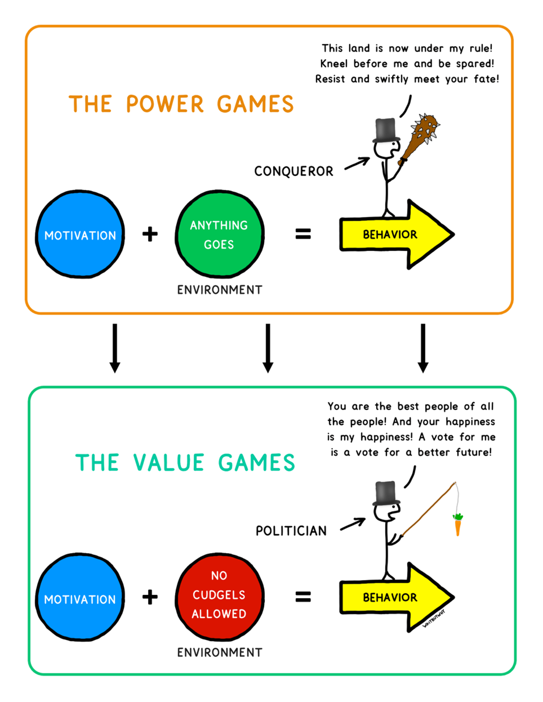

# Chapter 5: Mute Button

- To understand humans at a larger scale, it’s worth modelling some of the dynamics at play when groups of humans meet. The basic model is this: people have an inner and an outer self. People’s outer selves communicate using language. A human in a society is like a neuron in a brain.
- One’s inner and outer self need not be fully aligned. You can believe things that you dare not speak. For any given topic there is a range of what is acceptable to speak and/or believe.
- **Model: expression spectrum** of speech platforms, from national speech (official from on high) to community discussions, to small groups of friends.

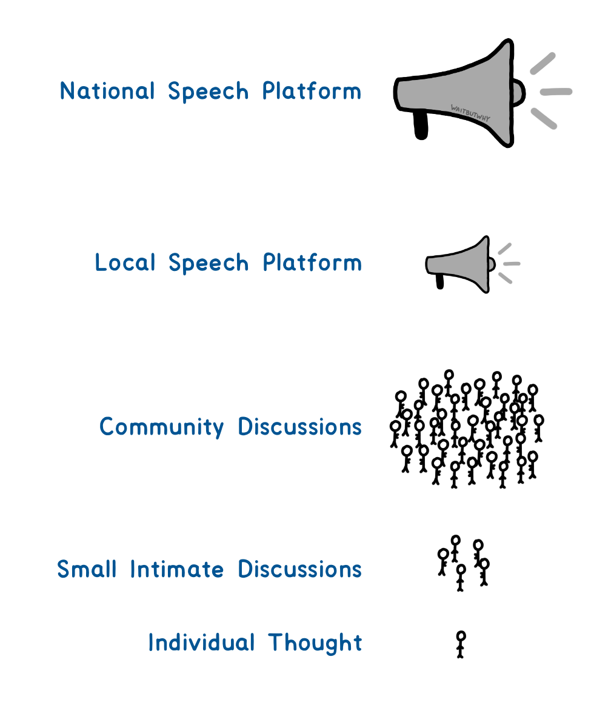

- **Model: idea spectrum & Thought Pile** models various positions on a specific topic. By putting idea spectrum on X and expression spectrum on Y, plot a Thought Pile of what people believe.

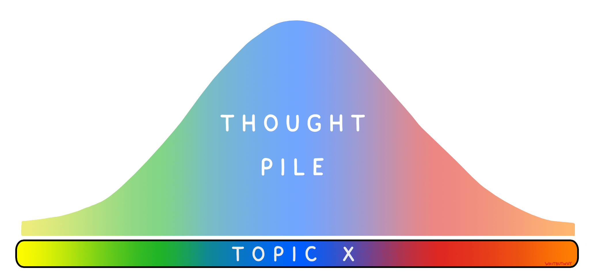

- **Model: Speech Curve**: Also draw a Speech Curve of what is acceptable to say at which expression level. For example, you can hold fringe views in a small group that has a certain set of priors and shared understanding. But if the same thing was said at a larger scale, it would not land well.

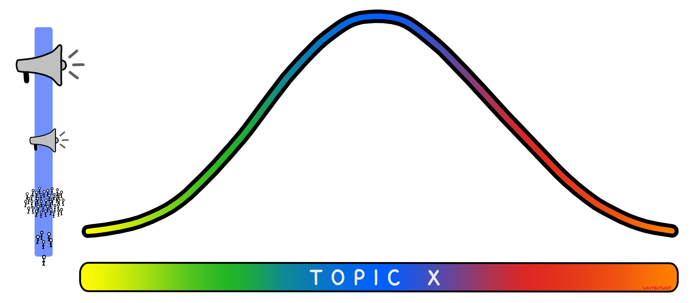

- Sometimes if a despot is in charge, he will want to control what people think, as a way to hold on to power. There is no direct way to control though, but there is a direct way to punish and control speech. 
- “Censorship takes a single region formed by an aligned Thought Pile and Speech Curve and turns it into three regions by generating two “censorship gaps.”

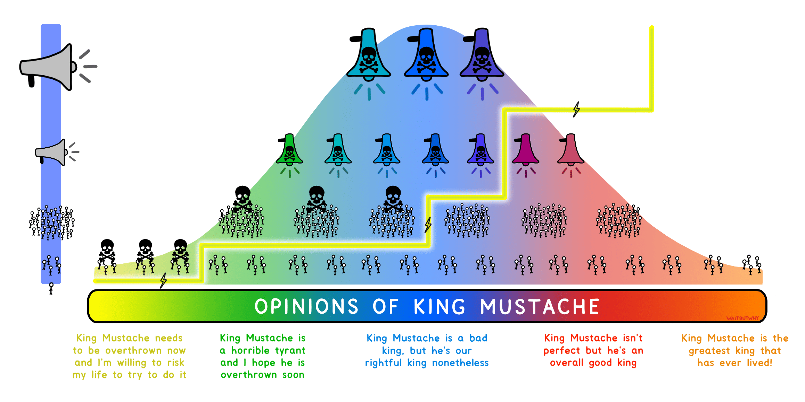

# Chapter 6: American Brain

- Thought Piles need not be normally distributed. In America they are often bimodal.
- You don’t need to be ruled by a despot for there to be discrepancy between Thought Pile and Speech Curve. 
- **Model: Overton window** There’s a range of ideas the public will accept as politically reasonable (Overton window) and politicians at the highest level are often hamstrung by it. They can’t really move it themselves, just need to feel its boundaries.

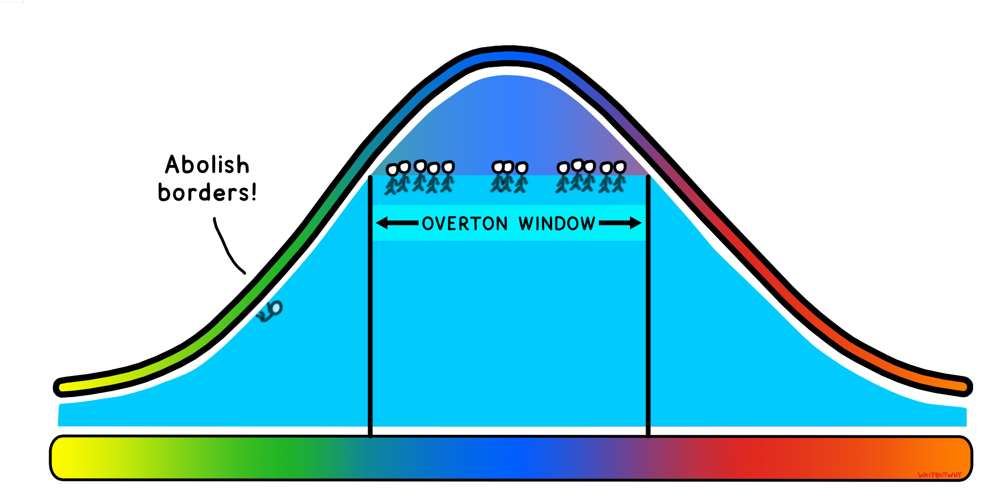

- “If you live in a democracy, and you’re not zoomed out far enough, you might look at the politicians running your government and mistake them for your leaders. In the short term, sure, they jostle with each other over the country’s policies and steer the country on the international stage. But with a step back, the real long-term leader of a democracy is the giant communal brain of the citizen body.”
- **Model: Thought Pile follows Speech Curve**

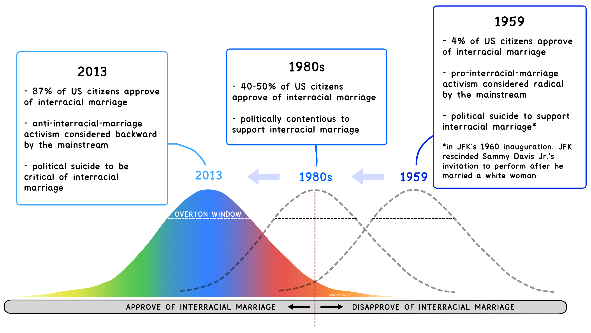

# Chapter 7: Thinking Ladder

- There’s a tension between just caring about what is true, and wanting to have your deepest beliefs confirmed. “So when it comes to beliefs, the Primitive Mind doesn’t want truth, it wants confirmation—of your existing beliefs.”
- **Model: psych spectrum**, although I think many people often apply different types of thinking personas to different problems:
	- Scientist: “chasing truth is like climbing through thick fog up an infinitely high mountain. It’s the pursuit of something that can never be fully achieved, but it can be approached—and their goal is simply to continue moving up the mountain”
	- Sports fan: “It’s just…that they really really want that process to yield a certain outcome. They’re not just watching the game—they’re rooting.”
	- Attorney: "The client is not guilty. Now let’s figure out why.”
	- Zealot: “In reality, you’ve taken a set of ideas to be sacred, and you’ve given up an independent truth-seeking path in order to faithfully serve those sacred ideas”

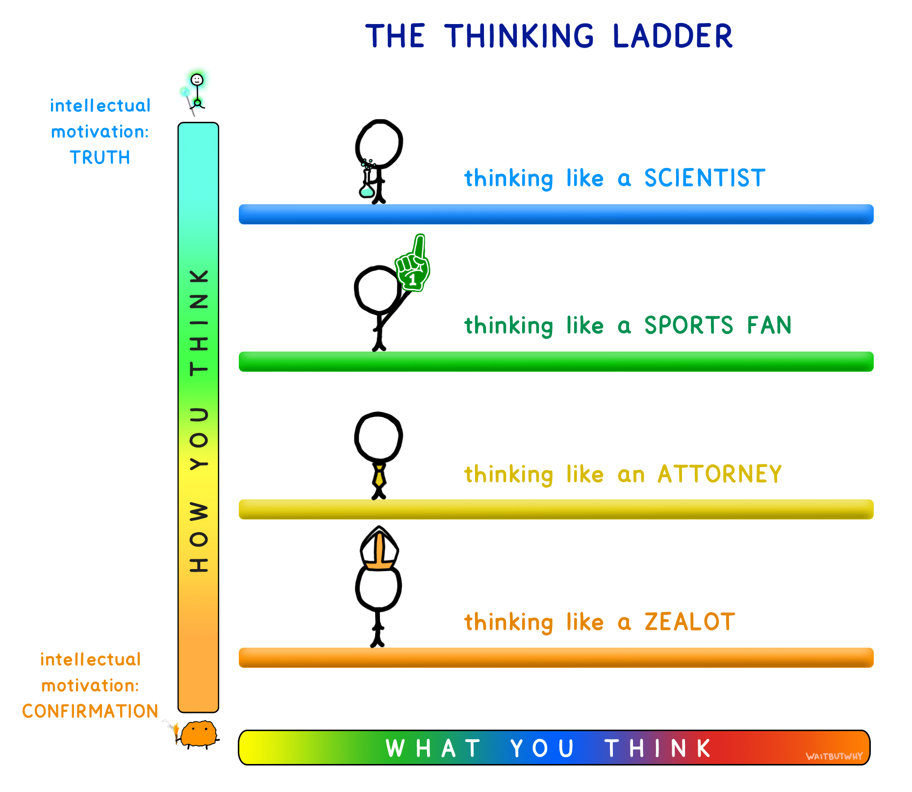

- **Model: Skepticism Spectrum**. “Move to the left of the sweet spot on the spectrum, where the filter is looser, and you begin to allow some bullshit to flow into your beliefs. Move even farther left and your beliefs become packed with a jumble of falsehoods, misconceptions, and contradictions. Moving to the right of the sweet spot tightens the filter too much, like a business owner so worried about accidentally accepting Monopoly money that they end up turning down real money too. Go way to the right and you’ll stop believing the moon landing happened.”

# Chapter 8: Idea Labs vs. Echo Chambers

- **Model: Idea Labs** are collections of Higher Minds, independent thinkers all seeking truth, working off one another and testing one another’s ideas. “Thoughtful contrarianism is valued because there’s an implicit understanding that the evolution of knowledge works like the evolution of life.” “Humility wins you major respect in an Idea Lab—where “I don’t know” is a very cool thing to say.”

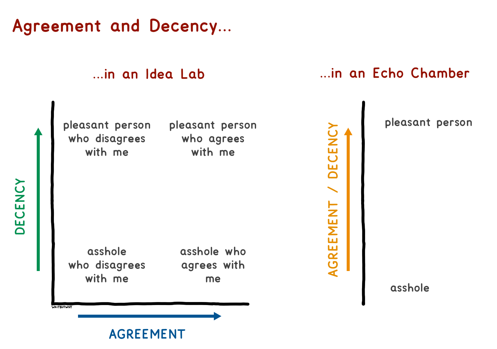

- There aren’t that many of these places around though. Because even though the constitution is awesome, people are often not. “Free speech, like any Value Games privilege, requires both the government and the culture to be on board. The U.S. Constitution makes free speech possible—but only within the right culture does the freedom come to fruition.”
- **Model: the opposite of an Idea Lab is an Echo Chamber**. “To put a visual to it, Idea Lab culture views agreement and decency as separate, unrelated axes, while Echo Chamber culture views agreement and decency as a single axis”

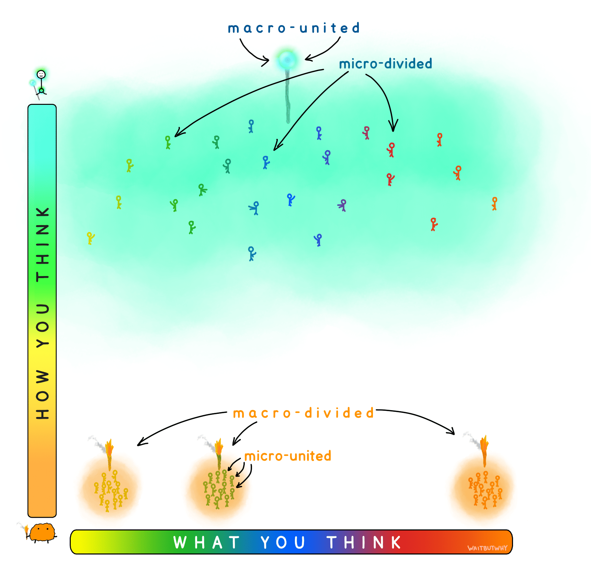

- “The over-application of taboo is the bane of free speech, so pro-free-speech cultures use it sparingly. This frees the Idea Lab’s Speech Curve to freely line up with its Thought Pile.” In an Echo Chamber, Thought Pile and Speech Curve do not align, you end up with effective censorship. 
- “An Echo Chamber’s taboo minefield makes it a safe and protected space for all ideas that confirm the sacred beliefs and a very dangerous space for ideas—and people—that don’t.”
- Conversely, Idea Labs are not a safe place for people whose identities are tied to their specific ideas. And this is many people.
- This is a useful model, but I think in practice people’s identities are always comprised of both Echo Chambers and Idea Labs, and this is a good thing. “A human society is a rich tapestry of overlapping and sometimes sharply contradictory cultures, and each of us lives at our own unique cultural intersection.”

# Chapter 9: Political Disney World

 - Politics is reminiscent of many of the worst aspects of religion. In terms of the psych spectrum, “The Political Ladder is bottom-heavy”, meaning full of zealots.
- **Model: 2D political spectrum.** By considering the political right-left spectrum with a Y-axis of psych spectrum, it becomes less about right vs. left, more about top vs. bottom, ways of thinking.

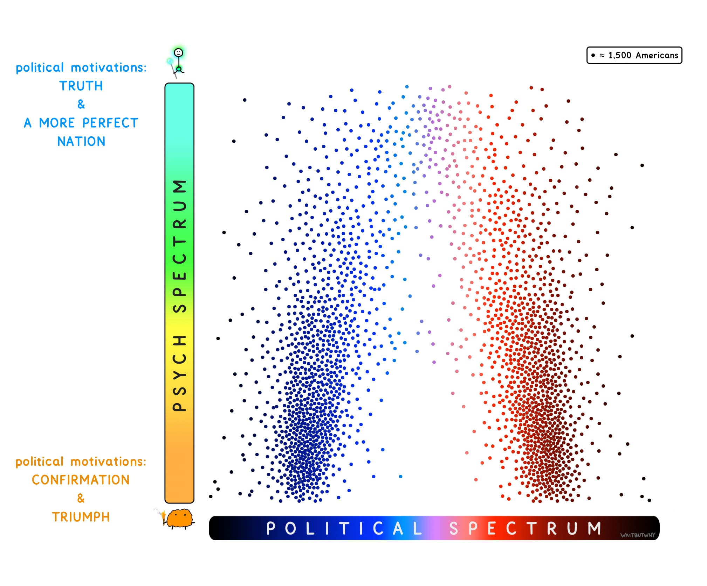

- **Model: conservatives vs progressives on emergence tower** nice little tie in.

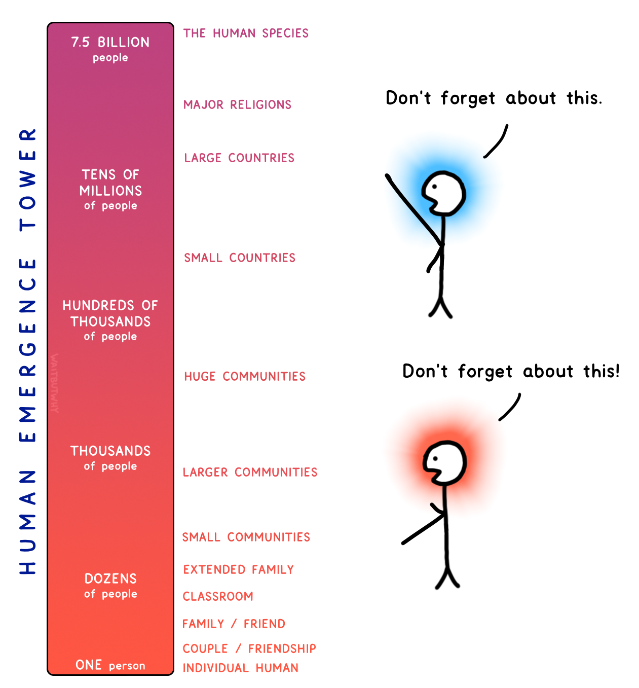

- **Model: Disney characters.** Disney characters tend to be binary: good incarnate, or evil incarnate. All nuance is lost. The same is done by Americans when thinking about politics.

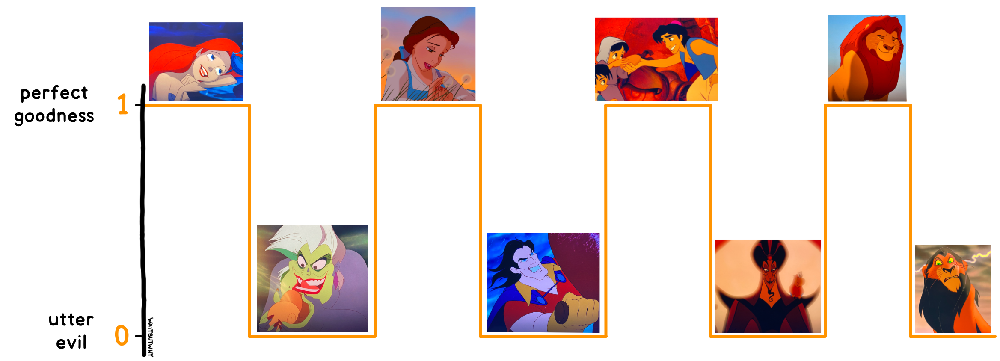

- **Model: Causation is Hard**. Given any two events, it’s often very hard to establish causation. The causation arrow can be strategically placed to make whatever point you’d like. (Book of Why)

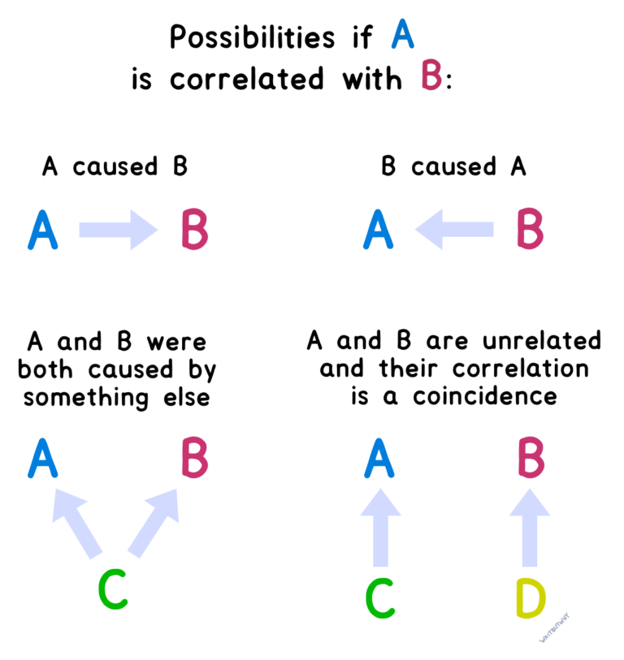

- **Model: Sucky Man** are all great ways of arguing in order to convince others:
	- Straw Man: reframe the wording of a strong dissenting argument, transform it into a much weaker argument.
	- Weak Man: takes a strong argument, hand-pick the weakest part of it and attacks that.
	- Hollow Man: fabricate a fake argument from scratch. Often framed by “some people say” – the easiest match possible.
- **Model: Motte and Bailey:** good visual explanation of the less-wrong concept.

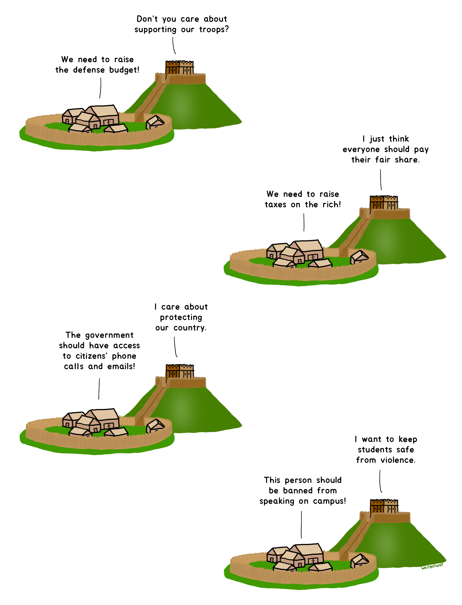

# Chapter 10: A Sick Giant

- **Model: Media matrix**

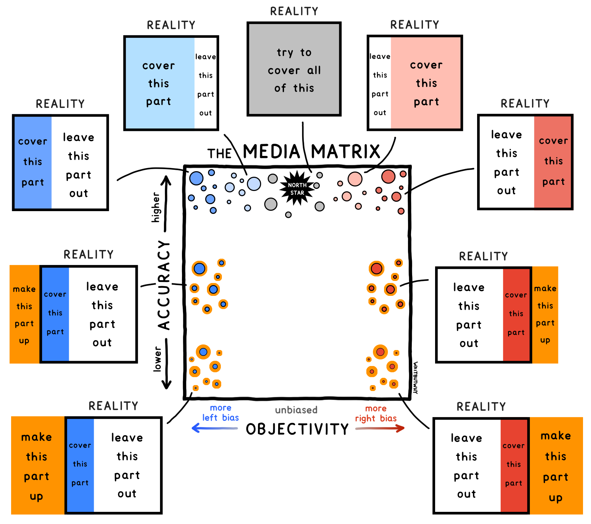

Very unsatisfying end (?) to the series. Many great models were introduced in prior chapters, but this last post is mostly a regurgitation of interesting Pew Research polls. Occasional references to Higher and Primitive Minds, but that’s about it!

#from smusmac#