Projects
========
type: custom

<main class="projects">
  
  <link href='//fonts.googleapis.com/css?family=Sofia+Sans:700' rel='stylesheet' />

  <h1>Projects</h1>

  <section class="project">
    

      <h2>Conversational Translation</h2>
      <h3>In-person multilingual conversations mediated by novel hardware</h3>
      
2018 — now

      

        Our work on enabling live translation in everyday glasses was the
        closing feature at the Google I/O 2022 keynote: <q>Let's see what happens when we take our advances in
          translation and transcription, and deliver them in your line-of-sight.</q> — Sundar Pichai, CEO (<a
          href="https://www.youtube.com/watch?v=nP-nMZpLM1A&t=6978">video</a>)
      

      
Extensive coverage on <a
          href="https://www.theverge.com/2022/5/11/23067426/google-ar-glasses-live-translate-io">The Verge</a>, <a
          href="https://www.engadget.com/google-ar-glasses-190114468.html">Endadget</a>, etc.

      <ul class="pubs">
        <li><a class="patent" href="/patents/2017 - Speech Translation Device and Associated Method.pdf">US2019/095430</a> Speech translation device and associated method. Smus B., Donsbach A. 2017</li>
        <li><a class="paper" href="/papers/2020 - Unmet Needs and Opportunities for Mobile Translation AI.pdf">Unmet needs and opportunities for mobile translation AI</a> Liebling D. J., Lahav M., Evans A., Donsbach A., Holbrook J., Smus B., Boran L. <a href="https://chi2020.acm.org/"> CHI 2020</a></li>
      </ul>
      

    

    

      <video class="big" autoplay muted loop poster="media/augmented-language-preview.jpg"
      src="media/augmented-language.mp4"></video>
    

  </section>

  <section class="project">
    

      <h2>WebXR (née WebVR)</h2>
      <h3>Open-source design and development</h3>
      
2015 — 2017

      

        When the web's VR ecosystem was still nascent, I helped to bootstrap it and make the WebVR API available even
        on
        low
        end devices like Google Cardboard. I built and maintained libraries like the <a
          href="https://github.com/immersive-web/webvr-polyfill/">WebVR Polyfill</a>
        to provide head tracking and lens distortion in vanilla JavaScript. I created <a
          href="https://developers.google.com/vr/develop/web/vrview-web">VR View</a> to help webmasters embed
        interactive stereo 360 imagery. <a href="https://github.com/borismus/webvr-boilerplate">WebVR
          Boilerplate</a> helped me build numerous creative VR experiences to inspire and help novices get started with VR on the web.
      

      

    

    

      

        <a href="/copresence-webvr/">
          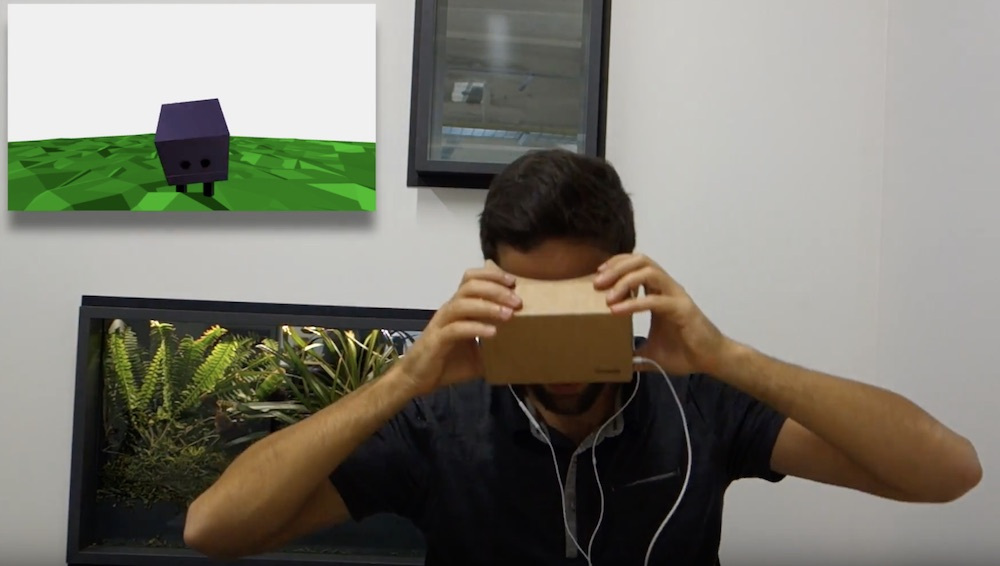
          <label>WebVR meets WebRTC for a more social VR experience</label>
        </a>
      

      

        <a href="https://vr.google.com/tourcreator/">
          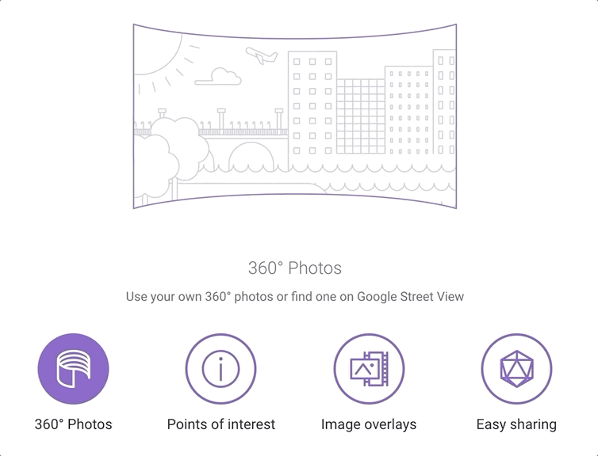
          <label>I built the Tour Creator for Google Expeditions</label>
        </a>
      

      

        <a href="/wikipedia-vr/">
          
          <label>What if you could browse Wikipedia in VR?</label>
        </a>
      

      

        <a href="/spatial-audio-web-vr/">
          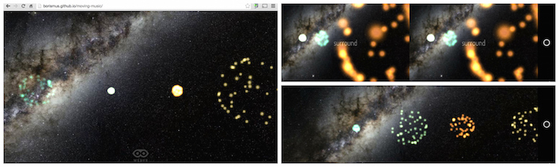
          <label>Spatial audio experiments with WebVR and Web Audio</label>
        </a>
      

      

        <a href="/ray-input-webvr-interaction-patterns/">
          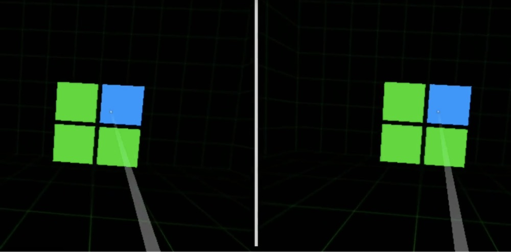
          <label>3D interaction patterns that scale up to full VR.</label>
        </a>
      

    

  </section>

  <section class="project">
    

      <h2>Google Tone</h2>
      <h3>Transmit the URL of the current browser tab to computers within earshot, over audio.</h3>
      
2015 - 2019

      

        When you press the blue megaphone button in your browser bar, the computer's speakers emit a combination of
        audible and inaudible sounds that any nearby machine with a microphone can pick up. The signal triggers a
        Chrome notification. Clicking it opens the transmitted URL in a new browser tab.
      

      
Covered on the <a href="https://ai.googleblog.com/2015/05/tone-experimental-chrome-extension-for.html">Google
          Research blog</a> & <a
          href="https://techcrunch.com/2015/05/19/googles-tone-chrome-extension-lets-you-share-urls-by-sound/">Techcrunch</a>.
      

      <ul class="pubs">
        <li><a class="patent" href="/patents/2017 - Communicating Data with Audible Harmonies.pdf">US9,882,658</a> Communicating Data with Audible Harmonies. Smus B., Getreuer P. T. 2017</li>
        <li><a class="patent" href="/patents/2014 - Using Ultrasound to Improve IMU-based Gesture Detection.pdf">US9,811,311</a> Using Ultrasound to Improve IMU-based Gesture Detection. Smus B., Plagemann C., Mohan A., Rifkin R. M. 2014</li>
        <li><a class="patent" href="/patents/2016 - Methods Systems and Media for Synchronizing Media Content with Audio Timecodes.pdf">US 2018/0063572</a> Methods Systems and Media for Synchronizing Media Content with Audio Timecodes. Smus B. 2016</li>
      </ul>
      

        <a class="primary" href="https://g.co/tone" target="_blank">Try Google Tone</a>
      

    

    

      <video class="big" autoplay muted loop preload="none" src="media/google-tone.mp4"
        poster="media/google-tone-preview.png" preload="none"></video>
    

  </section>

  <section class="project">
    

      <h2>Google Cardboard</h2>
      <h3>An award-winning, inexpensive virtual reality viewer for smartphones.</h3>
      
2014 - 2017

      

        I invented, prototyped, and built the magnetic input method for the Cardboard
        headset. The initial run was 10,000 units. There are now more than 20 million viewers out there.
      

      <ul class="pubs">
        <li><a class="patent" href="/patents/2019 - Magnetic controller for device control.pdf">US11,269,022</a> Magnetic controller for device control. Smus B., Plagemann C. 2019</li>
        <li><a class="patent" href="/patents/2015 - Virtual Reality Headset (Cardboard VR Design Patent).pdf">US D750074</a> Virtual Reality Headset. Coz D., Henry D., Plagemann C., Smus B. 2015</li>
        <li><a class="paper" href="/papers/2015 - Magnetic Input for Mobile Virtual Reality.pdf">Magnetic Input for Mobile Virtual Reality</a> Smus B., Riederer C. <a href="http://iswc2015.semanticweb.org/"> ISWC 2015</a></li>
      </ul>
      

      

        <a class="primary" href="https://g.co/cardboard" target="_blank">Try Cardboard</a>
      

    

    

      <video class="big" autoplay muted loop preload="none" poster="media/cardboard-preview.jpg" src="media/cardboard.mp4"></video>
    

  </section>

  <section class="project">
    

      <h2>Web Audio</h2>
      <h3>Open-source development and writing</h3>
      
2011 — now

      

        I could write an ode to the web platform and to the power of the web
        Audio API. When I worked with Chrome Developer Relations, I had the
        opportunity to write a number of articles on the Web Audio API, which
        came together in an O'Reilly Book. Since then, I have been an avid user
        of the API, which came together in a number of open source projects.
      

      <ul class="pubs">
        <ul><li><a class="patent" href="/patents/2021 - Synchronized performances for remotely located performers.pdf">US2022/014570</a> Synchronized performances for remotely located performers. Goldstein M., McNabb M., Smus B. 2021</li>
        <li><a class="paper" href="/papers/2022 - Telejam - From Low Latency to No Latency.pdf">Telejam: From Low Latency to No Latency</a> Goldstein M., McNabb M., Smus B. <a href="https://webaudioconf.com/"> WAC 2022</a></li>
      </ul>
      

        <a class="primary" href="https://www.amazon.com/Web-Audio-API-Advanced-Interactive/dp/1449332684"
          target="_blank">Buy the Book</a>
        <a href="https://webaudioapi.com/book" target="_blank">Read For Free</a>
      

    

    

      

        <a href="https://webaudioapi.com/book/">
          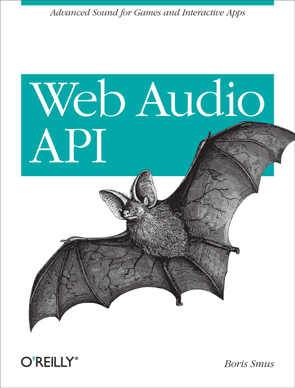
          <label>Wrote the O'Reilly book about the Web Audio API.</label>
        </a>
      

      

        <a href="/web-audio-ml-features/">
          
          <label>Implemented a log-mel feature extractor in JS.</label>
        </a>
      

      

        <a href="https://musiclab.chromeexperiments.com/spectrogram/">
          
          <label>Built the 3D spectrogram in the Chrome
            Music Lab.</label>
        </a>
      

      

        <a href="https://borismus.github.io/spectrogram/">
          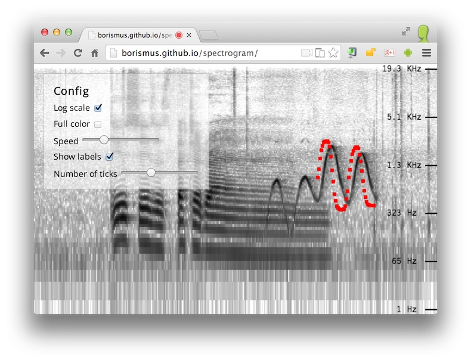
          <label>Built a live-input spectrogram using the Web Audio API</label>
        </a>
      

      

        <a href="https://borismus.github.io/classical-interpreter/">
          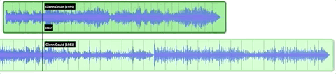
          <label>Compare different performances of the same classical piece.</label>
        </a>
      

      

        <a href="https://borismus.github.io/filter-playground/">
          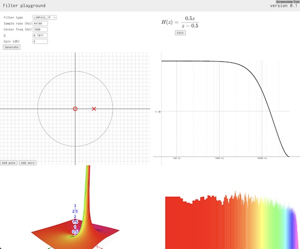
          <label>Build multimodal intuition around digital filters.</label>
        </a>
      

    

  </section>

  <section class="project">
    

      <h2>Physical Computing</h2>
      <h3>Reality is underrated</h3>
      
2011 — now

      

        I like creating things with my hands. It's a nice remedy to staring at screens all day long. Here are some projects that require more than fingers typing on a keyboard.
      

      <ul class="pubs">
        <li><a class="paper" href="/papers/2010 - Running Gestures - hands-free interaction during physical activity.pdf">Running Gestures: hands-free interaction during physical activity</a> Smus B., Kostakos V. <a href="https://www.ubicomp.org/ubicomp2010/"> UbiComp 2010</a></li>
        <li><a class="paper" href="/papers/2010 - Ubiquitous Drums - a tangible, wearable musical interface.pdf">Ubiquitous Drums: a tangible, wearable musical interface</a> Smus B., Gross M. <a href="http://www.chi2010.org/"> CHI 2010</a></li>
      </ul>
    

    

      

        <a href="/minimal-business-card-design/">
          
          <label>Created a clever little business card as part of a design class.</label>
        </a>
      

      

        <a href="/little-free-library/">
          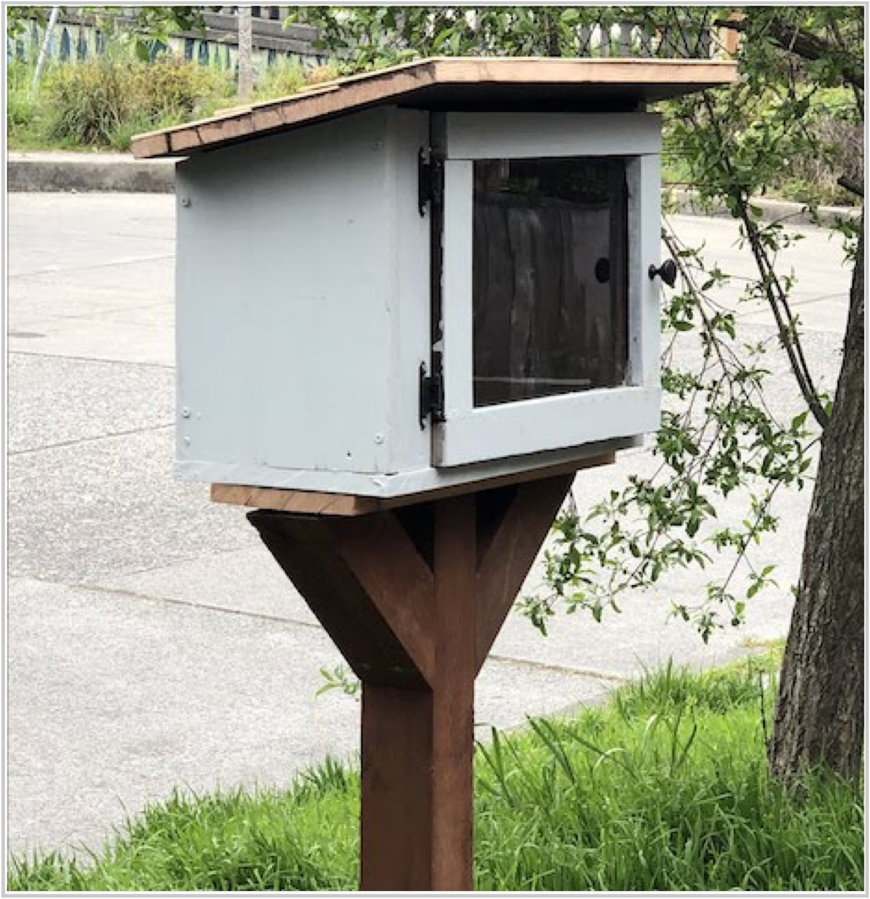
          <label>A little free library out of my garage.</label>
        </a>
      

      

        <a href="/toddler-music-box/">
          
          <label>A bespoke music box for my daughter.</label>
        </a>
      

      

        <a href="/esup-builders/">
          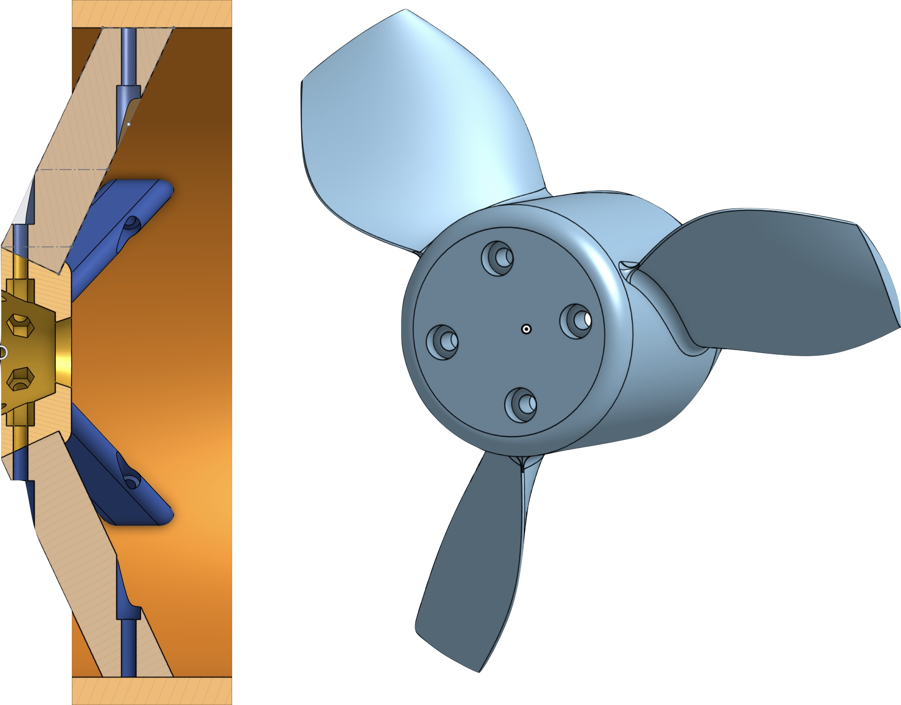
          <label>A 3D printed propeller for my home-made efoil.</label>
        </a>
      

      

        <a href="/skip-running-gesture/">
          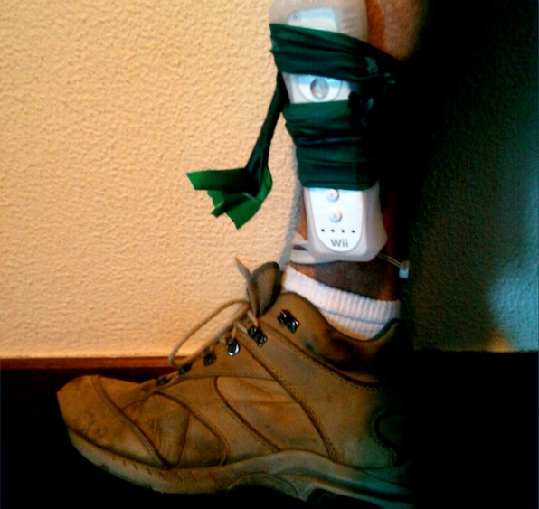
          <label>Control your music player with a little hop.</label>
        </a>
      

      

        <a href="/ubiquitous-drums/">
          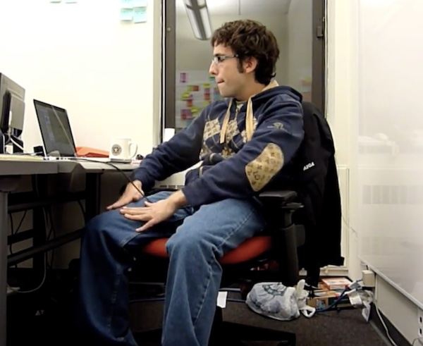
          <label>Drums in your pants.</label>
        </a>
      

    

  </section>

  <section class="project">
    

      <h2>Apple</h2>
      <h3>iWeb and iWork.com</h3>
      
2007 — 2009

      

        Developed software architecture for significant portions of iWork.com and implemented new features for iWeb
        and
        the iWork suite in Objective-C. Also:
      <ul>
        <li>Created a text and object selection engine in JavaScript.</li>
        <li>Built a cross-browser graphics library using SVG, Canvas and VML.</li>
        <li>Prototyped new product ideas using JavaScript and Ruby on Rails.</li>
        <li>Wrote parts of the Microsoft Office document viewer for iPhone Mail.</li>
      </ul>
      

      <ul class="pubs">
        <li><a class="patent" href="/patents/2008 - Shared comments for online document collaboration.pdf">US2010/0095198</a> Shared comments for online document collaboration. Bultrowicz M., Smus B. 2008</li>
      </ul>
      

    

    

      
    

  </section>

  <section class="project">
    

      <h2>Social Computing</h2>
      <h3>Crowdsourcing and visualization projects</h3>
      
2011 — now

      

      My Crowdforge research at CMU showed that Microtask markets like MTurk can be used to accomplish complex tasks. I then got a taste for the wisdom of the crowds, as well as their foolishness. Could random people on the internet be corralled to create a tech tree? Could they be asked to tinker with an evolutionary origami art system? Could people with opposing viewpoints be brought together to participate in friendlier debates?
      

      <ul class="pubs">
        <li><a class="paper" href="/papers/2011 - Crowdforge - Crowdsourcing Complex Work.pdf">Crowdforge: Crowdsourcing Complex Work</a> Kittur, A., Smus, B., Khamkar, S., Kraut, R., E. <a href="https://uist.acm.org/uist2011/"> UIST 2011</a></li>
        <li><a class="paper" href="/papers/2020 - Usnea - An Authorship Tool for Interactive Fiction using Retrieval Based Semantic Parsing.pdf">Usnea: An Authorship Tool for Interactive Fiction using Retrieval Based Semantic Parsing</a> Swanson, B., Smus, B. <a href="https://acl2020.org/"> ACL 2020</a></li>
        <li><a class="paper" href="/papers/2011 - An Assessment of Intrinsic and Extrinsic Motivation on Task Performance in Crowdsourcing Markets.pdf">An Assessment of Intrinsic and Extrinsic Motivation on Task Performance in Crowdsourcing Markets</a> Rogstadius, J., Kostakos, V., Kittur, A., Smus, B. <a href="https://www.icwsm.org/2011"> ICWSM 2011</a></li>
      </ul>
    

    

      

        <a href="/evogami/">
          <video autoplay muted loop src="media/social-evogami.mp4" />
          <label>Evolutionary origami with crowds.</label>
        </a>
      

      

        <a href="https://borismus.github.io/asimov/web/cross-shape/#steel">
          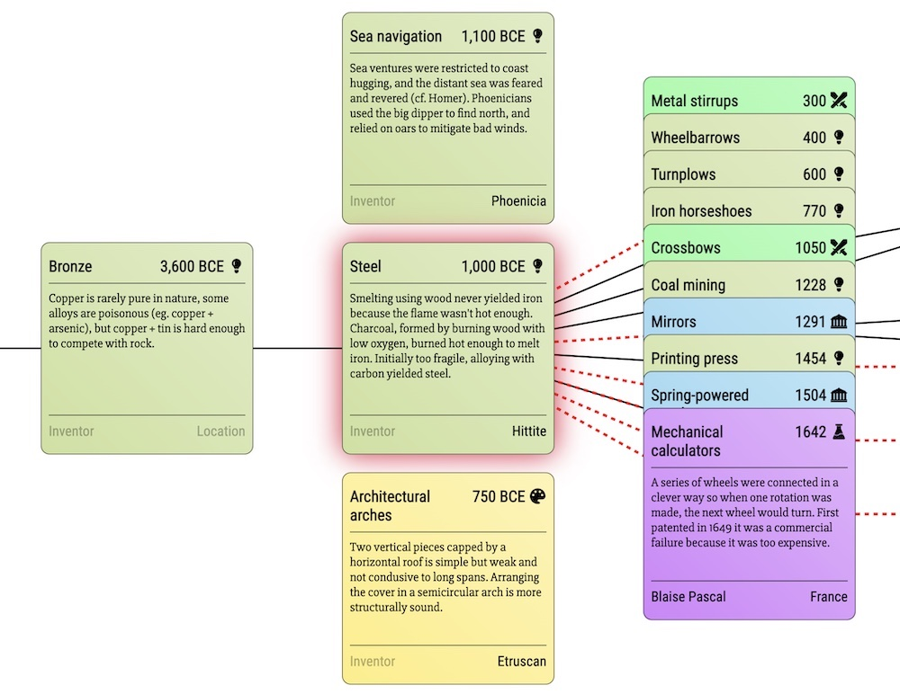
          <label>I visualized Asimov's chronology of science & technology.</label>
        </a>
      

      

        <a href="/debaters-friendly-disagreement">
          
          <label>You and someone with an opposing view in a private, friendly conversation.</label>
        </a>
      

    

  </section>
</main>