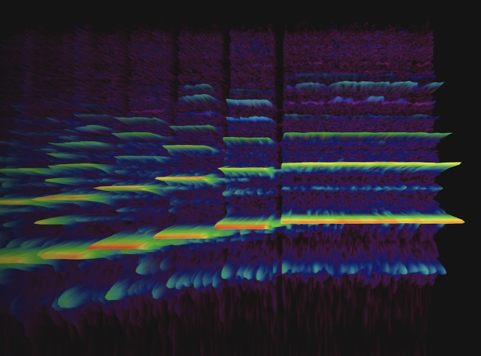

Projects
========
type: custom

<main class="projects">
  
  <link href='//fonts.googleapis.com/css?family=Sofia+Sans:700' rel='stylesheet' />

  <h1>Projects</h1>

  <!-- TODO(smus): paste in visual resume output here. -->

<section class="project">

  

    <h2>Meta.ai Video Restyle</h2>
    <h3>Meta AI's first GenAI powered video editor</h3>
    
2024 - 2025

    

      
Software engineer and technical lead coordinating a team of engineers to build Meta's first generative video feature on the web, letting users edit short-form videos with presets.

Press coverage on <a href="https://www.theverge.com/news/685581/meta-video-editing-ai-preset-prompts">The Verge</a> and <a href="https://techcrunch.com/2025/06/11/meta-ai-gains-video-editing-capabilities/">TechCrunch</a>

    

    <ul class="pubs">
      
      
    </ul>

    

      

      <a class="primary" href="https://meta.ai" target="_blank">
        Try the web version
      </a>
      
    

  

  

    
    

      
      <label></label>
    

    
  

</section>
<section class="project">

  

    <h2>Augmented Language</h2>
    <h3>AI-powered Smart Glasses</h3>
    
2021 - 2024

    

      
I managed a team of 5-6 SWEs and prototypers building Translate and Transcribe for Augmented Reality glasses and beyond. Our work on enabling live translation in everyday glasses was the closing feature at the <a href="https://www.youtube.com/watch?v=nP-nMZpLM1A&amp;t=6978">Google I/O 2022 keynote</a>:

<blockquote>

Let's see what happens when we take our advances in translation and transcription, and deliver them in your line-of-sight. — Sundar

</blockquote>
    

    <ul class="pubs">
      
      <li>
        <a class="paper" href="assets/papers/2023 - Modeling and Improving Text Stability in Live Captions.pdf">
          Modeling and Improving Text Stability in Live Captions
        </a>
        Liu B., Zhang J., Ferrer L., Xu S., Bahirwani V., Smus B., Olwal A., Du R.
        <a href="https://chi2023.acm.org/">CHI 2023</a>
      </li>
      
      <li>
        <a class="paper" href="assets/papers/2020 - Unmet Needs and Opportunities for Mobile Translation AI.pdf">
          Unmet needs and opportunities for mobile translation AI
        </a>
        Liebling D. J., Lahav M., Evans A., Donsbach A., Holbrook J., Smus B., Boran L.
        <a href="https://chi2020.acm.org/">CHI 2020</a>
      </li>
      
      
      <li>
        <a class="patent" href="assets/patents/2017 - Speech Translation Device and Associated Method.pdf">US2019/095430</a>
        Speech translation device and associated method
        Smus B., Donsbach A.
        2017
      </li>
      
    </ul>

    

      
    

  

  

    
    

      <a >
        
        <video class="big" autoplay muted loop preload="none" src="assets/augmented-language/iris.mp4" />
        
      </a>
      <label></label>
    

    
  

</section>
<section class="project">

  

    <h2>Expeditions & VR View</h2>
    <h3>Stereo 360 imagery on the web and beyond.</h3>
    
2016 - 2018

    

      
I created <a href="https://developers.google.com/vr/develop/web/vrview-web">VR View</a> (<a href="https://developers.googleblog.com/2016/03/introducing-vr-view-embed-immersive.html">Google Developer Blog</a>) to help webmasters embed interactive stereo 360 imagery. I also built the first versions of the Expeditions Creator tool, used by teachers to create expeditions for their classrooms (<a href="https://blog.google/products/google-ar-vr/teachers-keep-their-lesson-plans-fresh-expeditions/">Google Blog</a>).

    

    <ul class="pubs">
      
      
    </ul>

    

      

      <a class="primary" href="https://storage.googleapis.com/vrview/2.0/examples/index.html" target="_blank">
        Try VR View
      </a>
      
    

  

  

    
    

      <a >
        
        <video class="big" autoplay muted loop preload="none" src="assets/expeditions.mp4" />
        
      </a>
      <label>A classroom on a virtual field trip to the Burj Khalifa.</label>
    

    
  

</section>
<section class="project">

  

    <h2>WebXR (née WebVR)</h2>
    <h3>Open-source design and development</h3>
    
2015 — 2017

    

      
When the web's VR ecosystem was still nascent, I helped to bootstrap it and make the WebVR API available even on low end devices like Google Cardboard. I built and maintained libraries like the <a href="https://github.com/immersive-web/webvr-polyfill/">WebVR Polyfill</a> to provide head tracking and lens distortion in vanilla JavaScript. <a href="https://github.com/borismus/webvr-boilerplate">WebVR Boilerplate</a> helped me build numerous creative VR experiences to inspire and help novices get started with VR on the web.

    

    <ul class="pubs">
      
      
    </ul>

    

      
    

  

  

    
    

      
      <label>WebVR meets WebRTC for a more social VR experience.</label>
    

    
    

      
      <label>What if you could browse Wikipedia in VR?</label>
    

    
    

      
      <label>Spatial audio experiments with WebVR and Web Audio</label>
    

    
    

      
      <label>Interaction patterns that scale from mouse and keyboard up to full VR</label>
    

    
  

</section>
<section class="project">

  

    <h2>Google Tone</h2>
    <h3>Transmit the URL of the current browser tab to computers within earshot, over audio.</h3>
    
2015 - 2019

    

      
When you press the blue megaphone button in your browser bar, the computer's speakers emit a combination of
audible and inaudible sounds that any nearby machine with a microphone can pick up. The signal triggers a
Chrome notification. Clicking it opens the transmitted URL in a new browser tab.

Covered on the <a href="https://ai.googleblog.com/2015/05/tone-experimental-chrome-extension-for.html">Google Research blog</a>, <a href="https://techcrunch.com/2015/05/19/googles-tone-chrome-extension-lets-you-share-urls-by-sound">TechCrunch</a>, and <a href="https://www.theverge.com/2015/5/19/8626795/google-tone-chrome-extension">The Verge</a>

    

    <ul class="pubs">
      
      
      <li>
        <a class="patent" href="assets/patents/2017 - Communicating Data with Audible Harmonies.pdf">US9,882,658</a>
        Communicating Data with Audible Harmonies
        Smus B., Getreuer P. T.
        2017
      </li>
      
      <li>
        <a class="patent" href="assets/patents/2016 - Methods Systems and Media for Synchronizing Media Content with Audio Timecodes.pdf">US 2018/0063572</a>
        Methods Systems and Media for Synchronizing Media Content with Audio Timecodes
        Smus B.
        2016
      </li>
      
      <li>
        <a class="patent" href="assets/patents/2014 - Using Ultrasound to Improve IMU-based Gesture Detection.pdf">US9,811,311</a>
        Using Ultrasound to Improve IMU-based Gesture Detection
        Smus B., Plagemann C., Mohan A., Rifkin R. M.
        2014
      </li>
      
    </ul>

    

      

      <a class="primary" href="https://g.co/tone" target="_blank">
        Try Google Tone
      </a>
      
    

  

  

    
    

      <a >
        
        <video class="big" autoplay muted loop preload="none" src="assets/google-tone.mp4" />
        
      </a>
      <label></label>
    

    
  

</section>
<section class="project">

  

    <h2>Google Cardboard</h2>
    <h3>An award-winning, inexpensive virtual reality viewer for smartphones.</h3>
    
2014 - 2017

    

      
I invented, prototyped, and built the magnetic input method for the Cardboard
headset. The initial run was 10,000 units. There are now more than 20 million viewers out there.

    

    <ul class="pubs">
      
      <li>
        <a class="paper" href="assets/papers/mimvr.pdf">
          Magnetic Input for Mobile Virtual Reality
        </a>
        Smus B., Riederer C.
        <a href="https://iswc2015.semanticweb.org">ISWC 2015</a>
      </li>
      
      
      <li>
        <a class="patent" href="">US11,269,022</a>
        Magnetic controller for device control
        Smus B., Plagemann C.
        2019
      </li>
      
      <li>
        <a class="patent" href="">US D750074</a>
        Virtual Reality Headset (Cardboard VR Design Patent)
        Coz D., Henry D., Plagemann C., Smus B.
        2015
      </li>
      
    </ul>

    

      

      <a class="primary" href="https://g.co/cardboard" target="_blank">
        Try Cardboard
      </a>
      
    

  

  

    
    

      <a href="https://webaudioapi.com/book">
        
        <video class="big" autoplay muted loop preload="none" src="assets/cardboard.mp4" />
        
      </a>
      <label>Assembly of Google Cardboard.</label>
    

    
  

</section>
<section class="project">

  

    <h2>Airbender</h2>
    <h3>Multi-device interactions</h3>
    
2012 - 2016

    

      
I was a prototype engineer and eventually Co-Lead for Airbender along with <a href="https://plagemann.net/">Christian Plagemann</a> and <a href="https://portfolio.minimalcomputing.com/">Alex Kauffmann</a>. We combined physical intuitions with clever uses of sensors to elegantly solve user interaction problems in Chrome, Android, and beyond.

    

    <ul class="pubs">
      
      
      <li>
        <a class="patent" href="assets/patents/2011 - Simulating Multi-touch Events on a Browser System.pdf">US2018/0164912</a>
        Simulating Multi-touch Events on a Browser System
        Smus B.
        2011
      </li>
      
      <li>
        <a class="patent" href="assets/patents/2012 - Keyboard event detection and network event generation.pdf">US 8803808</a>
        Keyboard event detection and network event generation
        Smus B.
        2012
      </li>
      
      <li>
        <a class="patent" href="assets/patents/2013 - Supplementing Speech Commands with Gestures.pdf">US9,390,726</a>
        Supplementing Speech Commands with Gestures
        Smus B., Kauffmann A., Plagemann C.
        2013
      </li>
      
      <li>
        <a class="patent" href="assets/patents/2013 - System and Method for Providing Web Content for Display Based on Physical Dimension Requirements.pdf">US2015/0199076</a>
        System and Method for Providing Web Content for Display Based on Physical Dimension Requirements
        Smus, B.
        2013
      </li>
      
      <li>
        <a class="patent" href="assets/patents/2013 - Situated Multi-person User Interface.pdf">US9,237,182</a>
        Situated multi-person user interface
        Smus B., Kauffmann A., Plagemann C.
        2013
      </li>
      
      <li>
        <a class="patent" href="assets/patents/2014 - Determining User Handedness Using a Touchscreen Device.pdf">US9.239,648</a>
        Determining User Handedness Using a Touchscreen Device
        Smus B.
        2014
      </li>
      
    </ul>

    

      
    

  

  

    
    

      <a >
        
        <video class="big" autoplay muted loop preload="none" src="assets/airbender/constellation.mp4" />
        
      </a>
      <label></label>
    

    
  

</section>
<section class="project">

  

    <h2>Chrome DevRel</h2>
    <h3>Mobile web & Web Audio developer advocacy</h3>
    
2011 - 2013

    

      
I was the lead DevRel Engineer during the Chrome for Android &amp; iOS launches. I specialized in mobile web development, writing articles with millions of views featured on <a href="https://html5rocks.com">https://html5rocks.com</a>. My secondary focus was on browser audio, including writing an O'Reilly book about the Web Audio API. Since then, I have been an avid user of the API, which came together in a number of open source projects.

    

    <ul class="pubs">
      
      <li>
        <a class="paper" href="assets/papers/2022 - Telejam - From Low Latency to No Latency.pdf">
          Telejam: From Low Latency to No Latency
        </a>
        Goldstein M., McNabb M., Smus B.
        <a href="https://webaudioconf.com">WAC 2022</a>
      </li>
      
      
      <li>
        <a class="patent" href="assets/patents/2021 - Synchronized performances for remotely located performers.pdf">US2022/014570</a>
        Synchronized performances for remotely located performers
        Goldstein M., McNabb M., Smus B.
        2021
      </li>
      
    </ul>

    

      

      <a class="primary" href="https://www.amazon.com/Web-Audio-API-Advanced-Interactive/dp/1449332684" target="_blank">
        Buy the Book
      </a>
      

      <a  href="https://webaudioapi.com/book" target="_blank">
        Read for Free
      </a>
      
    

  

  

    
    

      
      <label>Wrote the O'Reilly book about the Web Audio API.</label>
    

    
    

      
      <label>Built the 3D spectrogram in the Chrome Music Lab.</label>
    

    
    

      
      <label>Implemented a log-mel feature extractor in JS.</label>
    

    
    

      
      <label>Built an interactive explanation for learning digital filters.</label>
    

    
  

</section>
<section class="project">

  

    <h2>Social Computing</h2>
    <h3>Crowdsourcing and visualization projects</h3>
    
2010 - now

    

      
My Crowdforge research at CMU showed that Microtask markets like Mechanical Turk can be used to accomplish complex tasks. I then got a taste for the wisdom of the crowds, as well as their foolishness. Could random people on the internet be corralled to create a tech tree? Could they be asked to tinker with an evolutionary origami art system? Can people with opposing viewpoints be brought together to participate in friendlier debates?

    

    <ul class="pubs">
      
      <li>
        <a class="paper" href="assets/papers/2011 - Crowdforge - Crowdsourcing Complex Work.pdf">
          Crowdforge: Crowdsourcing Complex Work
        </a>
        Kittur A., Smus B., Khamkar S., Kraut R., E.
        <a href="https://uist.acm.org/uist2011">UIST 2011</a>
      </li>
      
      <li>
        <a class="paper" href="assets/papers/2020 - Usnea - An Authorship Tool for Interactive Fiction using Retrieval Based Semantic Parsing.pdf">
          Usnea: An Authorship Tool for Interactive Fiction using Retrieval Based Semantic Parsing
        </a>
        Swanson B., Smus B.
        <a href="https://acl2020.org">ACL 2020</a>
      </li>
      
      <li>
        <a class="paper" href="assets/papers/2011 - An Assessment of Intrinsic and Extrinsic Motivation on Task Performance in Crowdsourcing Markets.pdf">
          An Assessment of Intrinsic and Extrinsic Motivation on Task Performance in Crowdsourcing Markets
        </a>
        Rogstadius J., Kostakos V., Kittur A., Smus B.
        <a href="https://www.icwsm.org/2011">ICWSM 2011</a>
      </li>
      
      
    </ul>

    

      
    

  

  

    
    

      <a href="https://smus.com/evogami">
        
        <video  autoplay muted loop preload="none" src="assets/social/evogami.mp4" />
        
      </a>
      <label>Evolutionary origami with crowds.</label>
    

    
    

      
      <label>Asimov's chronology of science & technology, visualized.</label>
    

    
    

      
      <label>Opposing viewpoints in a private, friendly conversation.</label>
    

    
  

</section>
<section class="project">

  

    <h2>Physical Computing</h2>
    <h3>Reality is underrated</h3>
    
2009 - now

    

      
I like building things with my hands. It's a nice remedy to staring at screens all day long. Here are some projects that require more than fingers typing on a keyboard.

    

    <ul class="pubs">
      
      <li>
        <a class="paper" href="assets/papers/2011 - Crowdforge - Crowdsourcing Complex Work.pdf">
          Crowdforge: Crowdsourcing Complex Work
        </a>
        Kittur A., Smus B., Khamkar S., Kraut R., E.
        <a href="https://uist.acm.org/uist2011">UIST 2011</a>
      </li>
      
      <li>
        <a class="paper" href="assets/papers/2020 - Usnea - An Authorship Tool for Interactive Fiction using Retrieval Based Semantic Parsing.pdf">
          Usnea: An Authorship Tool for Interactive Fiction using Retrieval Based Semantic Parsing
        </a>
        Swanson B., Smus B.
        <a href="https://acl2020.org">ACL 2020</a>
      </li>
      
      
    </ul>

    

      
    

  

  

    
    

      
      <label>Created a clever little business card as part of design class at CMU.</label>
    

    
    

      
      <label>Built a little free library in my garage.</label>
    

    
    

      
      <label>Designed a bespoke music box for my daughter (predates Toniebox).</label>
    

    
    

      
      <label>Designed a 3D printed propeller for my home-made efoil.</label>
    

    
    

      
      <label>Control your music player with a little hop.</label>
    

    
    

      
      <label>Is that a drum kit in your pants?</label>
    

    
    

      
      <label></label>
    

    
  

</section>
<section class="project">

  

    <h2>Apple</h2>
    <h3>iWeb and iWork.com</h3>
    
2007 - 2009

    

      
Developed software architecture for significant portions of iWork.com and implemented new features for iWeb and the iWork suite in Objective-C. Also:

<ul>
<li>Created a text and object selection engine in JavaScript.</li>
<li>Built a cross-browser graphics library using SVG, Canvas and VML.</li>
<li>Prototyped new product ideas using JavaScript and Ruby on Rails.</li>
<li>Wrote parts of the Microsoft Office document viewer for iPhone Mail.</li>
</ul>
    

    <ul class="pubs">
      
      
      <li>
        <a class="patent" href="assets/patents/2008 - Shared comments for online document collaboration.pdf">US2010/0095198</a>
        Shared comments for online document collaboration
        Bultrowicz M., Smus B.
        2008
      </li>
      
    </ul>

    

      
    

  

  

    
    

      
      <label></label>
    

    
  

</section>

  <!-- END PASTE -->

</main>