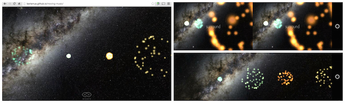

Spatial audio and web VR
========================
posted: 2015-03-19

Last summer I visited Austria, the capital of classical music. I had the
pleasure of hearing the [Vespers of 1610][vespers] in the great
[Salzburger Dom (photosphere)][photosphere]. The most memorable part of
the piece was that the soloists moved between movements, so their voices
and instruments emanated from surprising parts of the great hall.
Inspired, I returned to the west coast and eventually came around to
building a spatial audio prototypes like this one:

[][demo]

Spatial audio is an important part of any good VR experience, since the
more senses we simulate, the more compelling it feels to our sense
fusing mind. WebVR, WebGL, and WebAudio all act as complementary specs
to enable this necessary experience. As you would expect, because it
uses the [WebVR boilerplate][boilerplate], this demo can be viewed on
mobile, desktop, in Cardboard or an Oculus Rift. In all cases, you will
need headphones :)

[demo]: http://borismus.github.io/moving-music
[boilerplate]: https://github.com/borismus/webvr-boilerplate

<!--more-->

## Early spatial music

One of the things that made my acoustic experience in the Salzburg Dom
so memorable was the beauty of the space in which it was performed. The
potential for awesome sound was staggering, with one massive organ at
the back, and four smaller organs surrounding the nave. During the
performance of the vespers, the thing that struck me the most was that
as the piece transitioned from movement to movement, choreographed
soloists also moved around the cathedral, resulting in haunting acoustic
effects. Sometimes, a voice would appear quietly from the far end of the
cloister, sounding distant and muffled. Other times, it would come from
the balcony behind the audience, full of unexpected reverb. It was a
truly unique acoustic experience that I will never forget, and it made
me wonder about the role of space in music.

As it turns out, there is a rich history on the [topic of spatialization
in music][spatial-music] going back to the 16th century. For the
purposes of this blog, I am more interested in the present day. In
particular, given the [excellent state of audio APIs][web-audio] on the
web, what follows is a foray into spatial audio with WebVR.

[photosphere]: http://goo.gl/e3WBB2
[vespers]: http://en.wikipedia.org/wiki/Vespro_della_Beata_Vergine
[spatial-music]: http://en.wikipedia.org/wiki/Spatial_music
[web-audio]: http://www.w3.org/TR/webaudio/

## Experiments in spatial audio

How does music sound if in addition to pitch, rhythm and timbre, we
could tweak position and velocity as additional expressive dimension?
My demo places you into a virtual listening space, that you look
around into (using whatever means you have available: mouse and
keyboard, mobile phone gyroscope, or cardboard-like device) -- thanks to
[WebVR boilerplate][boilerplate]. Each track is visualized as a blob of
particles. These animate according to the instantaneous amplitude of the
track, serving as a per-track visualizer and indicating where the track
is in space.

There is a surprising amount of multi-track music out there, such as
[Cambridge Music Technology's raw recordings archive][cmt] for aspiring
audio engineers and [soundcloud stems][soundcloud] which are typically
recorded separately in a studio and then released publicly for [remix
contests][remix]. In the end, I went with a few different sets just to
get a feeling for spatializing a variety of tracks:

- Multiple people [speaking (demo)][speech] simultaneously (the [cocktail party effect][cpe]).
- Multi-track [live (demo)][jazz] recording with many mic'ed instruments.
- Multi-track [studio recording (demo)][phoenix] with cleanly recorded tracks (A [Phoenix][phoenix-band] track).

In addition to selecting the sounds to spatialize, the demo supports
laying out the tracks in various formations. To cycle between these
modes, hit space on desktop, or tap the screen on mobile:

- Sources are [clumped together (demo)][clump] in one place.
- Sources are [positioned around the observer (demo)][spread].
- Sources are [moving around the observer (demo)][moving].

Given that the code is [open sourced on github][github], it's pretty
easy to try your own tracks, implement new trajectories or change the
visualizer. Please fork away!

[speech]: http://borismus.github.io/moving-music/?set=speech
[jazz]: http://borismus.github.io/moving-music/?set=jazz
[phoenix]: http://borismus.github.io/moving-music/?set=phoenix
[clump]: http://borismus.github.io/moving-music/?mode=0
[spread]: http://borismus.github.io/moving-music/?mode=1
[moving]: http://borismus.github.io/moving-music/?mode=2

[phoenix-band]: http://en.wikipedia.org/wiki/Phoenix_%28band%29
[cmt]: http://www.cambridge-mt.com/ms-mtk.htm
[soundcloud]: https://soundcloud.com/search/sets?q=stems
[remix]: http://www.remixcomps.com/
[cpe]: http://en.wikipedia.org/wiki/Cocktail_party_effect
[github]: https://github.com/borismus/moving-music

## Implementation details

In an attempt to eat my own dogfood, this project partly serves as a way
to test the [WebVR boilerplate project][boilerplate] to make sure that
it is usable, and provides the functionality that it purports to. I've
made a bunch of changes to the boilerplate in parallel, fixing browser
compatibility issues and resolving bugs. Notable improvements since
inception include the ability to mouselook via [pointer
lock][pointerlock] in regular desktop mode and improved support for iOS
and Firefox nightly. Thanks to [Antonio][antonio], my awesome designer
colleague, the WebVR boilerplate has a new icon!

This project relies heavily on audio, but requires the page to be
running in the foreground for you to enjoy the immersive nature of the
experience. Browsers, especially on mobile devices, can have some weird
behaviors when it comes to backgrounded tabs. It's a safe bet to just
prevent this from happening altogether, so I've been using the [page
visibility API][pagevis] to mute the music when the tab goes out of
focus, and then resume it when it's back in focus. This works super well
across browsers I've tested in and prevents the page-hunt where you're
trying to find which annoying tab/activity/app is playing!

I toyed a little bit with the doppler effect, but found it to be
terrible for music. Because in the moving case, each track moves with
its own velocity relative to the viewer, frequency shifts are
non-uniform, leading to a cacophany of out-of-tune instruments. For
spoken word, it worked quite well, though. The caveat to all this is that the
current [doppler API is deprecated](http://crbug.com/439644), so I
didn't delve too deeply into doppler until we have a new implementation.

[antonio]: http://www.antoniocosta.eu/
[pagevis]: http://www.smashingmagazine.com/2015/01/20/creating-sites-with-the-page-visibility-api/
[pointerlock]: http://www.html5rocks.com/en/tutorials/pointerlock/intro/

## Pitfalls and workarounds

**Set your listener's up vector properly.** Something you should beware
of is to always set the up vector correctly in the
`listener.setOrientation(...)` call. Initially, I was only setting the
direction vector, keeping up fixed at `(0, 1, 0)`, but this yielded
unpredictable results and took a long time to track down.

**Streaming is broken in mobile implementations.** A couple of issues
related to loading audio bit me as I was developing, proving to be
nearly show stoppers (please star if you feel strongly):

- Streaming audio doesn't work on Android (or iOS). This means that
  every track we play needs to be first loaded, and then decoded:
  <http://crbug.com/419446>
- Decoding mp3 on Android takes a very very long time (same in Firefox):
  <http://crbug.com/232973>
- Though it doesn't directly affect my spatial sound experiments, the
  inability to bring in remote WebRTC audio streams into the audio graph
  is blocking other ideas: <https://crbug.com/121673>

I tried to work around the streaming issue by doing my own chunking
locally and then writing a `ChunkedAudioPlayer`, but this is harder than
it seems, especially when you want to synchronize multiple chunked
tracks.

**Beware of implementation differences.** It's also worth noting that
different browsers have slightly different behaviors when it comes to
PannerNodes. In particular, Firefox spatialization can appear to sound
better, but this is simply because it's louder (the same effect can be
replicated in Chrome by just increasing gain). Also, on iOS, it seems
that the spatialization effect is weaker -- potentially because they are
using a different HRTF, or maybe they are just panning.

**Spatialization effect can be subtle.** I found that there wasn't
enough oomph to the effect provided by WebAudio's HRTF. Perhaps it is
acoustically correct, but it just wasn't obvious or compelling enough as
is. I had to fudge the situation slightly, and implement a sound cone
for the observer, so that sources that are within the field of view got
a slight gain boost.

## Parting words and links

[The nature and distribution of errors in sound localization][carlile]
is a seminal paper from 1997, giving a thorough psychoacoustic analysis
on our hearing limits. In this web audio context, however, it is unclear
how much of this perceptual accuracy is lost due to variations in
headphone style and quality, and software implementation details.  To
truly bring my Austrian cathedral experience to the web, we would
probably need a personalized HRTF, and also a more sophisticated room
model that could simulate reflections from the walls of the building.
This is concievable on the web in the near future, especially with the
prospect of the [highly anticipated][aw1] [AudioWorker][aw2].

Let me conclude by linking you to a couple more spatial audio demos:

- Ilmari wrote an [html5rocks post][ilmari] a while back about three.js
  and the Web Audio API.
- Mozilla built the [Songs of Diridum demo][diridum], showing a cute
  spatialized jazz band.
- Arturo recently emailed me, showing me a [pretty compelling WebVR +
  Audio project][arturo], in the spirit of WebVR.
- Not web-based, but a painstakingly recorded and tweaked [binaural
  haircut simulation][haircut] just to illustrate the potential.

[ilmari]: http://www.html5rocks.com/en/tutorials/webaudio/positional_audio/
[arturo]: http://inspirit.unboring.net/
[diridum]: https://hacks.mozilla.org/2013/10/songs-of-diridum-pushing-the-web-audio-api-to-its-limits/
[haircut]: https://www.youtube.com/watch?v=IUDTlvagjJA
[carlile]: http://www.ee.usyd.edu.au/people/philip.leong/UserFiles/File/papers/errors_hr97.pdf
[aw1]: https://plus.sandbox.google.com/+ChrisWilson/posts/QapzKucPp6Y
[aw2]: http://webaudio.github.io/web-audio-api/#audio-worker-examples
