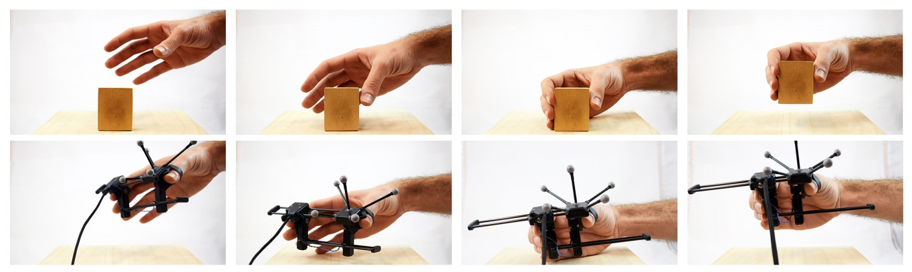

UIST 2017 highlights
===
posted: October 28, 2017

Picking up where I left off [3 years ago](/uist-2014) with this year's UIST
highlight reel. As expected, the research creatively applied interesting
principles, but many applications were adorably contrived. Also, I miss academia!

<!--more-->

## WhichFingers / characterizing end-to-end latency

Both papers used a finger-mounted vibration sensor made from a piezoelectric
polymer, and implemented simple finger tap detection.  One showed how this
method could be used for measuring latency using a blinking screen. They did a
great job of measuring latency at every stage.

<iframe src="//www.youtube.com/embed/s2iUJsm7JcI" 
frameborder="0" allowfullscreen class="video"></iframe>

The other paper had vibration sensors for each finger, and did time-based
correlation to determine which finger tapped a screen. They had a 30ms window
within which you had to fall to have unambiguous classification.  Interesting:
they also moved their vibration sensors up to the ring position (third phalanx),
and seemed to also get pretty good results. Also nice is that they [open sourced
everything][oss], and that the whole system is cheaper than $35.

[oss]: http://cristal.univ-lille.fr/~casiez/whichfingers/

## Carpacio: unobtrusive passenger & driver ID

The cheesily named project served to repurpose capacitative screens to
differentiate between drivers and passengers. Motivated by driver distraction,
cars are now shipping with on-screen UIs that are locked until you answer an
onscreen question: are you a driver or passenger?  This is counter-productive.
Edward Jay Wang from UW showed how the car system can identify who is
interacting with it automatically. Both seats are instrumented with signal
transmitters, transmitting a unique signal through each of the sitting people,
and the screen is instrumented with a receiver. The rest is signal correlation.
Then they did validation and got really good results (for research): > 99%
accuracy.

Zooming out for a second, I really wish that this wasn't a problem that needed
to be solved. Physical controls work better in a car, and allow the driver to
interact with them more easily.

## Grabity: ungrounded haptics for grasping

This project is an end-to-end look at an ungrounded device that provided haptic
feedback for grasping an object with your hand. They detailed each stage:
grabbing it, picking it up, feeling its weight, then moving it around and
feeling its inertia.

Weight is perceived by multiple senses in the human body: muscle spindles (eg.
in biceps), golgi tendons (eg. in elbow), mechanoreceptors sensing shear (eg. in
palm and fingers). Their idea: only use mechanoreceptors in hand, which lets you
simulate the equivalent of about 15g of weight. It was cool that they compared
the sensation to an actual weight with real users. I've seen prior work which
relies on asymmetric vibration to create virtual forces through skin
displacement. A few limitations: it looks pretty wacky, and users thought that
the constant vibration was annoying, but pretty cool tech demo.

## Dodecapen: 6DOF Pose Tracking System

This project puts a dodecahedron-shaped AR marker on the end of a regular pen. A
cube didn’t work because of pose ambiguity, and other Platonic solids have
triangular faces that are relatively small in area.

<iframe src="//www.youtube.com/embed/7Xczpq4VkHM" 
frameborder="0" allowfullscreen class="video"></iframe>

3D printing a perfect dodecahedron is hard, so they needed a calibration step
for it. The pen-tip also needs to be calibrated, since pens vary in size and
shape. Also the paper surface itself had to be calibrated. That's a lot of
calibrations! They used a mocap system with 8 markers to create ground truth.
Looked at the mean shortest distance and saw mm-level precision. They claim that
precision is comparable to a mocap system with 10 active cameras.

I also tried the demo, which worked very well. One caveat is that it relies on a
global shutter camera, so not sure how well it generalizes to smartphones yet.
Another big limitation here is that the dodecahedron needs to be in the camera’s
FOV.

## Inviso: 3D design environment to create sonic VR

Anil Camci showed a web-based GUI to define point sources as well as regions for
playing back ambisonic soundscapes. Point sources could have multiple cones that
you could attach with a graphical tool, and also adjust their direction, angles,
and amplitude. Each point source, and the observer could also be animated over a
trajectory. You could then play it back through the Web Audio API. Most of the
design is done from a top-down view, since this is a good match to human
auditory perception, which is much better at lateral than vertical
source differentiation.

In the end he showed multiple examples of people using the system and creating
complex auditory scenes, including overlapping zones, and animated, multi-coned
point sources. Seems to be quite efficient for building up immersive auditory
environments.

I encouraged them to recreate classic spatial audio demos, like my favorite
barbershop example. The editor is [available online](http://inviso.cc/), and
just recently [open sourced](https://github.com/CreativeCodingLab/Inviso).

## SoundCraft: smart watch interaction using hand generated acoustics

This project features a microphone array that fits onto a watch form factor.
They can localize sounds made by the other hand against itself (what is the
sound of one hand clapping?) or against another surface. Localization gives you
angles relative to the watch (angular resolution ~15 deg).

<iframe src="//www.youtube.com/embed/O1G-j1EBQh0" 
frameborder="0" allowfullscreen class="video"></iframe>

The applications were kind of weak, but having a small aperture (1/2 inch
between microphones) and wearable form factor was an interesting idea. They also
showed tracking the lateral position of a finger on the same hand as the watch,
and using the watch as an audio marker for an AR application.

## Data storage & interaction using magnetized fabric 

Justin Chan from UW showed what can be achieved when conductive fabric (woven
out of conductive thread) is magnetized using a permanent magnet. First they
explored various properties of the medium, like how long it stays magnetized
(28% decrease per week), how far the field can be detected from (up to 1cm), how
its properties vary with weave pattern (better for dense patterns), and whether
magnetization decreases from washing (not very much). The basic idea is that you
can encode data onto a conductive thread by having conductive segments that can
be magnetized interleaved with insulated segments. A binary string is then
encoded by mapping 0 to one polarity and 1 to the other.

They also showed use cases, such as writing and reading data from the clothing,
or even engraving data images (smallest pixel using a regular loom was 1.8cm^2)
onto clothing. They also showed some interactive examples where the clothing can
be read by a magnetometer on a phone or watch. This is interesting especially
because it doesn't require any batteries, and can be achieved using
off-the-shelf embroidery machines. 

## iSoft: soft touch and stretch sensor

This project uses electrical impedance tomography (EIT, which I know nothing
about, and wasn't explained) to detect touch and stretch in (1D) in a special
elastomer which is designed to be affordable. Discrete contact accuracy was
really good: 96%, using a small dataset. Distance error was ~10% of sensor size.

<iframe src="//www.youtube.com/embed/JVaYEl9nbME" 
frameborder="0" allowfullscreen class="video"></iframe>

Applications (as usual, weak): a bunch of instrumented objects (lamp, cup,
clothing, travel pillow, etc). Limitations: hard to make it big, hard to make it
arbitrarily shaped, doesn’t support multidimensional stretching.

## Mutual human actuation

I missed most of the VR sessions because parallel tracks were more interesting,
but caught this one because it was super clever. Previously, Haptic Turk used
support people to lift and lower the player immersed in VR. TurkDeck was an
environment for players that is constructed by support people outside VR.
However, previous research found that players enjoyed the experience more than
the support people, so Mutual Turk (presented here) made all participants into
players. Two people are in VR, but they are playing different games that are
complimentary in force (eg. A is fishing, B is flying a kite.)

<iframe src="//www.youtube.com/embed/JKGdQjx-_BI" 
frameborder="0" allowfullscreen class="video"></iframe>

This generalizes to two things: 1. shared props through which users exchange
forces, and 2. synchronization of state between the people involved. They had a
few other examples, like having one player fan a campfire, which created wind
for the other player in the middle of a storm. As far as practicality, obviously
this requires multiple people to be co-present, and also requires multiple
players to synchronize up to the action sequence.

## Demos, Posters, Contests

Apparently you can print piezoelectric elements. I tried a set that emits low
frequency vibrations for haptic feedback. But you need a special print process
(won’t work on an inkjet).

Artem Dementyev built a robot that walks along human skin using pneumatics.
Supposed applications in health care.

Pepper’s cone was a great illusion from Steve Seitz’s student. Nice improvement
over the usual ghost setup, which has four discrete viewing points, where here
you can pick any point in a circle.

Gierad showed a poster about a multimodal sensing platform that plugs right into
the wall and which can track all sorts of activity in the house, using high
frequency accelerometers, microphones, and other sensors.

Hanchuan Li from UW showed a poster summarizing some of his PhD projects,
including passive sensing, IR based user localization, and various power
harvesting techniques.

Jihyeon Janel Lee showed her poster which automatically created accompanying
visualizations for travel podcasts via geographic entity extraction.

The good folks at i.am showed a way of making TTS sound better by extracting
contours from speech spoken by a person onto a TTS-synthesized example.

The student design contest featured creative ideas implemented with the help of
an Arduino Braccio robot arm. One project required multiple people to operate
one arm. Each person had to do a gesture to operate one degree of freedom of the
arm. Another project involved two front body-mounted robot arms that fed the
other person. Yet another featured an improv show where an actor operated a sock
puppet, and a robot arm spoke lines that were crowdsourced by the audience.

## Keynotes...

**Gabriella Coleman** kicked off UIST 2017 with a slightly off-topic, but
nevertheless interesting (and timely) keynote, summarizing hacker culture from a
historical and anthropological perspective. Much of it was review for me, but I
also learned a fair amount:

- The origin of "hacker" comes from the Tech Model Railroad Club from MIT. Now
  James' fascination with model railroads is crystallizing.
- Some of the earlier phreakers were blind, and phreaking was empowering. Some
  were (sometimes additionally) gifted with perfect pitch, and could whistle the
  correct frequency to emulate phone network signals.
- The speaker's personal beliefs were very anti-US, and she was very aligned
  with the hackers. Perhaps it is not coincidental that she is at McGill now.

**Upon receiving a lasting impact award**, Ivan Popyrev gave a short summary of his
storied career. I liked his frankness on the topic of VR: "With every VR fad,
the next fad is the AR fad". At one point he also suggested that we need to
break away from “heavy reliance on rich visual feedback and undivided attention
from the user" that are common in today’s UIs. I completely agree. 

I liked his succinct vision: "How can we make the whole world augmented and
interactive?", which he then elaborates on as having two parts: 

1. Augment physical, tactile & proprioceptive channels of human augmentation & actuation.
2. Deliver novel UI at scale by integrating them into everyday physical objects.

I should come up with one for my HCI work. 

**Niki Kittur** closed off the conference with a summary of his crowdsourcing work,
and I was quite glad to see CrowdForge prominently mentioned in the beginning.
He did a good job weaving a coherent narrative throughout the last five years of
his career, which covered disparate topics such as peer production,
crowdsourcing and web browsing. I often wonder how much of that storytelling is
premeditated, and how much of it is done post-hoc. He showed off some neat
projects, including Alloy (name perhaps forge-related?) and KA, as well as
[Iota, a task-oriented browser][iota] inspired by V. Bush's vision of people
leaving trails of knowledge for one another.

I skipped the last few UISTs, and it was nice to say hi to some familiar faces,
especially from CMU. I also met some great people, including Danny Fan from an
[audio startup](http://i.am) in LA, some talented grad students and fortuitously
re-connected with old acquaintances (Hi Trevor) who are apparently also based in
Seattle. 

[iota]: https://iotabrowser.com
