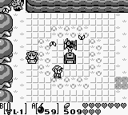

Zelda LEGO Mosaic
===
posted: September 13, 2019

I'm not much of a gamer these days, but one game series has a special place in
my heart. Link's Awakening was my first in the series, and remains my favorite.
You can imagine my excitement about its remake, due to land this month.  Twenty
five years later, the most memorable part of the game was of course the music.
But the graphics were amazing in their own right. Using a 160 x 144 greenscale
graphic display capable of rendering just four colors, a whole world came to
life. This is concentrated nostalgia:

This parismonious use of pixels and color lends itself super well to
reproduction as a LEGO mosaic! Here's a slightly colorized sprite from the DX
version. mosaic I made of the most iconic sprite from that game I could think
of: Link toting his shield through Koholint Island:

LEGO has this amazing service called Pick-a-Brick where you can buy spare parts
that ended up in your vacuum cleaner's dustbin. Or you can buy tiles and flats
and make an awesome mosaic. But how many of each color do you need? Not to
worry, I've got you covered. Here's a script that takes an image and counts the
colors in it. Fully assembled, LEGO Link makes an excellent coaster for the
office.

I tried doing the same for my second favorite Zelda: Link to the Past.
Unfortunately, a 16-bit color palette is way harder to replicate with LEGO's
limited set of colors, and the result isn't worth sharing.
[Onward!](https://www.youtube.com/watch?v=NccSaUwoibM)
