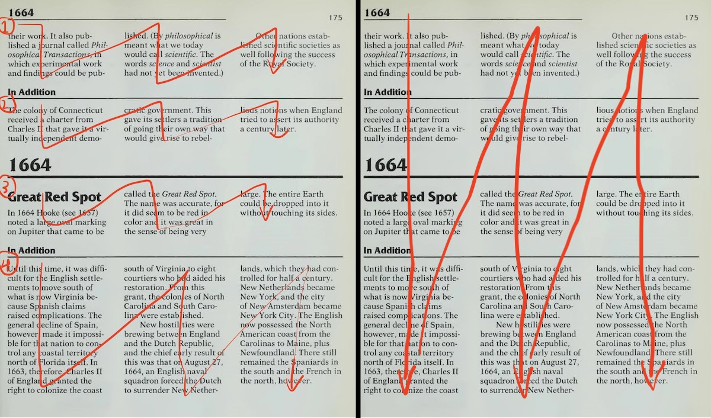
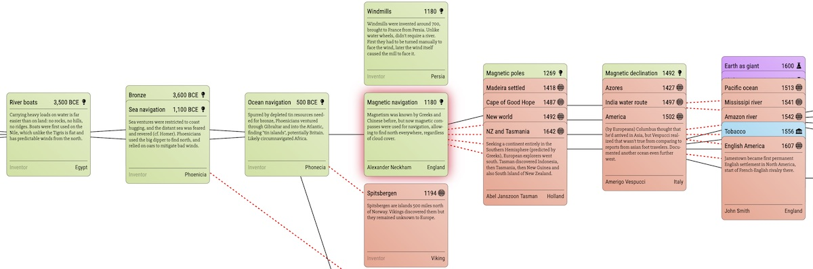

Visual Chronology of Science & Discovery
===
posted: February 11, 2020

As Newton wrote, “If I have seen further it is by standing on the shoulders of giants”. But whose giant shoulders did Newton stand on? And did those giants stand on the shoulders of other giants? And how about Newton’s successors, or people working in other fields? As far as I can tell, it’s giants all the way down.

Last year, I got my hands on a remarkable book, [Asimov’s Chronology of Science and Discovery](/books/asimovs-chronology-of-science-and-discovery/). It inspired me to produce a visual summary of human ingenuity, to see what one giant saw from the shoulders of another. After some experimentation, I turned it into an interactive visualization. You can play with it [here](https://borismus.github.io/asimov/web/cross-shape#steel):

<!--more-->

One of the unnerving things about Asimov’s book was the visual table of contents for the first edition:

Following this winding path is tricky to say the least. With this in mind, I carefully read the first quarter of the book, spanning from the beginning of time until 1700 CE, which amounts to about 300 entries, or about a quarter of those contained in the book. I took notes in a spreadsheet, providing a 1-2 sentence summary of each entry and manually extracting some key metadata. For each of Asimov’s entries, I captured the title, a couple sentences of description, the associated person’s name, and where the invention was created or discovery found, usually the country or empire.

In addition, I provided two extra fields which are more subjective and frankly, made up by yours truly, to bring the visualization to life: 

1. **Field**: which domain was this discovery made. (How granular should this be? Should Science be split up into Chemistry, Physics, and Biology?)
2. **Dependencies**: what older inventions and discoveries enabled this one. (This can be really tricky.)

With this in place, Asimov’s linear chronology becomes a directed graph, and since we don’t know how to time travel, there are no time cycles. So what we have is a [directed acyclic graph (DAG)](https://en.wikipedia.org/wiki/Directed_acyclic_graph). It is not a tree since I allow each node to have multiple parents. For instance, the field of Geometry is built up logically from axioms. At the same time, the founding text of the field, Euclid’s Elements, is mostly derived work from many mathematicians working before Euclid in the Academy and Lyceum. So the DAG shows **Geometry** rooted both in **Advanced Schools** and **Logic**.

## Manual entry is tiring

Sadly, the Chronology is not available as a text-based ebook, which complicates matters. As it turns out, optical character recognition (OCR) is not easy if your content is laid out like a newspaper:

Google Cloud Vision and [tesseract](https://github.com/tesseract-ocr/tesseract) don’t do well on complex text flows, often failing to recognize section boundaries. For the image above, tesseract wrongly assumes that that the text flows in three full height columns.

I also tried to do automatic entity extraction using python’s `nltk` and `ne_chunk` to automatically generate inventors and locations but a quick experiment yielded too many entities for each entry, meaning that I’d have to make a manual pass regardless, and this step would provide minimal time savings.

## Playing cards and tech trees

Each invention and discovery needs its own view. I gravitated to a card metaphor, which is often used in historical strategy games like Civ, role playing games like Diablo, and in many playing card games like Magic the Gathering. Here are a [few examples](https://www.are.na/boris-smus/tech-tree-cards) that inspired me.

One challenge that I found ultimately insurmountable was to find good images for each entry. While you can find reams of royalty free images, and even download them automatically using tools like [googleimagesdownload](https://github.com/hardikvasa/google-images-download), finding a set that is visually consistent was tough. I did this manually for the first hundred inventions. Theoretically a style transfer model might be able to convert them all to a consistent look. But ultimately, they didn’t add much value to the visualization as a whole, so I ditched the idea.

## Chronological visualization

To visualize the entries, I started with a naive approach: render all of the entries at once in a giant horizontal scrolling view, kind of like how tech trees work in Civilization-like games. Doing such a thing linearly makes no sense at all, since the first entry in the book is Bipedalis, dating to 4 million years ago (ma), followed by Stone Tools at 2 ma, Fire at 0.5 ma, then 8 entries later, Agriculture at 0.01 ma (10,000 years ago). This sort of timeline is best represented on a log-scale, which makes entries more reasonably spaced out, although still not perfect. Actually there’s quite a lot of variation in density. For example, this is the chronology of the first millennium CE (1000 years):

While this is just the 16th century (100 years, an order of magnitude shorter than above):

Even with the log-scale, inventions are by no means well distributed in time, with the 16th century far more visually dense than the first millennium. In both examples, links are especially obscure, since they often stretch out for many screens, and are basically impossible to trace from source to destination. 

I tried variants of this view as well, involving collapsing entries into more compact default representations, and allowing them to be expanded for more detail. One promising variant involved expanding a selected entry and all transitively linked ones, but the predecessors and successors are still typically positioned far off-screen, so a lot of scrolling is required.

## Entry-centric visualization

One of the shortcomings of a purely chronological view is that connections between entries are lost. Yet this is the most important part of this whole project, so I kept searching.

I opted for a more structured approach, one that lets you focus on a particular entry and at a glance see what technology led to it, and what technology it enabled. At the same time, I wanted to show the invention in its chronological context, in the spirit of Asimov’s book. So the current design takes a Cartesian approach, with one card centered at the origin, serving as the focus. Technologies that enabled the focused card are shown to the left and technologies that the focus enabled are shown to the right, along the x axis. Chronologically previous and next entries are shown along the y axis. 

## Technology transcending fields

Once the dependency graph is in place and each entry is associated with a field, one starts seeing interesting patterns in the data. 

The discovery of magnetism lead to the invention of the compass, giving navigators confidence to traverse the ocean, in turn leading to the discovery of the new world:

Melting glass beads and glass blowing enabled lens crafting and microscopes which in turn let careful observers see microorganisms in pond water, ultimately leading to great advances in medicine. 

Cross field dependencies like the ones I described above are visualized as dashed red arrows.

## Please help complete this project

This visualization is backed by a spreadsheet which is [publicly viewable](https://docs.google.com/spreadsheets/d/1hDNXas7DzwglB95HV2_2u1utWAwBZR2hQHlMPz-fj5A/edit#gid=0), the result of a bunch of my own reading and summarizing. I’ve compiled a quarter of Asimov’s impressive tome by hand, but I’d love your help finishing the project.

If you’re game to help, here are the necessary pieces:

1. A [PDF of the second edition of Asimov’s Chronology](https://drive.google.com/file/d/190RDAxrUzu5m0d_zxQi98euIguBDb0qf/view?usp=sharing) I scanned in hopes of automating the whole process (see above).
2. A [publicly editable spreadsheet](https://docs.google.com/spreadsheets/d/1uDeBCfcaVUfZFEK-0WJIb43dT6cqHHq9o6Uxn6PihLY/edit#gid=158368026) containing stubs for all of the inventions listed in the chronology from 1700 to 1993.

Please read a chunk of the latter quarter of the book (starting 1700) and contribute it to the public spreadsheet. I hope you will be as excited as I was to learn a whole lot about the history of science and compile it into this format. Once the project is complete, it will be glorious! 

I’ll update this post as more of the spreadsheet is filled out. Meanwhile, thanks for reading and stay tuned – I have a few follow up posts in mind already.