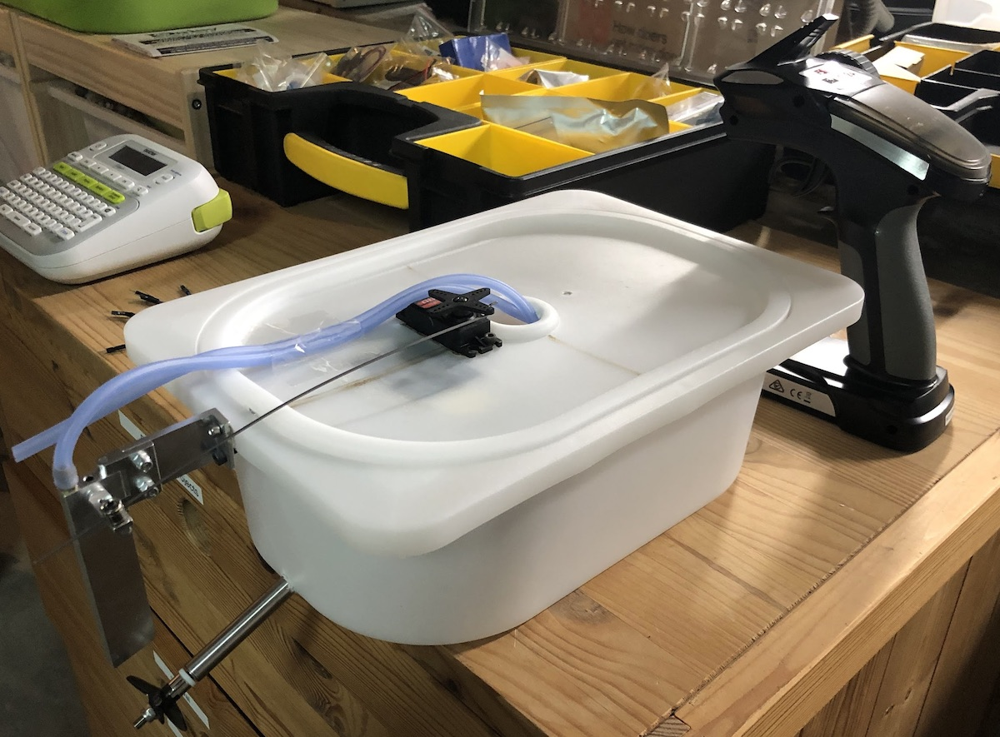
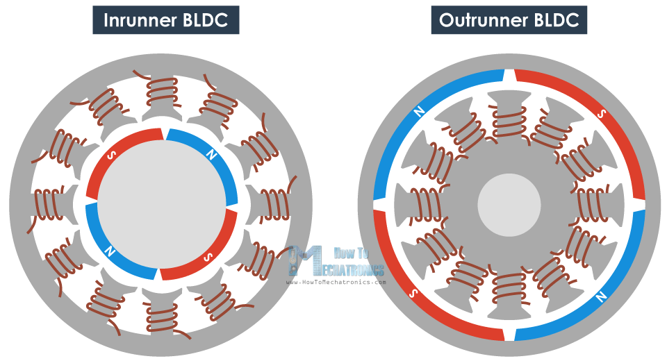

eSUP Build
===
posted: July 20, 2020
type: draft

Over the last couple of months, I’ve been tinkering with brushless electrical motors, trying to make floating objects move quickly. Inspired by [efoil.builders](https://efoil.builders) and a technical void to fill: knowledge and skills related to electric vehicles, I started by hacking a remote control “boat” from a plastic IKEA bin (max 30A, 11V, 5000 RPM, 3cm prop):

And moved on to motorize a paddle board (60A, 22V, 1000 RPM, 15cm prop):

Perhaps one day I’ll take it up an order of magnitude (120A, 50V), but I’m at a natural stopping point for now, so it’s a good time to capture some of my learnings.

<!--more-->

I’ve been spending a lot more time on the water, sailing and stand-up paddling as an escape from a sometimes monotonous routine, rarely interrupted by the luxuries I’m waning myself from: work trips, visits to Vancouver, exotic vacations.

After the COVID-induced sailing hiatus, I needed to find another way to get out on the water. SUPing was great fun, but a bit repetitive, and frustrating whenever there’s even light wind. I found [efoil builders](http://efoil.builders/), a community of crazy European kids building electric hydrofoils that scream above the surface of the water at breakneck speed.

I’m no stranger to riding strange electric vehicles, but I certainly was a stranger to high voltage and high current. When my Solowheel broke down and I was unable to fix it on my own, I donated it to an acquaintance who promptly replaced the battery and brought it into tip-top shape. My interest was piqued.

Coincidentally, the last few months have lent themselves well to doing a lot of electrical work around the house: installing new outlets in the basement, ceiling fans and window air conditioners in the bedrooms. These are not glamorous achievements, just small victories that add up to something.

# Building for gratification

There is something very satisfying about creating physical objects with your own hands. In these strange times, I find this to be one of my most comforting escapes.

If the resulting object is of value to you or others, so much the better. [Building for my daughter](/toddler-music-box) takes the cake, especially when she appreciates the results. [Building for community](/little-free-library) is also gratifying and surprising. But this time, I’m building for myself, to eventually go really fast. 

# What I learned

## Mysteries of brushless electric motors

**Principle**: A brushless motor is like a railgun, except rather than causing linear acceleration, it creates angular acceleration. There are two basic components: 

1. The rotor has a permanent magnet attached to it and rotates. 
2. The stator has electromagnetic coils attached to it, and is fixed body of the motor.

**Inrunner/outrunner**: An inrunner’s rotor is on the inside of the stator, coming out as a shaft. An outrunner’s rotor is on the outside of the stator, and typically the whole outside of the motor rotates. Outrunners tend to be have higher torque since the rotating part is larger.

**Names and dimensions**: Brushless motors are often named by their dimensions. A motor with a 60mm diameter and 100mm long is sometimes called 60D100L. Other times they are called 60100, and you're supposed to know how to parse that because you're super cool. The RC boat I built had a 2040, the eSUP’s was 5085.

**Voltage and RPM**: Many brushless motors have a KV rating, not to be confused with kW. KV is the ratio between voltage and RPM without load. The higher the voltage, the faster the motor will try to rotate..
 

## Speed controllers and VESC

Speed controllers are microcontrollers that know how to actuate the electromagnets in a brushless DC motor with the correct timing, based on sensing the current phase of the rotor. There are a variety of ways to sense this phase. 

**Sensored vs. sensorless**: Sensored brushless motors have hall sensors which sense the magnetic field of the permanent magnets affixed to the rotor. Sensorless motors rely on tracking [back-EMF](https://en.wikipedia.org/wiki/Counter-electromotive_force) generated as the rotor spins.

**PWM as input**: Brushless motors have a bunch of permanent magnets in the Speed controllers often also have the same “interface” as servo motors. They are controlled with PWM duty cycling. RC remotes are very plug and play as a result. The remote I bought has a giant trigger for throttle, which maps well to the speed controller (ESC). It also has a wheel for turning, which maps naturally to the servo rudder on my RC boat. The receiver has pins that plug into a standard 3-pin servo connector.

**FOC vs BLDC**: 

**ERPM vs RPM**:

**VESC is extremely powerful**: 

**Bluetooth in the field**: small range

- VESC is a whole universe
	- foc vs bldc
	- Bluetooth logging
	- ERPM and RPM

## Batteries

**Standard cells**: LiPo batteries are made out of one fundamental unit: a cell of nominal voltage 3.7V. Each LiPo pack is made by chaining multiple cells in parallel and in series. Battery packs are named after the number of cells in series and in parallel, like 6s2p means that there are 6 cells in series and 2 in parallel. 

**Voltage and charge**: One way to tell how much charge remains is to look at actual output voltage. As the battery discharges, its voltage drops too. Fully charged, each cell is 4.2V. Here’s a [good guide about LiPo batteries](https://rogershobbycenter.com/lipoguide) for more.

## Connectors and wires

**Connectors galore**: there is a huge number of connectors to connect wires in the RC world. There are T connectors, XT, EC, AS. And many variants of each. So generally speaking, you lop off the connector and replace it with the one you need. 

- Because I’m dealing with relatively high current applications, I was using EC5s and XT90s.

## Propellers

- propeller mounting is also super non-standard. Some shafts are threaded, others have an indentation. Others mount using a number of screws, others use a pin to attach to a hole in the shaft. 
- propellers are tricky but not impossible
	- there is a nice MIT course doc that taught me everything I know. Also handy that it includes cross sections.
	- Fundamentally pitch is to be thought of as if the prop was a screw going through a soft solid. 
	- The shape is a helix, but it's not just an extrusion, since each prop blade is a foil itself and generates not just displacement but also lift.
	- grass and weeds are a real problem. 
- hull speed is a thing. Many ways to travel on water: displacement, planing and foiling. Hull speed isn't a real limit, but the heavier the vessel, the harder it is to surpass. 

## Misc

- solid state relays aren't that scary actually. But they get super hot. Melted a substantial indent the seaHorse case. 
- kill switches are just switches. nothing crazy.
- soldering irons matter. I managed to overheat the motor so much that the contact fell out and I'd be screwed if not for an EE skilled friend. 

# Builds and parts so far

## Tropfast IKEA RC boat

ESC
Motor

## First eSUP attempt

Board, foamcore with Deep Tuttle port
Naish 65cm mast
[Flipsky 50A VESC based on V4.12](https://flipsky.net/products/torque-esc-vesc-%C2%AE-bldc-electronic-speed-controller)
[Flipsky 5085 motor](https://flipsky.net/products/f5085-140kv-brushless-motor-for-direct-drive-propeller)
[Gens Ace 6S 4 mAh LiPo battery](https://www.amazon.com/Gens-ace-4000mAh-Battery-Goblin/dp/B0721BJT3J)
Custom mast clamp ([onshape](https://cad.onshape.com/documents/9008f491eb3b37b138306395/w/151f8733bac1d09cb1fbce5b/e/dc088e9e03eb76f671d5bc26))
Custom prop for 5085 motor ([onshape](https://cad.onshape.com/documents/07ebbbfe9074e0b9b543ca4c/v/837c590e6d8c15772aa5432e/e/81de0414d9560e59eb06bc57))
