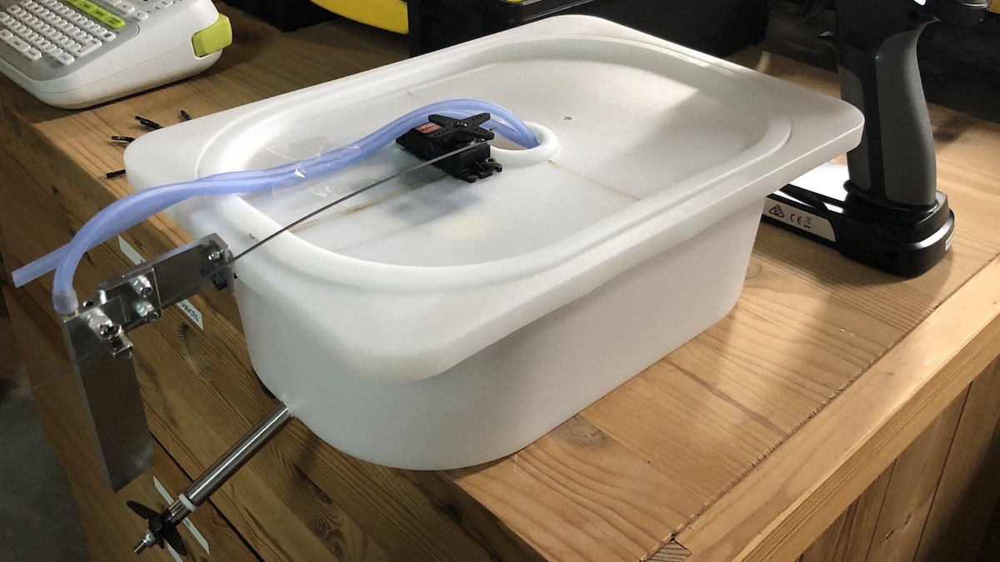
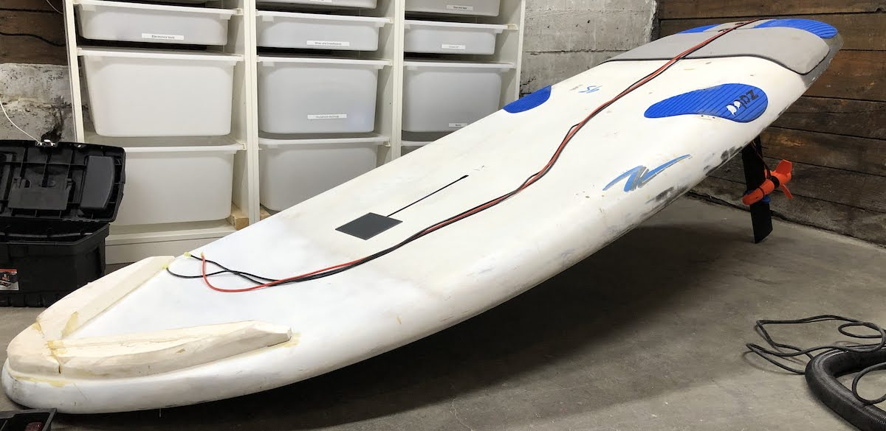
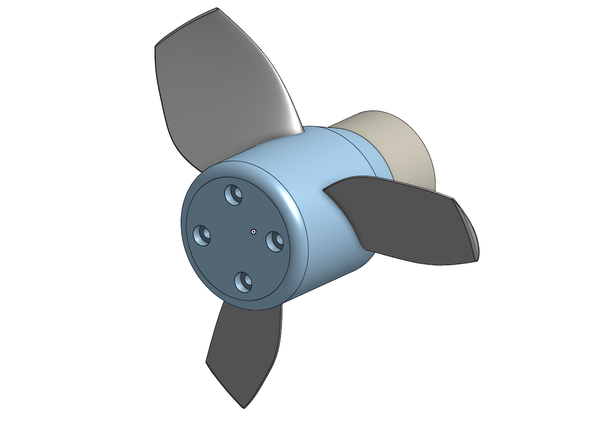

ESUP Builders
===
posted: July 30, 2020

Since May, I’ve been tinkering with brushless electrical motors, trying to make floating objects move more quickly. The proximate result is this electric motorized paddleboard:

This project is by no means finished. Traveling at 5 mph is fun, but not nearly fast enough. As we speak, a motor ten times the power of this one is sitting in a shipping container, en route to my basement. While I wait, let me pause and reflect on the project so far.

<!--more-->

---- 

This summer I’ve been spending more time on the water. Sailing and stand-up paddling are great escapes from a sometimes monotonous routine. As a result, I’m slowly forgetting luxuries I once took for granted: work trips, visits to Vancouver, vacations to faraway lands.

After my forced sailing hiatus, I needed to find another way to get out on the water. SUPing was great fun, but a bit repetitive, and frustrating in even light headwind. Driven by the need for speed, I found [efoil.builders](http://efoil.builders/). They are a community of crazy European kids building electric hydrofoils that scream above the surface of the water at breakneck speed.

I’m no stranger to strange electric vehicles, but I certainly was when it came to high voltage and high current. When my Solowheel broke down last year and I was unable to fix it on my own, I donated it to an acquaintance who promptly replaced the battery and brought it into tip-top shape. It took him no time at all, but I had no idea where to begin.

Happily, the last few months have presented many opportunities for electrical work around the house. I installed a ceiling fan in our bedroom and a window AC in my daughter’s. I wired up and installed new outlets in the basement. These are not glamorous achievements, just small victories that slightly reduced my fear of electricity.

# Building for …

There is something very satisfying about creating physical objects with your own hands. In these strange times, I find this to be one of my most comforting escapes.

If the resulting object is of value to you or others, so much the better. [Building for my daughter](/toddler-music-box) takes the cake, especially when she appreciates the results. [Building for the community](/little-free-library) is also gratifying and surprising. Sometimes you just build to learn. This time, I’m building for myself. And in this case, a big part of the challenge will be learning to ride the damn thing. I think I’m up for the challenge!

Realizing that I’m dealing with a completely new domain, and my chance of failure is high, I decided to start small. The first milestone was to create some sort of vessel from a plastic IKEA bin (max 30A, 11V, 5000 RPM, 3cm prop). Having proved the concept, I moved on to something that would support my weight, and substantially larger components (60A, 22V, 1000 RPM, 15cm prop).

Let me conclude with a parts list for both builds.

# Tropfast components

As you can see, this is not a seaworthy vessel.

Electronics:

- ESC: [Hobbywing Seaking 30A](https://www.amazon.com/gp/product/B00PR8XT7G)
- Motor: [Hobbywing Seaking 4800KV-2040SL](https://www.amazon.com/gp/product/B00PRAME7U)
- Battery: [POVWAY 5200mAh 3S](https://www.amazon.com/gp/product/B07TS2GVS3)

Mechanics:

- Hull: IKEA [TROFAST bin](https://www.ikea.com/us/en/p/trofast-storage-box-white-80089239/) with [TROFAST lid](https://www.ikea.com/us/en/p/trofast-lid-white-57454500/)
- Propeller: [uxcell D=36mm](https://www.amazon.com/gp/product/B07Q32KHDW)
- Motor mount: [L base for RC motors](https://www.amazon.com/gp/product/B07NWKGTZT)
- Rudder: [Basic RC boat rudder with water-cooling intake](https://www.amazon.com/gp/product/B0773D9L9X)

# SUPSMUS v1 components 

Electronics:

- ESC: [Flipsky 50A VESC based on V4.12](https://flipsky.net/products/torque-esc-vesc-%C2%AE-bldc-electronic-speed-controller)
- Motor: [Flipsky 5085 outrunner motor](https://flipsky.net/products/f5085-140kv-brushless-motor-for-direct-drive-propeller)
- Battery: [Gens Ace 6S 4 mAh LiPo battery](https://www.amazon.com/Gens-ace-4000mAh-Battery-Goblin/dp/B0721BJT3J)

Mechanics:

- Hull: Foiling board with Tuttle box. Bought it from a guy on craigslist.
- Propeller: [3D printed prop design](https://cad.onshape.com/documents/07ebbbfe9074e0b9b543ca4c/v/837c590e6d8c15772aa5432e/e/81de0414d9560e59eb06bc57)

- Motor mount: [Naish 65cm mast](TODO) and [3D printed mast clamp](https://cad.onshape.com/documents/9008f491eb3b37b138306395/w/151f8733bac1d09cb1fbce5b/e/dc088e9e03eb76f671d5bc26)

# Shared components

As you can see, both vessels have a lot of component types in common. So much so that I simply reused some of the same parts in both projects:

- Remote: [Flysky FS-GT2E](https://www.amazon.com/gp/product/B00VE3QC7C)
- Charger: [Haisito 80W 6A Balance Charger](https://www.amazon.com/gp/product/B07QRQT3LC)

I plan to write up a technical summary of what I learned in the process. Stay tuned.