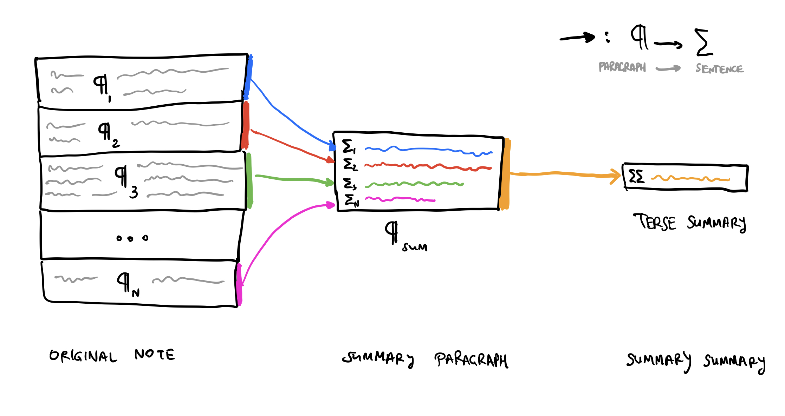

AI note garden: summarizer
===
posted: December 17, 2021

One benefit of keeping a long term note garden is that you can have
conversations with your past self. You wake up a slightly different person every
morning. Aggregated over years and decades, you slowly become a very different
person. But if you've been taking notes, a crystallized past self is still
around!

Unfortunately, your past self kinda sucked at note taking. He wrote too
verbosely. He was not familiar with note hygiene like putting the [Bottom Line
Up Front](https://en.wikipedia.org/wiki/BLUF_(communication)). Worst of all, he
picked the least descriptive note names, like "3D Automaton", "Geo Games", and
"Run". If he was still around, you would tell him to read [How to Take Smart
Notes by Sonke Ahrens](/books/how-to-take-smart-notes/), but your old self is
long gone.

What if we could summarize overlong, unstructured, poorly named notes
automatically, into terse but precisely descriptive golden nuggets?

<!--more-->

Just think of the possibilities...

- We could auto-generate far better names for your old notes, or suggest names
  for new ones.
- We could remind you what a rambling note was really about, or suggest a BLUF
  paragraph for notes that seem to be missing it.
- Each note's summary could then be used in other automatic generation tasks!

# So how can we summarize long notes automatically?

Large Language Models (LLMs) like GPT-3 are built on Transformer, a neural
network architecture that Google Research invented and open-sourced in 2017.
These models are trained on huge amounts of data, hence "Large". They are
designed to be universal, capable of performing a variety of different tasks.
Given some input text, the LLM predicts what words should come next. This simple
input-output signature leads to surprisingly flexible results. 

As of 2021, LLMs seem to produce more compelling text summaries than older
models specialized for this purpose.

## Constraints of LLMs

Although input length limits increased substantially since GPT-2, **input length
is still limited** to 2048
[tokens](https://help.openai.com/en/articles/4936856-what-are-tokens-and-how-to-count-them),
which maps to roughly 8000 chars. Some of my notes are well beyond this limit,
so inputting a long note verbatim is not possible. 

Even without the token limit constraint, there is a natural **recency bias**
towards the latter part in the input. The model continues the provided input
string, so the last words of the input are naturally weighted more heavily.

Also, LLMs are trained on giant amounts of text, mostly harvested from things
people write on the internet. On the internet, nobody knows you're a dog. Dogs
can be a little bit crass, or make up facts, so it's no surprise that GPT-3
often does the same.

# Summarization ¶ by ¶ by ¶

One naive approach might be to take the whole note, its first few sentences, or
its first couple paragraphs, and feed this as input to the summarizer. Even if
the note fits within the GPT-3 token limit, we would end up indexing on
arbitrarily selected last sentences of the input.

To better sample the whole note, my approach is inspired by [OpenAI's book
summarization](https://openai.com/blog/summarizing-books/), and reminiscent of
techniques I used for [CrowdForge](https://smus.com/crowdforge/). I summarize a
note paragraph-by-paragraph, where each paragraph becomes a line in a new
"paragraph" I call the summary. If an even greater summarization is desired, the
resulting paragraph can itself be summarized. My summarization approach,
succinctly:

**GPT-3 and Markdown**: Markdown's funny characters can safely be stripped
before summarizing. Seeing URLs in the input makes GPT-3 want to produce URLs
too. These URLs look legit and the domain is often a real website, but the path
is almost always hallucinated. To prevent GPT-3 from generating bizarre
punctuation and URLs to nowhere, I convert the markdown to plaintext, and strip
all links.

**Short paragraphs**: Some paragraphs are short and don't need to be summarized.
Single sentences can be thrown into the intermediate summary directly.

# Zero-shot, few-shot, fine-tuning, oh my!

**Zero-shot** is the simplest possible way to get GPT-3 to produce a summary of
input text. Here, we provide plaintext instructions requesting that a summary be
generated, with no examples of what sort of output we would like. Here's a
python f-String template that we can fill out and send to GPT-3:

    f'''Paragraph: 
    {paragraph}
    One sentence summary:'''

**Few-shot** gives more control over the output. We can include a few examples
of expected results before providing the input paragraph: 

    f'''Paragraph: 
    {example_paragraph_1}
    One sentence summary: {example_summary_1}
    Paragraph: 
    {example_paragraph_2}
    One sentence summary: {example_summary_2}
    Paragraph: 
    {example_paragraph_3}
    One sentence summary: {example_summary_3}
    Paragraph:
    {input_paragraph}
    One sentence summary:'''

**Fine-tuning** s the next level in optimizing output of the summarizer would be
to fine-tune the model with thousands of examples.

So far, I've found that few-shot and zero-shot paragraph summarization leads to
results that are on par in terms of their subjective quality. But prompt design
is not an exact science, and I'd expect better of an NLP expert (is that you?
please email me 😇).

Enough rambling. Show me the summaries, Lebowski!

# The good, the bad, and the funny

<table class="waffle" cellspacing="0" cellpadding="0"><tbody><tr style="height: 45px"><td class="s0" dir="ltr">Note name</td><td class="s0" dir="ltr">Zero-shot Sumsum</td><td class="s0" dir="ltr">Ratio</td><td class="s0" dir="ltr">Rating</td></tr><tr class="good" style="height: 20px"><td class="s1" dir="ltr">The Coming Shock That Will Transform the U.S. Economy - bloomberg.com</td><td class="s1" dir="ltr">The rise of telecommuting, or working from home, was given a major boost by the pandemic, when so many Americans were forced to work from home.</td><td class="s2" dir="ltr">17.08 x</td><td class="s3" dir="ltr">GOOD</td></tr><tr class="good" style="height: 20px"><td class="s1" dir="ltr">Matthew effect of accumulated advantage - success to the successful</td><td class="s1" dir="ltr">The rich get richer, and the poor get poorer, and the rich get richer.</td><td class="s2" dir="ltr">4.39 x</td><td class="s3" dir="ltr">GOOD</td></tr><tr class="good" style="height: 20px"><td class="s1" dir="ltr">How Limiting Latin Mass May Become the Defining Moment for Pope Francis - theconversation.com</td><td class="s1" dir="ltr">The Vatican has concluded that the traditional Latin Mass has not brought about the church unity Pope Benedict had hoped for.</td><td class="s2" dir="ltr">13.86 x</td><td class="s3" dir="ltr">GOOD</td></tr><tr class="good" style="height: 20px"><td class="s1" dir="ltr">Darkness at Noon by Arthur Koestler</td><td class="s1" dir="ltr">The novel is set in the Soviet Union in the 1930s. It is the story of a man who is arrested, tried, and convicted of crimes he did not commit. He is sent to a labor camp to be executed. He is released, and he tries to find the real criminals.</td><td class="s2" dir="ltr">10.98 x</td><td class="s3" dir="ltr">GOOD</td></tr><tr class="ok" style="height: 20px"><td class="s1" dir="ltr">Grandpa interview</td><td class="s1" dir="ltr">REDACTED tells his life story, from his birth in REDACTED, to his immigration to Canada in the early 1950s.</td><td class="s2" dir="ltr">13.13 x</td><td class="s4" dir="ltr">OK</td></tr><tr class="ok" style="height: 20px"><td class="s1" dir="ltr">Rules of play notes</td><td class="s1" dir="ltr">A game is a conversation between a game designer and a player. The designer creates the rules of the game, the player creates the experience of the game.</td><td class="s2" dir="ltr">16.63 x</td><td class="s4" dir="ltr">OK</td></tr><tr class="ok" style="height: 20px"><td class="s1" dir="ltr">VR Ideas</td><td class="s1" dir="ltr">The future of VR is a giant simulation of the real world.</td><td class="s2" dir="ltr">20.37 x</td><td class="s4" dir="ltr">OK</td></tr><tr class="bad" style="height: 20px"><td class="s1" dir="ltr">LiPo Batteries and Wiring</td><td class="s1" dir="ltr">The Solowheel is a self-balancing, electric unicycle. It is powered by a lithium polymer battery, and is controlled by a gyroscope. The gyroscope is a sensor that measures the rate of rotation around the three axes. The rider can control the speed of the wheel by leaning.</td><td class="s2" dir="ltr">4.83 x</td><td class="s5" dir="ltr">BAD</td></tr><tr class="bad" style="height: 20px"><td class="s1" dir="ltr">Parable of the Monkey on a Pedestal</td><td class="s1" dir="ltr">The first step should be to teach the monkey to read and recite Shakespeare.</td><td class="s2" dir="ltr">3.3 x</td><td class="s5" dir="ltr">BAD</td></tr><tr class="bad" style="height: 20px"><td class="s1" dir="ltr">List of human hormones</td><td class="s1" dir="ltr">The Culture is a post-scarcity society that has developed a technology that allows its citizens to secrete hormones on demand.</td><td class="s2" dir="ltr">5.58 x</td><td class="s5" dir="ltr">BAD</td></tr><tr class="bad" style="height: 20px"><td class="s1" dir="ltr">REDACTED sleep diary 2020</td><td class="s1" dir="ltr">She&#39;s a little shit.</td><td class="s2" dir="ltr">30.7 x</td><td class="s5" dir="ltr">BAD</td></tr><tr class="bad" style="height: 20px"><td class="s1" dir="ltr">Complexity happens in a sweet spot</td><td class="s1" dir="ltr">Complexity is the amount of interdependence, connectedness, diversity, and adaptation in a system.</td><td class="s2" dir="ltr">19.45 x</td><td class="s5" dir="ltr">BAD</td></tr><tr class="bad" style="height: 20px"><td class="s1" dir="ltr">The Wind&#39;s Twelve Quarters by Ursula K. Le Guin</td><td class="s1" dir="ltr">A man is on a train and sees a woman who looks exactly like his wife, but he&#39;s not sure if she is. He gets off the train and follows her, and finds out that she is his wife.</td><td class="s2" dir="ltr">9.43 x</td><td class="s5" dir="ltr">BAD</td></tr><tr class="bad" style="height: 20px"><td class="s1" dir="ltr">Zone of Proximal Development (ZPD)</td><td class="s1" dir="ltr">The zone of proximal development is the difference between what a learner can do without help and what he or she can do with help.</td><td class="s2" dir="ltr">3.82 x</td><td class="s5" dir="ltr">BAD</td></tr><tr class="bad" style="height: 20px"><td class="s1" dir="ltr">Revolutionary technology vs technology revolution</td><td class="s1" dir="ltr">The internet is fucking awesome, but it isn&#39;t world changing.</td><td class="s2" dir="ltr">7.8 x</td><td class="s5" dir="ltr">BAD</td></tr></tbody></table>

Some things to highlight from the results above:

- Some facts are completely made up, even with the original content to ground
  GPT-3. The 1950s aren't mentioned anywhere in `Grandpa interview`.
- Lists like `VR Ideas` and the Ursula Le Guin short story collection are
  summarized in really unsatisfying ways.
- GPT-3's synthesis between a diaper change, and too many wake-ups? "She's a
  little shit." I sometimes feel that way too!
- **Cherry picking**: Some summaries overindex on one part of the note, and
  ignore the rest. 
  - Overly focused on Solowheel in `LiPo Batteries and Wiring` even though I
    only used it as an example of an EV using lithium iron phosphate battery
    batteries.
  - Completely ignores the actual hormones in `List of human hormones`, and just
    focuses on a small aside about the Culture novels. 
  - Ignores the pedestal in `Parable of the Monkey on a Pedestal`, focusing on
    just getting the monkey to read Shakespeare. Admittedly, this is the point
    of the parable, but the result is not an adequate sumary.

# Too much variety

Looking through some of these random notes and their generated summaries, I am
reminded of the wide variety of notes in my garden. Some are collections of
favorite poems, quotes, and words I like. Others include references to images
and tables. Book summaries, meeting notes, recipes, sometimes even fragments of
code are all found in my garden.

To produce better summaries in the future, I'd first classify what sort of note
we're dealing with, and then pick from a variety of different summarization
techniques. The current approach doesn't work well on lists. Fragments of code
don't need to be summarized at all.

So that's Summer, the note summarizer. She could use more work, but I'm going to
call it a day for now. I'll be back soon to introduce you to another AI-based
note gardener apprentice.
