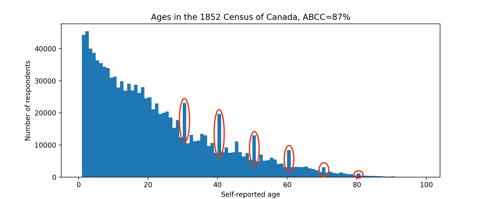
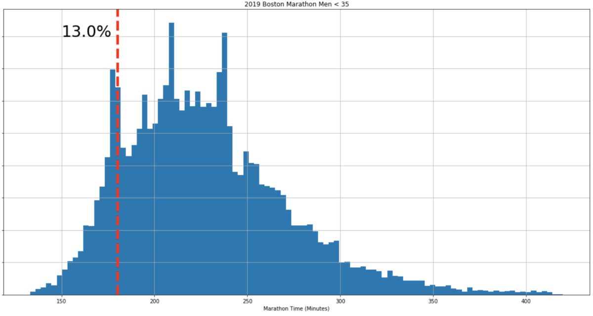
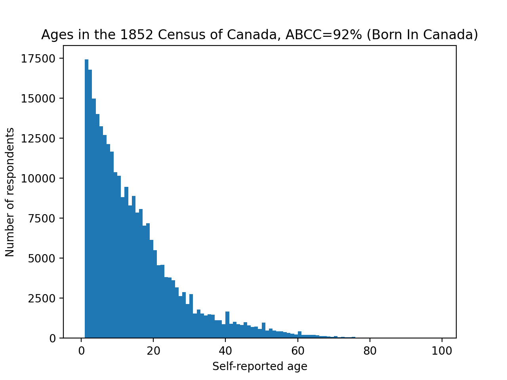
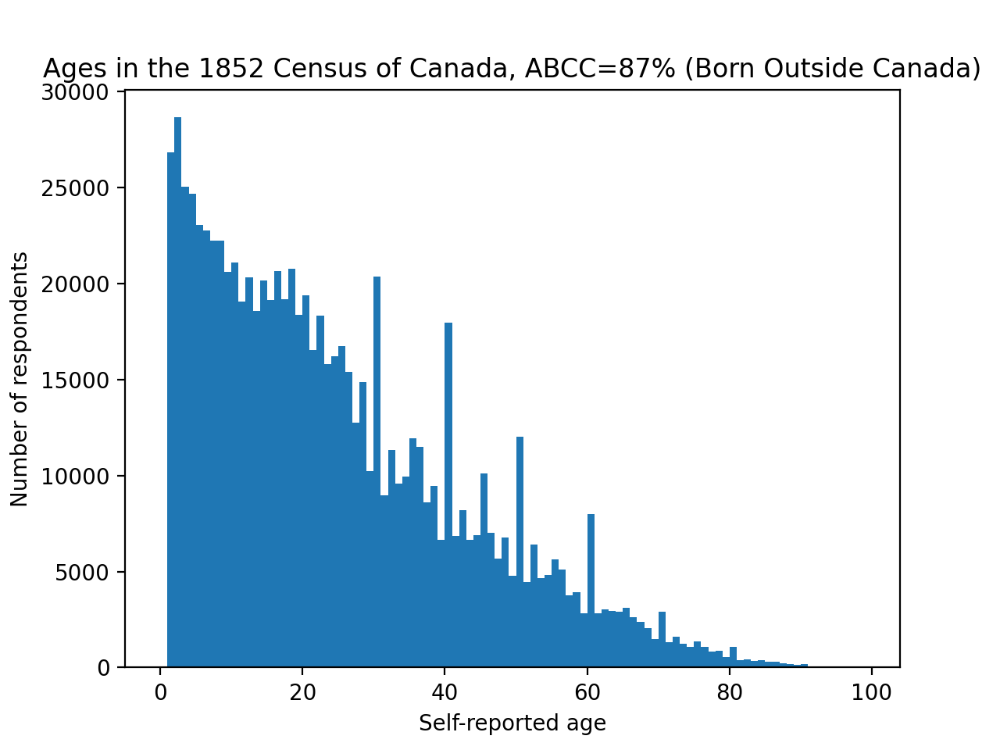
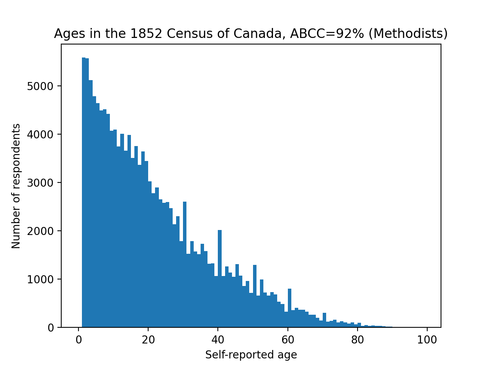
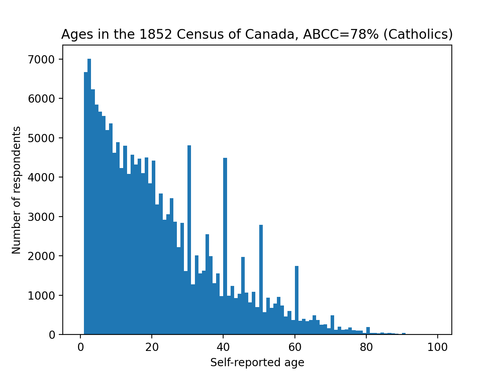

Diffusion of Literacy in 19th Century Canada
===
posted: June 21, 2021

The ancient Sumerians invented writing sometime around 3500 BCE. But how did
writing get refined? How did it spread outside of Sumer? In general, tracking
diffusion of ancient technology is hard. For tracking the spread of literacy,
however, here's an interesting idea. Innumerate people may fudge their
self-reported age to round or auspicious numbers. Individually, this leads to
[terrible earworms][blink-182]. In aggregate, this error is called age heaping
and may be a decent proxy for literacy. In this post, I dig into the Province of
Canada's 1852 census, scraped from automatedgenealogy.com. To whet your
appetite, just look at these beautiful age heaps:

Splitting the census data by demographics and calculating the [ABCC Index][abcc]
on each, what can we infer about literacy in 19th Century Canada?

<!--more-->

# Timelines shminelines

It's easy to create a timeline of historical inventions. Steam Engine? No
problem: 100 CE. Musical Notation? 2000 BCE. Bam! Land mines? 1277. There are
[many](https://en.wikipedia.org/wiki/Timeline_of_historic_inventions)
[such](https://smus.com/visual-chronology-science-discovery/)
[timelines](https://localhistories.org/a-timeline-of-science/)
[available](https://www.amazon.com/s?k=chronology+science&i=stripbooks&ref=nb_sb_noss).
But the first known working date of an invention is usually a miniscule part of
the whole story. More interesting is what led to the invention being practical.
How was it refined? How did it spread? What was the impact? What cascade of
other inventions did it lead to? What were the cultural implications, the second
order effects?

# Technological diffusion is hard to measure

William Gibson famously quipped, "the future is already here —  it's just not
very evenly distributed." Well, how uneven is the distribution? What about over
time? For ancient inventions, the archaeological record is often sparse.
Historians of technology fall back to depictions in art and philolology, both
often controversial sources.

# Aside: psychology of numbers

I recently came across some finishing times for the 2019 Boston Marathon, which
included very clear peaks at the qualifying time (~3h for that year) as well as
round numbers:

It's inspiring to see people strive for and achieve goals. When I tweeted this,
@MelancholyYuga introduced me to a phenomenon I'd not heard of called Age
Heaping.

# Literacy from self-reported age?

Here's the theory: people that struggle with numbers often don't know their own
age precisely, instead producing a round or lucky number.  Perhaps because they
can’t subtract to infer their current age from their birth year and the current
year. Or perhaps because they don't know their birth year at all. In aggregate,
these errors add up to create Age Heaps, clearly visible at decades, with
smaller peaks at ages ending in 5.

Given any survey with self-reported ages, one can calculate a metric that
estimates the literacy of a population. [Various indices][abcc] like Whipple's
Index or ABCC Index quantify this.

# Finding an early census is hard

Rather than read boring papers, I decided to try this idea on a raw dataset. I
immediately thought of the Domesday book, a famous medieval English survey.
Happily, it's been digitized and is available online in quite a nice form at
[opendomesday.org](https://opendomesday.org/). Unfortunately, the survey was not
granular enough to ask for self-reported ages, mostly focusing on the shire
level.

Newer historical census data is generally owned by the government, but then
digitized and indexed by private companies usually focused on genealogy, such
as <https://familysearch.org>. A fascinating wrinkle on early US censuses:
before 1840, the US census only named the head of household and then bucketed
dependents into seemingly arbitrary age categories: (0-10, 10-16, 16-26, 26-45,
45+). This throws a wrench into finding any Age Heaps.

Another source for data with self-reported ages are US passenger arrival
records, for example this [Ellis Island arrival
database](https://heritage.statueofliberty.org/). Once again, you can search the
corpus via their website, but they do not provide the underlying dataset, even
if you ask them nicely by email.

# 1852 Census of the Province of Canada

I was about to throw in the towel but then found
<https://automatedgenealogy.com>, a crowdsourced effort to digitize old
(pre-1920) Canadian censuses. Digitizing a census is tricky since the records
were entirely handwritten in flowing cursive, and I don't think we have good
enough OCR to make a dent on this problem. So the process involves transcribers
and verifiers working in tandem. I'm not entirely sure how well vetted the [data
from the site](http://automatedgenealogy.com/census52/index.jsp?locale=en) is,
but I scraped it to do this analysis anyway. 

This census includes the following fields:

1. Name
1. Occupation
1. Country of Origin
1. Religion
1. Self-reported Age (YAY!)
1. Sex

The self-reported age field is key. But the other demographic information is
also interesting. Looking at ABCC scores for sub-populations will be fun.

# ABCC Indices by demographics

First off, I was pleasantly surprised to see very clear age heaping in this
census.

<table>
  <tr><th></th><th>ABCC Score</th><th>Souls</th></tr>
  <tr><td>Overall</td><td>88%</td><td>1134930</td></tr>

  <tr><th colspan=3>Geography</th></tr>
  <tr><td>East (Quebec)</td><td>91%</td><td>481108</td></tr>
  <tr><td>West (Ontario)</td><td>85%</td><td>653822</td></tr>

  <tr><th colspan=3>Birthlace</th></tr>
  <tr><td>Born in Canada</td><td>92%</td><td>273873</td></tr>
  <tr><td>Born outside Canada</td><td>87%</td><td>861057</td></tr>

  <tr><th colspan=3>Occupation</th></tr>
  <tr><td>Labourer</td><td>79%</td><td>83754</td></tr>
  <tr><td>Farmer</td><td>86%</td><td>80544</td></tr>
  <tr><td>Servant</td><td>71%</td><td>13378</td></tr>
  <tr><td>Wife</td><td>89%</td><td>11214</td></tr>
  <tr><td>Spinster</td><td>87%</td><td>5992</td></tr>
  <tr><td>Carpenter</td><td>88%</td><td>5511</td></tr>
  <tr><td>Yeoman</td><td>88%</td><td>4505</td></tr>
  <tr><td>Blacksmith</td><td>90%</td><td>3226</td></tr>
  <tr><td>Merchant</td><td>92%</td><td>2327</td></tr>
  <tr><td>Housekeeper</td><td>82%</td><td>1743</td></tr>
  <tr><td>Teacher</td><td>85%</td><td>1737</td></tr>
  <tr><td>Tailor</td><td>91%</td><td>1713</td></tr>
  <tr><td>Cooper</td><td>87%</td><td>1617</td></tr>
  <tr><td>Weaver</td><td>81%</td><td>1277</td></tr>
  <tr><td>Miller</td><td>89%</td><td>1137</td></tr>

  <tr><th colspan=3>Religion</th></tr>
  <tr><td>Catholic</td><td>78%</td><td>176343</td></tr>
  <tr><td>Methodist</td><td>92%</td><td>145544</td></tr>
  <tr><td>Church of England</td><td>84%</td><td>111262</td></tr>
  <tr><td>Presbyterian</td><td>85%</td><td>104949</td></tr>
  <tr><td>Episcopalian</td><td>86%</td><td>37826</td></tr>
  <tr><td>Church of Rome</td><td>73%</td><td>11208</td></tr>
  <tr><td>No Religion (explicitly)</td><td>91%</td><td>2850</td></tr>
</table>

# Wait, what exactly are ABCC Indices measuring?

But is it really the case that if you don't know your age, you're likely to be
innumerate? All signs [point to yes][blink-182].

More seriously, a [big caveat](https://onlinelibrary.wiley.com/doi/10.1111/ehr.13087?af=R) applies here:

> Though it can stand in as an acceptable proxy for literacy, our findings
suggest that age-heaping is most plausibly interpreted as a broad indicator of
cultural and institutional modernization rather than a measure of cognitive
skills.

# Mostly open questions around the edges

I suppose it makes sense that merchants (ABCC 92%) and skilled craftsmen
(Blacksmith 90%, Tailor 91%) would be more advanced on a measure of "cultural
and institutional modernization" as compared to servants (71%) and laborers
(79%).

It also makes sense that those born in Canada would remember their age better
than immigrants. The simplest explanation is that those born in Canada are
generally younger. Looking at the two age distributions side-by-side is
revealing:

But why are residents of Canada East so much better at telling their own age
than those of Canada West? 

And why do Methodists know their age so much better than Catholics? I've always
found protestant denominations mysterious. The plot thickens!

Speculating wildly, if your culture is really into birthdays, you would closely
track your age and the age of close relatives. Knowing your own age would then
have little bearing on your ability to write or do arithmetic, throwing shade on
the whole premise.

# Eyes on the prize

I'd originally hoped to find a way to measure diffusion of literacy
over time. But the 1852 Census of Canada only gives a single snapshot in time,
and other census data available on automatedgenealogy.com does not overlap
geographically.  In search for more data, I found and purchased [Russians to
America Passenger
Data](https://aad.archives.gov/aad/series-description.jsp?s=4434&col=1002),
covering 1834 - 1900.

Quick pre-registration of hypotheses on that dataset:

- Subsequent waves of Russian immigrants exhibit increasing ABCC. 
- Strong correlation between size of city of origin and ABCC.

Stay tuned and find out.

[abcc]: https://en.wikipedia.org/wiki/Whipple%27s_index
[blink-182]: https://www.youtube.com/watch?v=K7l5ZeVVoCA
