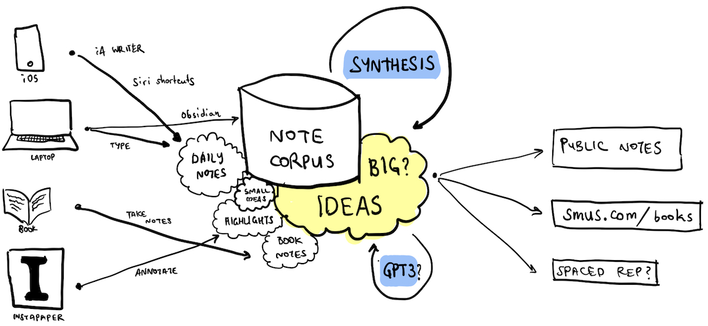

File Systems for Thought
===
posted: September 8, 2021

Tools for Thought are all the rage these days. Unfortunately, most of these tools assume one corpus per tool, and the interoperability story is [very poor](https://subconscious.substack.com/p/composability-with-other-tools). At the same time, it's pretty clear to me that no single app can serve as my [second brain](https://thesephist.com/posts/browser/). What I need instead is a [System for Thought](https://speakerdeck.com/adewale/tools-for-thought-from-the-memex-to-index-cards?slide=13) that supports many different tools working seamlessly together.

The solution I have arrived at is a cloud-synchronized directory of plaintext [files](https://jenson.org/files) and images. Here's a visual summary of what's going on in my system for thought today:

This system has two key advantages: 

1. **Tool choice**: I can choose my favorite among multiple existing tools
2. **Hackability**: I can build my own tools to support specific needs

<!--more-->

# Advantages: tool choice & hackability

One advantage of this approach is that I can pick and choose which editors to use across multiple platforms. On desktop, I tend to the corpus using Obsidian. On mobile, even though Obsidian recently launched an iOS app, I prefer to continue using iA Writer. Additionally, I can quickly jot notes using a Siri shortcut from an iPhone.

Another advantage is that as a programmer, I have full control to build solutions that work well for my needs. I've built my own scripts to synchronize reading highlights from Instapaper. I have multiple tools do automatically scheduled cleanup tasks, auto-deploy a subset of my corpus to the web. Below, I'll describe these components in more detail.

# Note corpus storage

My notes are stored in a directory of plaintext markdown files. These are also interlinked with Wiki-style markup. They are currently synchronized to iCloud Drive to make interoperability with iOS easier, while still allowing the notes to be accessed across multiple devices.

In theory, I aim for terse, evergreen notes that use the [[BLUF TLDR note taking style]]. But in practice, I keep many kinds of notes in the same corpus, and rely extensively on title- and full-text search.

## Small ideas

I use my note corpus for a lot of unimportant, practical things pretty far from any sort of intellectual pursuit. These include: 

- temporary shopping lists
- household notes, like car repair and nanny payments
- notes from conversations with people (stored in `Meeting notes/`)
- daily notes (stored in `Inbox/`)
- longer term TODO lists like [[WORK NEXT]]
- notes for new project ideas
- running notes for ongoing projects, like [[eFoil project notes]]

## Bigger ideas

I like to read actively and synthesize what I read to try to create a deeper understanding. Some of these notes are half-formed ideas at best, others are taken in a hurry when I am away from a computer. Others aspire to [evergreen status](https://notes.andymatuschak.org/Evergreen_notes). 

Anyway, let me describe more of the system in three steps:

1. Inputs: How do notes begin?
2. Synthesis: How are notes refined and intertwingled?
3. Output: What do notes turn into?

# 1. Inputs: how do notes begin?

## On a computer

On Desktop, I tend to have some time and can create a new note start-to-finish. I typically do this with Obsidian, which affords a nice editor and native support for traversal of wiki-style links.

I take meeting notes using Obsidian and store them separately (in `Meeting notes/`), and make random daily notes which get stored in a daily file such as `Inbox/2021-09-08.md`.

## On a mobile phone

iA Writer supports iCloud Drive well and supports fast indexed, full-text search. Although it doesn't understand wiki-style links, it's a great way of quickly looking up a note, or appending to a specific list. For example, I'll often add a new word to my [[Words I didn’t know well]] when I encounter it for the first time.

## On the go

Inspiration strikes at the most inconvenient times, often when I'm walking somewhere in nature. On iOS, I use a Siri Shortcut that I built to quickly dictate or type a semi-formed idea that may emerge on the go. Two slightly different shortcuts support both typing and dictation, and the result of either is to append the note text to the daily note (`Inbox/2021-09-08.md`). The [Back Tap accessibility gesture](https://support.apple.com/en-us/HT211781) is quite a handy way of triggering this shortcut.

Siri Shortcuts are a bit more awkward on the Apple Watch, since it takes a surprising amount tapping to invoke. I've also attempted to take notes completely hands free using AirPods by saying "hey siri note" which invokes my awesome shortcut. However this is quite frustrating in practice. Dictating notes, I often take a short pause to gather my thoughts, which triggers the silence detector in this dictation mode, and truncates my input. I'd love to be able to explicitly to trigger the end of dictation while hands free. My preferred solution would be a "safe word". Hufflepuff!

## Reading articles

My current article reading workflow is to funnel everything into Instapaper. I filter articles from friends, private groups on Discord, twitter, and general web browsing. If from a quick skim the article seems worthwhile, I'll cue up in Instapaper to calmly read at a later point.

I aspire to read actively, making heavy use of Instapaper's annotation features. These are synced up with <https://readwise.io>. From there, a [[Readwise to markdown script]] runs daily, importing annotations into my note collection for easy referencing.

## While reading/listening to books

Books feel more wholesome than articles, and afford me the luxury of delving more deeply into an area. Part of it is just that I can spend more time thinking about a single thing. This is both intrinsically pleasing, and can hopefully yield a more insightful synthesis. I typically keep a note for each book review, and append to it roughly while reading or listening to a book.

# 2. Synthesis: how are notes refined?

By synthesis I mean the collision of multiple concepts inside my note corpus into a new idea or insight. This process occurs naturally as I write and am reminded of something I have previously written. This is an iterative process, often done in multiple sittings. It resembles having a conversation with my past self, as ideas are clarified, integrated, and interlinked. 

This is the core loop of note taking, and I'm still learning this skill. Most of what I know is from [[How to Take Smart Notes by Sonke Ahrens]].

Tools can also catalyze synthesis. For example, in Obsidian, when typing a new internal link using the double bracket syntax, you are presented with a list of suggested notes based on title. This can sometimes remind me that I have another note that is relevant. Perhaps it should be linked, transcluded, or merged into this one. Notational Velocity was guite good at this, and Obsidian could do much more on this front.

Synthesis also happens when I triage rough daily notes taken on the go, and review highlights from articles. Reading through these half formed thoughts, I sometimes create a new note, or find an old note and append an elaboration.

I've also been experimenting with large language models for synthesis. Specifically, what happens if we take two randomly chosen notes, and then collide them using GPT3? I have a script that technically works but does not produce especially compelling results yet. Stay tuned.

# 3. Outputs: what do notes turn into?

## Manual book reviews

Once I finish reading a book, I read through the notes I took, organize them lightly, and cross-link to existing notes. Then I store the completed book note in the `Book notes/` directory, and post it manually on smus.com/books.

## Automatic publishing

I've started designating some notes as public by placing them in the `Public/` directory. A daily cron script automatically posts these notes to my new public note host, [z3.ca](https://z3.ca). 

## Integration with spaced repetition

I've made several attempts at trying to use spaced repetition for self-improvement purposes, and many have failed. However, one thing I'm still keen on is to use spaced repetition for improving my English vocabulary. I keep a list of new words I've encountered in a special note, and have tried using some spaced repetition apps to try to cram these. So far the habit has not stuck.

---

I'm excited to see a rennaisance in the Tools for Thought space. Hopefully new
entrants embrace a more interoperable approach, while still building sustainable
businesses. But for now, I have kludged together various pieces that together
feel more like a coherent System for Thought, address my specific needs, and
allow for interesting experiments in the future.
