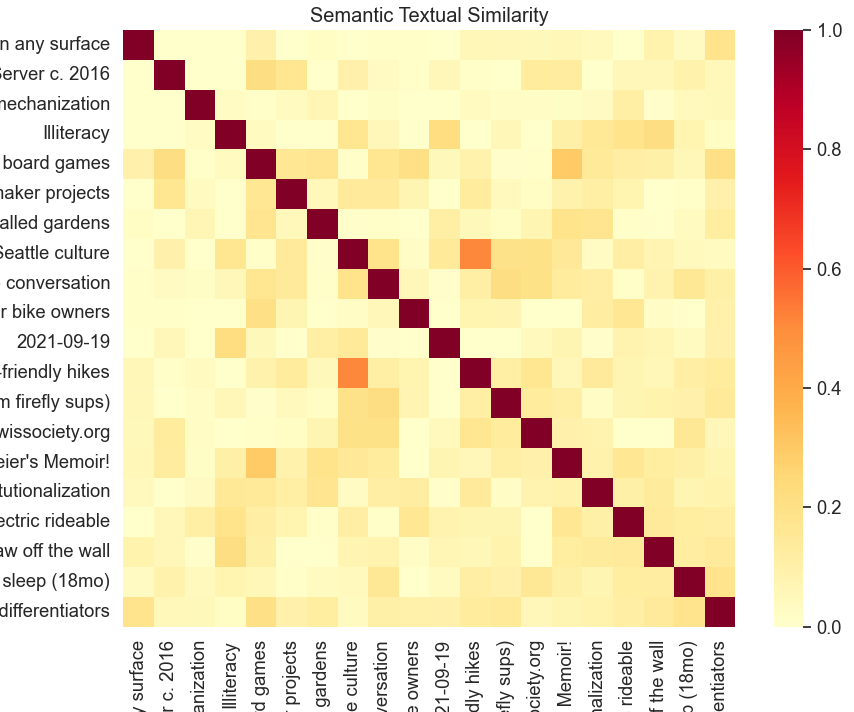

AI note garden: link suggestions
===
posted: January 14, 2022

My latest [AI gardener apprentice](/ai-note-garden-summarizer) finds pairs of notes that aren't explicitly linked, but maybe ought to be. This project was inspired by the human subconscious, which creates, cements, and removes neural connections during sleep.

Like a sleeping brain, my python script runs nightly, scouring my note garden for related notes. The end result is a list of the most similar notes pairs in the garden, based on semantic similarity. I found the results to be illuminating, and a real-time version with solid UX would be a central feature of my [system for thought](/file-systems-for-thought).

<!--more-->

# Ideas and connections

Ideas are naturally interlinked. They build on one another, like stepping stones
in the [[Adjacent Possible]]. Concepts build on one another forming a dependency tree, and
you can only learn something if you have first prepared a place to attach the new information. In other words, it must be in your [[Zone of Proximate Development]].
Fortune favours the prepared mind.

Our brains reflect this interlinked nature of ideas, with billions of neurons
and trillions of connections between them. This complicated machinery does its
best to create a representation of the world around us.

When we sleep, automatic processes in the brain tend to these connections,
creating new links, removing the obsolete ones, and paving the cowpaths.
[[Sleep has a profound effect on memory and learning]].

# Networked notes

An ideal collection of personal notes mirrors your own thoughts. Obsidian
emphasizes interlinking, and places a lot of weight on the note graph, a mind
map-like view of the whole note garden resembling a connectome. Connections are emphasized in Roam's marketing copy as a "note taking tool for **networked** thought".

While today's crop of note taking tools makes links and backlinks easier to manage than before,
it's still a pain to interlink notes. One major challenge is to recall what related notes you might
have written in the past.

What is the note garden equivalent of sleep, during which the brain's
subconscious processes triage new information gleaned during the day?
What might be useful automation for us note gardeners?

# Finding connections automatically

I take a fair amount of notes and sometimes have a feeling of deja-vu when I
realize that I've been parroting something I already wrote
many moons ago. If like me, you have a large note garden, a stable set of
interests, and a crappy memory, you might know what I'm talking about.

The simplest remedy to this problem might be to scour the note garden, looking
for redundancies: ideas that appear in multiple places. You might prune the
redundant note, reword it, link it to something relevant, or refactor
multiple notes to make more sense together.

Of course, redundancies aren't all bad! Notes need enough context to stand on their own
and topics that are interconnected can't help but overlap somewhat.
The goal here is not terseness, but cohesion and legibility. If a note is
related to other notes, let's cement that relationship with an explicit link.

## Sidebar: semantic similarity

Now, how might we determine if two notes are related? One could simply consider
two notes to be related if they have significant overlap in words. But we are
better than that. The NLP keyword for this problem is semantic similarity.

For words, the situation is relatively simple.
[word2vec](https://en.wikipedia.org/wiki/Word2vec) takes a word
and represents it as an array of numbers. Words that are semantically similar end up
closer together in the resulting vector space, and those that are semantically different end up far away.
The same can be done with sentences, using some of the same machinery that powers
large language models. We have the technology to take a whole sentence of variable length and create an
embedding for it. Once we have the ability to generate embeddings from sentences,
we can compare two sentences by evaluating how close or far their embeddings are.

We can do the same thing at a larger scale. Given N sentences,
we calculate an NxN matrix of similarity values which might look like this:

Quick sanity check:

- The diagonal answers the question "how similar is this sentence to itself" and has similarity 1 across the board
- The matrix is symmetric (eg. A is as similar to B as B is to A).
- In the above, notes named "Seattle culture" and "Seattle nearby child-friendly hikes" have high semantic similarity.

# Semantic similarity in my note garden

I wrote a python script to find related notes in my note garden. Here's how it
works:

1. Load all notes and their content
2. Split each note into paragraphs
3. Calculate embeddings for all paragraphs using [Universal Sentence Encoder (USE)](https://tfhub.dev/google/universal-sentence-encoder-large/5),
   keeping track of the source note.
4. Calculate the correlation matrix for all paragraphs using cosine similarity
5. Calculate a similarity score for each note pair using the above matrix
6. Sort note pairs by most similar, providing paragraph pairs as evidence

Now we have a list of the most similar notes in the garden, their associated
similarity scores.

## Sidebar: ignoring existing links

Notes that are already interlinked should not show up
in this list of similar notes. Their similarity is already legible to the system,
and there are really a lot of such notes. For instance, most of my Medieval
history notes are highly semantically similar, because they are derived from
similar books and cover very similar themes.

We can easily filter out these note pairs by considering the
graph structure of the note garden. An adjacency matrix gives O(1) lookup.
In practice, going on step further and ignoring note pairs that are a minimum
distance of 2 away has worked better on my note corpus. To help with this,
I hired the [Floyd–Warshall algorithm](https://en.wikipedia.org/wiki/Floyd%E2%80%93Warshall_algorithm)
and its friendly [scipy implementation](https://docs.scipy.org/doc/scipy/reference/generated/scipy.sparse.csgraph.floyd_warshall.html).
Once you have the matrix of minimum distances, filtering out the note pairs is easy.

# Living with the note garden linker

I run the semantic similarity AI nightly. This generates an updated note called
`Similar notes.md` which lists the most similar notes in my note garden. The resulting note is a collection of entries that look like this:

    Similarity 0.61:

    Note 1: Inventing on what principle c. 2019

    > Paragraph excerpt: How can you build software that doesn't need backends and SREs to run...

    Note 2: Evogami without firebase

    > Paragraph excerpt: How might we create multiplayer apps with state, without relying on a backend at all...

There is some mathematical beauty to a script which takes a collection of notes
as input, and outputs another note. Having notes update overnight without my
intervention makes the note garden feel like it's alive and growing.
That said, having an AI make arbitrary modifications to my hand written notes
sounds like a real nightmare. To mitigate this, I have by convention decided to
keep all AI-produced notes in the `Nightly/` directory.

My note linker has been up and running for the last month, so I have a sense
for how useful the resulting output is. One observation is that my note
garden grows slowly, and most notes are relatively static. The first time I ran
the similarity script, I found a lot of surprising and actionable output, but
unless I have an especially prolific note taking session,
running over the whole corpus nightly is probably overkill. More on this later.

Going through a fruitful generated list of similar notes, I tend to
take one of the following actions:

- One of the notes supercedes the other ➡️ merge any useful bits from the deprecated note and remove it
- Both notes point to the same concept ➡️ refactor the concept into a separate note and link to it from both
- Both notes are highly related but not explicitly linked ➡️ create a link from one note to the other

Any of these actions will cause the entry to disappear from `Similar notes` on
a subsequent run. A virtuous cycle.

## Repetition in my book reviews

I found some surprising redundancies in my book reviews. In 2017, I overused the
word "vivid" (similarity 0.71):

> **Gatsby**: Incredibly vividly written. Fascinating to see the self made struggles
> of people that are so fantastically well off. Very unsympathetic characters
> throughout, except for the narrator.
>
> **Nothing is True and Everything is Possible**: Super well written, incredibly
> engaging throughout. Incredibly so for non-fiction about a depressing topic.
> Much more entertaining than Gessen’s barrage of pessimism.

I struggled with provenance in 2018 (similarity 0.63):

> **Bird by Bird**: I've forgotten how this book appeared on my radar, but I
> think it was on someone's list of most influential books ever. I am more
> ambivalent.
>
> **The Fourth Turning**: I don’t remember why I decided to read this book. The
> political theory it describes is loved by both Gore and Bannon. This
> surprisingly heterogeneous recommendation reignited my interest when I saw it
> on my reading list.

In 2019, I did not mince words (similarity 0.64):

> **Building a Bridge to the 18th century**: I found the book mostly useless.
> It's a shallow summary of some stuff I already knew, and set forth an
> exaggerated technological pessimism that I, to some extent, share.
>
> **You Belong To The Universe**: The book itself is interesting but not
> groundbreaking. It involves overly flowery descriptions of things that I
> consider obvious: Google, Nest, Sim City, self driving cars, etc.

## How to handle quotes?

I have a special note where I track quotes that I really enjoyed from all over the place.
Since I like them, these quotes end up in other notes too. Since the quotes are inserted
verbatim, their presence is a very strong signal for note similarity.

My current solution is to ignore my `Quotes I like.md` note for this analysis,
but this is a hack, since there are still many instances of the same quote across
different notes used perhaps in different contexts. A shared quote is very weak evidence
that the two notes are related, often insufficient to warrant a direct link.

One approach I haven't yet tried might be to discard identical matches as meaningless.
This would naturally discard quotes, since they are generally inserted verbatim.

# Future works

The USE semantic similarity model I currently use is somewhat limited. It doesn't
perform well on non-latin character sets. According to it, anything with cyrillic
characters is extremely semantically similar. Relatedly, it doesn't perform well
on non-words. Snippets of code, guitar tabs, and ASCII art all look same.
Lastly, USE is already 4+ years old. AI/NLP is progressing so quickly, I
should be using a more modern model to generate embeddings. I recently got access to OpenAI's beta
embedding feature, which might be a logical next step. But running OpenAI embeddings on
tens of thousands of paragraphs sounds like an expensive proposition. I'd like
to continue to be able to run semantic similarity in the comfort of my own computer.

Let me be the first to admit that what I have hacked together is a crude
prototype, and a very rough approximation of the ultimate user experience
I want my note taking app to provide. I want to be able to request suggestions
for relevant notes to reference as I write, in a way that is not distracting.

If I had time, I'd build an Obsidian plugin version of what I've built as a
shell script:

1. Keep a cache of embeddings for notes in the note garden
2. As you write, periodically calculate this note's embeddings and compare them to the rest of the corpus
3. Surface relevant but as yet unlinked notes and their similarity scores in a sidebar

Wanna build it together? I promise to cheer you on from the sidelines! Drop me a line.