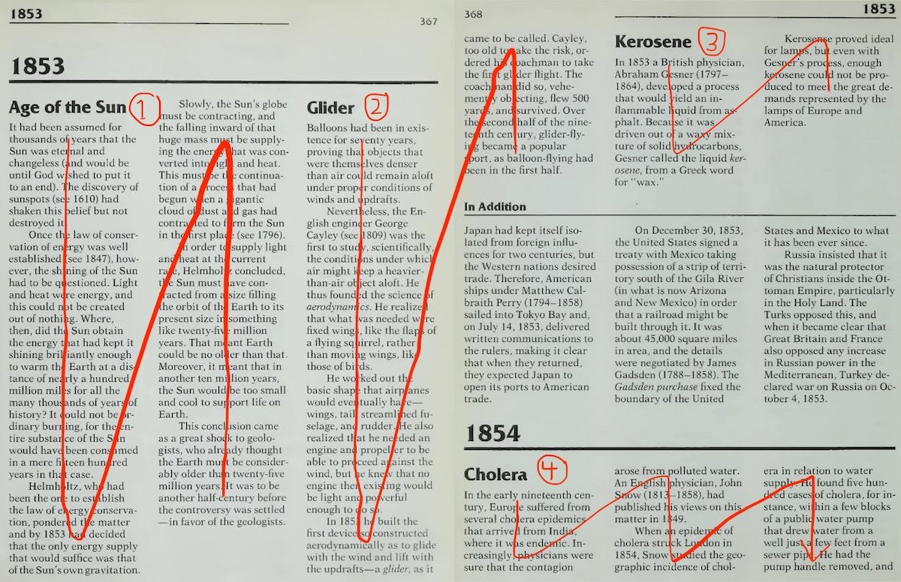

Invention Cards enhanced by AI
---
posted: May 30, 2024

I used GPT4's multimodal features to accelerate and improve my recently rebooted [Visual Chronology of Science & Discovery](/visual-chronology-science-discovery-v2/) project now hosted at <https://invention.cards>. First I used image-to-text models to extract and structure content from pages of Asimov's encyclopedia for **accelerated data entry**. Then I used text-to-image models to generate **visually consistent imagery** for each invention and discovery card. This post describes both workflows and my findings. Relevant source code is available in my [asimov-gpt repository](https://github.com/borismus/asimov-gpt).

<!--more-->

# Accelerated data entry

Invention Cards is based on Asimov's encyclopedia, which is laid out like a newspaper: multiple sections of multi-column text:

The "In Addition" sections are interesting but do not directly map to a card in my chronology so should be skipped. The bi-fold above has four relevant sections which I've numbered in the image:

1. Age of the Sun
2. Glider
3. Kerosine
4. Cholera

My initial idea was to completely transcribe the text using OCR, and then run an NLP extraction task on the extracted text. As I [wrote before](/visual-chronology-science-discovery/), off-the-shelf OCR solutions don't work well for digitizing this sort of layout. Inevitably the flow of text gets mangled, and manual intervention is required.

Experimenting with the current crop of multimodal AI models, I was pleasantly surprised that I could skip the explicit OCR step and jump straight to extraction. `gpt-4o`  happily follows detailed instructions given images of pages in the encyclopedia, extracting structured JSON for each heading on the page. Here's how my system works.

First I extract a page of interest from the 755-page PDF using the pypdf library. I send the page image to the OpenAI API along with the following prompt. I ironed out some kinks through trial and error:

> Summarize the inventions or discoveries on the following page. Please ignore sections entitled "In Addition".

> Provide the following information for each invention or discovery. Output should be described as an array of JSON objects with the following keys:

>  - title: one to three words describing the invention or discovery.
>  - year: the year the invention or discovery was made.
>  - description: full description of the invention or discovery as close to the text as possible.
>  - summary: two sentence summary without mentioning people or dates, focusing on what the invention or discovery is and does, and its impact.
>  - description: full description of the invention or discovery.
>  - inventor: full name of the inventor or discoverer.
>  - location: in which country was the invention or discovery made? In the case of Great Britain or the United Kingdom, use "England".
>  - field: (one of Math, Science, Culture, War, General, Design, Geography, Space). Sub-fields can be indicated with a colon (e.g. "Science: Physics or Science: Biology")
>  - related: one or more related previous invention or discovery, separated by commas. If there are no related inventions or discoveries, use "".

>Remember to escape quotes in JSON strings.

I found empirically that using JSON mode yielded worse results, but that not using JSON mode, I was able to easily extract JSON from the response. Sometimes it came in markdown-style code blocks, which are easy enough to strip. I then validate the resulting JSON object with [pydantic](https://pydantic.dev/), ensuring the types make sense and then sanity check it so that values are within ranges. If things do not validate, I automatically retry. Finally the script serializes each invention on the page in a Tab Separated Value (TSV) format, so that it can be copied from the terminal and pasted into my [master spreadsheet](https://docs.google.com/spreadsheets/d/1hDNXas7DzwglB95HV2_2u1utWAwBZR2hQHlMPz-fj5A/edit#gid=1533876043). Once entered into the spreadsheet, I can iterate on the content manually.

Here are my observations from extracting ~300 cards from Asimov's encyclopedia using this AI-infused workflow:

- **Title**: works quite well if the section is identified. About 2% of the sections are ignored.
- **Year**: works great with almost no errors.
- **Summary**: often wrong or incomplete, missing key details, especially when multiple inventions are mentioned under the same heading.
- **Inventor**: name works reasonably well when only one person is mentioned. A challenge arises when Asimov refers to previously mentioned people by just their last name. I haven't yet built a system for resolving full names from last names yet.
- **Location**: works well too, but there are tricky cases like United Kingdom / Great Britain / England. Also expect failures when multiple places are mentioned in Asimov's blurb.
- **Field**: sometimes wrong, often defaulting to "Science". Sub-fields were also sometimes muddled or overly specific. One common confusion is the preference of "Science:Astronomy" over "Space". To be honest, which field an invention or discovery belongs to is often fuzzy even for a human. The greatest discoveries span multiple fields or create new fields.
- **Related**: inventions are often missing, especially if none are explicitly mentioned in the originating text.

### Aside on page boundaries
Many of Asimov's invention & discovery descriptions span page boundaries. In the example above, Glider begins on 367 and wraps to the next page; Cholera begins on 368 and continues further.

I began working on an improved pipeline for handling page wrapped text, but realized that in practice, I needed to make revisions to many summarized card descriptions to make them more terse and informative than the AI generated summary. When I did this for inventions and discoveries that extended onto a second page, I ended up also manually incorporating content that was only available below the fold. This is not so bad because I'm curious about Asimov's invention & discovery stories, so end up at least skimming Asimov's original text anyway.

To handle the page boundary robustly in the future, I'm imagining a two pass solution: 1) Extract the headings from the page. 2) Send a bi-fold image of the current and next page, and in the prompt, ask to provide summaries for the headings extracted from the first pass. How well `gpt-4o` or the next crop of models will handle multi-page images remains to be seen.

### Data workflow
Here's my overall data extraction workflow:

I run the script for a range of pages:

`> python3 src/extract_cards.py --from=388 --to=400`

This outputs TSV for all entries on the page (terminal, window 2). I copy the TSV into the master spreadsheet (sheets, window 3), and then cross-reference the fields with the original text (preview, window 1).

Once ready, the spreadsheet is exported as TSV. I then load this TSV in the <https://invention.cards> site, and also use it as the source of truth for further processing. The inventions and discoveries on page 367-368 will be transformed into cards like this: [Glider](https://invention.cards/glider), [Cholera](https://invention.cards/cholera), [Kerosene](https://invention.cards/kerosene), and [Age of the sun](https://invention.cards/age-of-the-sun).

At this point you might be wondering where the snazzy images came from. Read on to find out!

# Visually consistent imagery
After I have a TSV file of inventions and discoveries from the AI-assisted process I described above, we can begin generating consistent imagery for these inventions. I use OpenAI's `dall-e-3` model to generate an image using the metadata provided. The f-string prompt looks something like this:

> - Title: {invention.title}
> - Description: {invention.summary}
> - Category: {invention.field}
> - Year: {invention.year}
> - Person: {invention.inventor}

> Generate vibrant art nouveau for the invention/discovery described above. The image should be a single object or scene that represents the invention/discovery.

The results are stylistically consistent and visually pleasing. Sometimes things are a bit off though. Here are a few failure modes I've observed:

A. The image does not correspond to the factual details of the card (e.g. [Aerodynamics (1809)](https://invention.cards/aerodynamics), [Binary System (1700)](https://invention.cards/binary-system) pictured):

B. The card title has multiple meanings, and the image generator latches on to the wrong one (e.g. [Percussion (1761)](https://invention.cards/percussion) and [Black Bodies (1860)](https://invention.cards/black-bodies) pictured):

C. The card is obscure and the image generator doesn't really know what to do (e.g. [Lanthanum (1839)](https://invention.cards/discovery-of-lanthanum), [Molybdenum (1778)](https://invention.cards/molybdenum), and [Thallium (1861)](https://invention.cards/thallium) pictured):

D. The card is abstract and the image generator doesn't really know what to do (e.g. [Celsius (1742)](https://invention.cards/celsius), [Celluloid (1869)](https://invention.cards/celluloid), and [Positive negative charge (1733)](https://invention.cards/positive-negative-charge) pictured):

E. The card includes an object that the image generator struggles to generate, so creates a crazy version of the object (e.g. [Safety Pin (1849)](https://invention.cards/safety-pin), [Telescope (1668)](https://invention.cards/telescope)):

Two common and undesirable occurrences in these generated card images are people and text. The image often focuses on the visage of the inventor to the detriment of his actual invention. Sometimes it's not the inventor or the discoverer, but a beautiful woman depicted in art nouveau style. The other failure mode is that the image contains unnecessary text. My favorite is when it is prominently misspelled, as in this set of attempts for [Carbon Dioxide (1754)](https://invention.cards/carbon-dioxide).

First I tried threats to discourage these misbehaviors. Unfortunately threatening to kill `dall-e-3`'s firstborn child triggers their AI safety subsystem. Then I tried cajoling. In the end I ended up pleading with very clear instructions. The prompt ends with:

> Please do not include any typography or text. Please do not draw any people.

This helps but does not fully solve the problem. Roughly ~10% of the images still suffer from unnecessary people and text.

### Image workflow

As a result of various problems in image generation, I can't fully trust the system to do a good job. So I've become the human in this AI loop. Let me describe my workflow.

My script generates images for cards spanning a range of years, saving the corresponding images in a directory with the same filename as the card's identifier

`> python3 src/gen_card_image.py --from_year=-100000000 --to_year=2000`

After these images are generated, I review them. I leave the ones I like untouched and rename the duds, adding a suffix (e.g. `carbon-dioxide.jpg` becomes `carbon-dioxide-1.jpg`). After this pass, I run the script again which will ignore existing images unless forced. Now I have a smaller set of images to review and rename. Rinse and repeat. At the end of this iterative process, I have a list of canonical imagery for each invention.

I'd say that more than half of the card images generated on the first pass are good enough for my bar. Some images end up requiring multiple generations and eventually produce something compelling. Other cards fail completely and require workarounds. In some cases, like [Morphine (1805)](https://invention.cards/morphine), `dall-e-3` simply refused to generate any image because it violated their policies. Winners don't use drugs!

In other cases, `dall-e-3` gets confused by Asimov's terms and generates consistently wonky images. In these rare cases, I took liberties and retitled the card. Though a separture from the original text, the new names are less confusing to both the image generator and to the general public. I renamed [Black Bodies (1860)](https://invention.cards/black-bodies) to "Blackbody Radiation" to be able to generate images without a black human body. Similarly, I renamed [Percussion (1761)](https://invention.cards/percussion), to "Medical Percussion" to avoid spurious musical instruments.