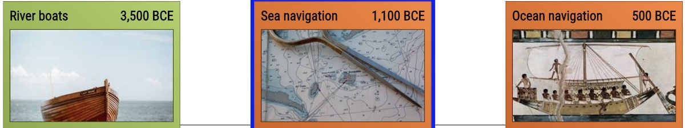

Visual Chronology of Science & Discovery 2.0
---
posted: May 16, 2024

I recently resumed my Visual Chronology of Science & Discovery [project][blog], a Civilization-inspired tech tree but for the real life history of science. The content is grounded in Asimov's [book][] with some flourishes added, courtesy of yours truly. Four years since starting the project I'm sharing a significant update. Here's a quick overview of the new viz:

<iframe width="560" height="400" src="https://www.youtube.com/embed/THE4xSGTQzc?si=E-_y2GX2j2poPHkm" title="YouTube video player" frameborder="0" allow="accelerometer; autoplay; clipboard-write; encrypted-media; gyroscope; picture-in-picture; web-share" referrerpolicy="strict-origin-when-cross-origin" allowfullscreen></iframe>

And some major improvements vis-à-vis the original version:

- Revised the visual design of the cards, each of which now features an illustration.
- Improved the UI of the overall system including search and field filtering and a separate timeline component.
- Addressed table-stakes like panning, zooming, and mobile web support.
- Extended the timeline from 1700 to 1850, more than doubling the number of cards to 597.

In the remainder of this short post, I describe challenges I encountered along the way, and their solutions.

[book]: /books/asimovs-chronology-of-science-and-discovery/
[blog]: /visual-chronology-science-discovery/

<!--more-->

# Challenge 1: chronological graphs

I [previously][blog] described the challenge of combining a chronological timeline with a dependency graph. I had originally incorporated both in a single visualization:

> Technologies that enabled the focused card are shown to the left and technologies that the focused card enabled are shown to the right, along the x-axis. Chronologically previous and next entries are shown along the y-axis.
> f
> Overwhelmingly, people found this very confusing. Rather than attempt to wedge both dependencies and chronology into to the same view, I've split out the temporal bits into its own timeline component, which also allows search and filtering by field. This is much clearer!

# Challenge 2: location, location, location?

Asimov's [book][] is not particularly consistent with location names. England is often used interchangeably with Britain, Great Britain, the United Kingdom, etc. As I create a more structured version of his encyclopedia, I feel the need to rectify these inconsistencies.

One option is to provide the temporally correct name of the originating place. For example, if an invention was created on the territory of modern day Crimea in the 7th century, perhaps it should be called a Greek invention. In the 13th century it ought to be labeled Mongolian. In the 18th century it ought to be labeled Russian. In 2000, it ought to be Ukrainian. Another option is to use the modern name for the territory, regardless of its historically accurate name.

I think I've arrived at a compromise with an arbitrary dividing line between the ancient world and the modern world.

For ancient inventions and discoveries, I use the name of the empire or civilization broadly speaking, following Asimov's lead. For example, [Libraries](https://borismus.github.io/asimov/#library) are attributed to Assyria in 640 BCE, and [Architectural arches](https://borismus.github.io/asimov/#arch) to the Etruscans in 750 BCE. Assyria and Etruria are no longer part of the political landscape, but I still think this makes a lot of sense.

For inventions in the last half-millennium is to use the modern country's name for the place where the discovery or invention occurred. Attempting to provide a historically accurate place name is difficult and potentially confusing. Also, historically accurate place names would often change depending on political events irrelevant to the arc of invention and discovery, making it hard to trace golden ages to a meaningful place.

Conveniently this approach allows for a distinction between English and Scottish inventors, so subsequent analysis should be able to pinpoint the Scottish Enlightenment, for example.

# Challenge 3: improved design

I was originally inspired by a set of physical card games and technology trees from computer games (see [are.na](https://www.are.na/boris-smus/tech-tree-cards)), and finally decided to bite the bullet and clone the original Magic the Gathering card design. I also managed to solve the problem of consistent imagery across whole collection.

# Challenge 4: consistent imagery

One of the biggest limitations of the first version of this project was to create a consistent visual design for this set of cards.

> While you can find reams of royalty free images, [...] finding a set that is visually consistent was tough.

Four years ago I speculated:

> Theoretically a style transfer model might be able to convert them all to a consistent look.

Modern AI models helped me solve this problem by generating a set of imagery using a textual prompt to guide the content and ensure a consistent style. I'm pleased with the results:

Compare to where I began several years ago:

# Challenge 5: data entry

It was difficult to fully digitize the original book because of its multi-columnar and sectional layout. As I wrote [before][blog]:

> optical character recognition (OCR) is not easy if your content is laid out like a newspaper [...] Cloud Vision and tesseract don’t do well on complex text flows, often failing to recognize section boundaries.

With modern AI, I've been able to extract content from the pages of the book into a structured output. This has been a boon to my productivity, and although I still verify the output of the model, my speed of data entry has greatly accelerated.

This project continues to be backed by a [spreadsheet](https://docs.google.com/spreadsheets/d/1hDNXas7DzwglB95HV2_2u1utWAwBZR2hQHlMPz-fj5A/edit#gid=0) which has now grown to nearly 600 entries.

# Open challenge: dependencies

One of my goals with the visual chronology of science & discovery was to explore how science builds on itself and to articulate the way in which one invention sometimes serendipitously leads to the next.

Asimov sometimes cites previous inventions in his encyclopedic entries, but truly connecting the dots is left as an exercise to the reader. To capture this relationship, each entry has a list of dependencies that led to its invention or discovery. This list of dependencies is quite subjective, and produced mostly by my judgement.

There are a number of ways of interpreting this parent-child relationship between cards:

1. Parent card loosely or directly inspired the person(s) to come up with their invention or discovery. Example: [Paved roads](https://borismus.github.io/asimov/#paved-road) were improved upon with [Macadamized roads](https://borismus.github.io/asimov/#macadamized-roads).
2. Parent card was necessary to enable the child invention or discovery. Example: [Improved steam engine](https://borismus.github.io/asimov/#improved-steam-engine) was necessary to build the [Steamboat](https://borismus.github.io/asimov/#steamboat). [Screw propeller](https://borismus.github.io/asimov/#screw-propeller) was necessary to build [Transatlantic liner](https://borismus.github.io/asimov/#transatlantic-liner).
4. Parent represents a resource that became scarce, causing a child invention to be invented. Example: [Bronze](https://borismus.github.io/asimov/#bronze) required tin, which was rare, causing Phoenicians to venture into the Atlantic and discover [Ocean navigation](https://borismus.github.io/asimov/#ocean-navigation).

I think this is the shakiest part of the data that powers the visualization. If you are an expert in the history of science, let's talk. I'd love to discuss where to draw the line. Pun intended.

# What's next for this project?

1. I've only digitized half of the book! Another 600 cards spanning from 1850 to 1993 have yet to be added. I'll continue chipping away at this.

2. Much of my recent progress on this project is due to hot new AI models. I'll have more details to share about that in a future post.

3. In parallel, I want to explore a printed version of the same cards. Perhaps 1200 cards is an unwieldy number to hold in hand, but I can easily see the appeal of a deck containing a subset of the cards. It's easy to imagine a deck of space-related discoveries, or one centered around chemistry, mechanical engineering, or any sufficiently deep scientific field. Is there a game to be played in there?

Please [try it out](https://borismus.github.io/asimov) for yourself and [send me](mailto:boris@smus.com) your feedback. I'm especially interested in hearing from you if you are a print designer (or an aspiring print designer) and want to collaborate on a physical version of this project! I'd also love to chat about the challenge of determining the dependency structure. On that note, if you find a mistake in the content, field, deps, or visual presentation, you can also file a [GitHub issue](https://github.com/borismus/asimov/issues/new), which is also linked to from the top right icon of any card. See you in the captivating world of invention & discovery!