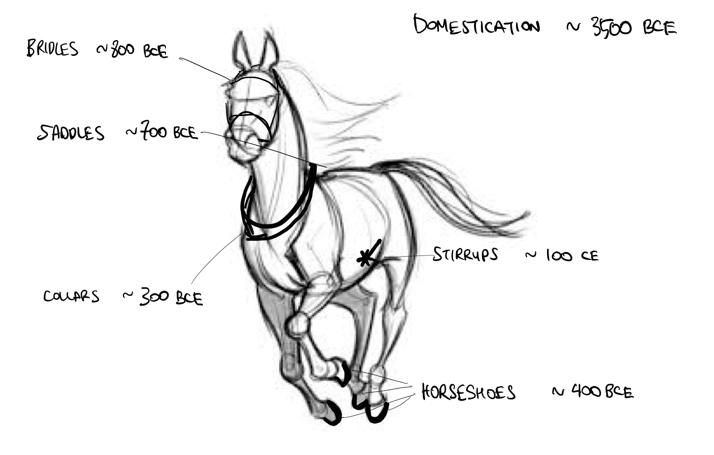
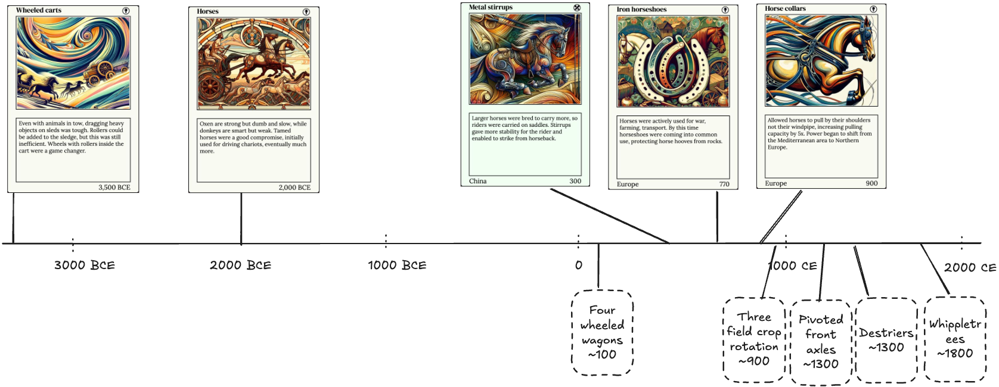

Horsing around with invention.cards
===
posted: Feb 2, 2025

This is the first in a series of vignettes based on observations I captured while creating [invention.cards](https://invention.cards), a visual chronology of science and discovery. In this series I hope to explore bits of the history of science and technology I found fascinating ("that's funny...") while reading and digesting [Asimov's chronology](/books/asimovs-chronology-of-science-and-discovery/) and also examine the limitations of source material. First, let's take a really thin slice of human ingenuity: horse-related inventions and discoveries.

<!--more-->

### Horses according to invention.cards

The horse, first domesticated a 3500-[2000 BCE](https://invention.cards/horse) was initially only used to drive chariots. With the invention of saddles and [metal stirrups](https://invention.cards/metal-stirrup) in 300 CE, riders could mount the horse, enabling mounted archers as a new form of warfare. As they grew in strength and size, horses were incorporated in agriculture. By [770, horseshoes](https://invention.cards/iron-horseshoes) were coming into common use in Europe. Despite this, horses were still weak pullers compared to other beasts of burden. By 900 however, a brilliant observer found that horse anatomy was different from the ox and devised the [horse collar](https://invention.cards/horse-collar). This let horses pull by their shoulders instead of their trachea, increasing their effective strength by an order of magnitude. This marked a shift in global power from the Mediterranean to Northern Europe.

I placed the above-mentioned horse-related invention.cards in a timeline:

### Horse-shaped gaps in invention.cards

Underneath the timeline above are some important gaps that don't have an invention card associated with them. These came to mind as I was recalling from the long and engaging lecture series about the middle ages by Philip Daileader ([early](/books/early-middle-ages/), [high](/books/high-middle-ages/), [late](/books/late-middle-ages/)). When I first listened to these lectures, I modified an existing sketch to create "The Cyborg Horse" at the start of this post. The gaps are indicated in dashed boxes, and are nowhere mentioned in Asimov's encyclopedia.

By prioritizing breadth, Asimov's encyclopedia inevitably sacrifices depth. Even the niche microcosm of horse-related technology can be deep and complex, and scholars of the Middle Ages have spilled much ink debating and discussing medieval technology (see [Medieval Technology and Social Change](/books/medieval-technology-and-social-change/)).

**On the farming front**. There is no mention of four-wheeled wagons in invention.cards, so in the visualization, [wheeled carts (3500 BCE)](https://invention.cards/cart) are the predecessor to [rubber tires (1887)](https://invention.cards/rubber-tire) with apparently no intervening improvements for almost five millennia. In fact, there were tons of stepping stones between these technologies. Firstly, I was surprised to learn that four-wheeled wagon technology emerged and diffused long after two-wheeled carts were in broad use. Then it took centuries to refine. Pivoted front axles allowed wagons to turn much better. Whiffletrees allowed multiple horses to pull a single heavy load. This all enabled the autonomy of the people, who could now use their horses for multiple purposes: as beasts of burden, for transportation, and as weapons of war.

**Horses for war**. Horses themselves changed significantly over the last few millennia. Saddles and stirrups enabled men to ride horseback. This required stronger horses to carry the weight of a man directly on their back. As the Middle Ages progressed, warriors wore increasingly heavy armor, requiring powerful warhorses called destriers specially bred for the purpose. The newly invented three field system meant a lot more oat production for feeding armies of large and hungry horses. New fighting technology like lances, firmly "couched" in a man's armpit, and high backed saddles provided additional stability. They transformed mounted warriors into knights, the shock troopers of the 13th and 14th centuries, whose devastating charge unleashed the full weight of horse, rider, and armor at the tip of his lance. These overpowered knights gained huge amounts of influence with the elites of the time and fundamentally changed the structure of feudal society.

As you can tell, I'm fascinated by horses as technology and their significant role in human history. By examining everything from horse collars to wagons to high couched lances, we see how incremental innovations transformed a domesticated animal into an engine of societal change. But as I've been compiling invention.cards, I have deliberately constrained myself to the content found in Asimov's encyclopedia to reduce scope. For now I must resist the temptation to drop this constraint and fill in the dotted gaps with newly minted invention.cards.

Did this topics spark your curiosity, or was it all too obscure? Let me know either way and stay tuned for the next vignette, where we’ll use invention.cards to examine the invention and adoption of the steam engine, whose strength was measured in horsepower, and how it gradually replaced actual horses.
