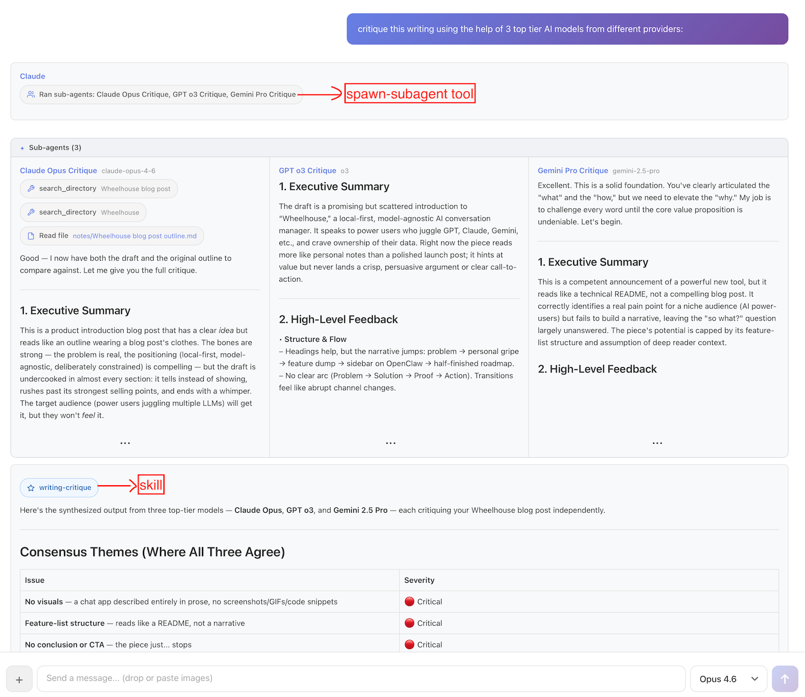

Alloy: a local-first AI workbench
===
posted: Feb 24, 2026

AI model vendors usually ship their own desktop apps, and aside from coding agents, these tend to be the ways in which I interface with AIs the most. But these apps are sticky by design: each vendor wants you to stay with them and continue to use them. As a result, I tend to have very lumpy usage patterns, focusing on one model at a time to the detriment of the others. This leads to an incomplete understanding of the ever-shifting AI landscape, with models constantly leapfrogging one another on the leaderboards.

To remedy this, I built my own web-based desktop app which is model agnostic. Beyond easy access to Gemini, Grok, Claude, and GPT, I had a few additional goals in mind:

1. Local-first: all conversations are stored as plaintext
2. Build an orchestrator to gain intuition around agents, tools, skills, etc,
3. Play around with new interaction patterns beyond the usual chat-and-wait

The result of this is Alloy, which I began in December and have used daily since then. With it, I've been able to more easily see how good each model is at using tools, agent skills, etc. Alloy also serves as a personal playground for experimenting with new interaction patterns: freewriting with a quiet AI collaborator, delegating to sub-agents mid-conversation, and setting up triggers that monitor the world on your behalf.


<!--more-->

# How it works
When you start a chat, Alloy picks one of your favorite models from a list you configure. As you talk with a model, the exchange is appended to the file that backs it. Files have the benefit of being local, permanent, and searchable with any tool you already use. You can always switch models even mid-conversation.

The orchestrator has access to built-in tools and any custom skills you've added to your vault. For example:



Here I asked Alloy to "critique this writing using 3 top-tier AI models from different providers." It loaded the `writing-critique` skill, spawned Anthropic Opus, OpenAI o3, and Google Gemini 2.5 Pro as parallel sub-agents, each critiquing an early draft of this post independently. The orchestrating agent then synthesized their responses into a single structured critique.

# Design philosophy

**File over app**: conversations, notes, triggers, and memory are all stored locally as plain text files. Everything is inspectable, searchable, and portable. The app still feels like ChatGPT or Claude Desktop though. Sync these files however you want: iCloud Drive, Google Drive, or whatever. Since I'm a heavy Obsidian user, I personally keep my Alloy directory as a subdirectory of my Obsidian vault and rely on Obsidian Sync.

**Transparent memory**: Alloy eschews hidden memory vectors for a simple, explicit approach: `memory.md`. This markdown file is a small, curated, always-on prompt piece injected into the system prompt. There you might include relevant bits about your identity and preferences. You have full and transparent control over what information is sent, not a mercurial UI buried in settings that the lab's apps provide.

```
# Preferences
- Offer multiple viewpoints or solutions.
- Leave sycophancy at the door.
  
# Personal
- Use Seattle for local context.
- Personal website/blog: https://smus.com
```


**Deliberately constrained**: Alloy can only read from and write to its own vault. It cannot run arbitrary code or scripts. Destructive writes require your confirmation. This is a design choice, not a limitation — the goal is a tool where it's safe to let AI manage your notes, memory, and triggers without worrying about the blast radius (looking at you, [OpenClaw](https://openclaw.ai/)).

**Still mostly online**: Ultimately Alloy is about reclaiming control over AI conversations to the extent possible. It does support calling local LLMs via ollama, but so far they are too slow on my M4 Mac Mini and too limited in tool use to be practical. So despite all conversations being stored locally, the bulk of the actual AI interactions continues to be through APIs to the cloud hosted models. 

# UX experiments within Alloy
Beyond standard chatting, Alloy has become my test bed for some practical AI experiments. Here are a few directions I've been excited about.

### Living memory via a note corpus
I've noticed in my own usage of ChatGPT style assistants that there can be many threads about the same project. Manually grouping these conversations has always felt unsatisfying to me. 

Rather than ask users to group conversations manually or even re-group them with the help of AI, I am trying something new. Alloy also includes an AI note corpus. The idea here is that the agent can read and write this corpus as you have conversations. Each note links back to the conversations that shaped it, so you always have provenance. This is still early, but I'm excited about the feedback loop that could result:

1. **Extraction**: Talk about a project or topic in any thread
2. **Consolidation**: AI builds up a robust note on that topic
3. **Recall**: Subsequent conversations about related projects become better

### The home thread
Most AI chat apps create a new conversation for every topic. Alloy has that too, but it also has a single persistent thread that's always open — think of it as a command line for your AI.

Standard chat forces you to wait. While the response streams, you're blocked from sending new messages. In the home thread, you can always send a new message. Responses are brief, direct, and conversational. But when something substantial needs to get done, the orchestrating agent delegates to a sub-agent. This interaction feels right for quick back-and-forth or rapid braindumping when thoughts aren't quite fully formed yet.

### Riff mode for freewriting and dictation
Sometimes you might not want to chat at all, but just capture semi-formed thoughts. Riff mode is more like thinking with a quiet collaborator sitting next to you, organizing your whiteboard while you keep talking.

You open a blank riff and just start typing or speaking — whatever comes to mind. As you pause, the AI quietly crystallizes your raw input into an organized draft. It weaves your scattered thoughts into something coherent, fills in gaps when you trail off ("something like..." or "I can't remember the name of..."), and answers questions you pose mid-thought. It marks its contributions in _italics_ so you always know what's yours.

### Conditional triggers for monitoring topics of interest
Most AI interactions require you to initiate, but some tasks require vigilance, not just intelligence. Conditional triggers turn the AI into a proactive sentry that only speaks when it has something to say.

You set up a "trigger" with a natural language condition like "Check prediction markets daily and notify me if the odds of regime collapse in Iran change by more than 5%." The system runs silently, monitoring the probabilities without your input. It saves you from constantly refreshing charts or doom-scrolling, acting instead as a dedicated analyst who only interrupts you when the signal becomes significant.

---

I’ve been using Alloy daily for a couple of months. It’s early and rough, but I think it’s ready for you to kick the tires. It’s a "bring your own API keys" tool — if you’re comfortable with that and care about owning your AI conversations, [give it a try](https://github.com/borismus/alloy/releases). The [source is on GitHub](http://github.com/borismus/alloy), and I’d love to [hear what you think](mailto:boris@smus.com).
