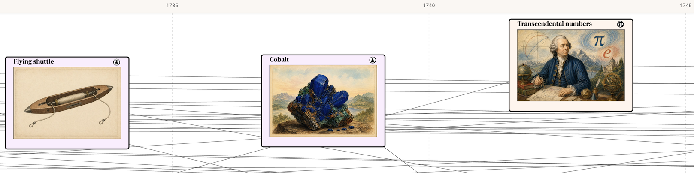
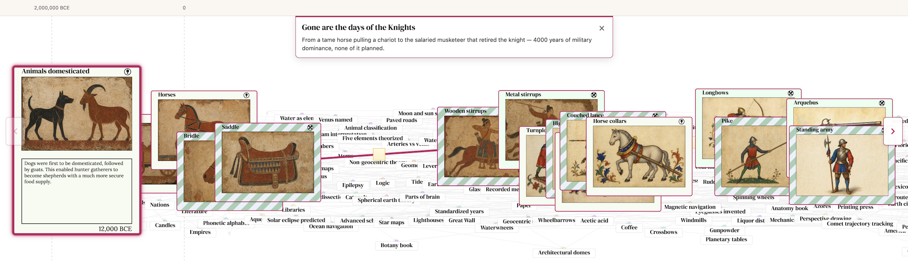
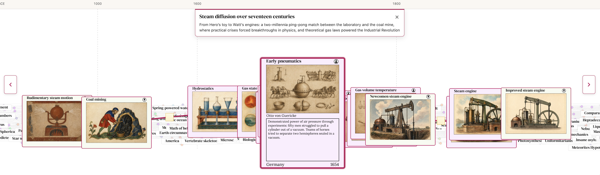
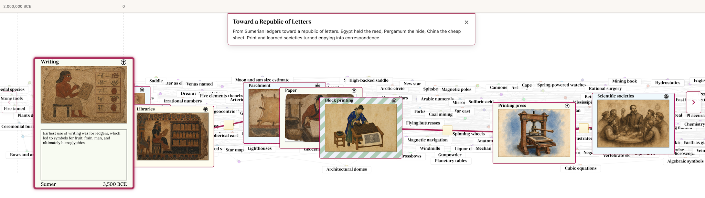

Invention Cards 3.0: Stories
===
posted: May 20, 2026

Last month, after a long hiatus, I showed [invention.cards](/visual-chronology-science-discovery-v2/) to a friend in SF and came away unsatisfied. Indeed, the work was [not yet done](/notes/2025/invention-discovery-cards-work-complete/). Three things drove this revision:

1. It felt incomplete. The experience was built around T-shaped navigation, focusing on a specific card and showing only their ancestors and descendants. It was hard to see where you were in time, hard to feel the shape of history, and ultimately was far removed from the way a tech tree should *feel*.
2. The connections matter more than the nodes. What's most interesting to me was not "ooh metal stirrup" in isolation, but how stirrups, saddles, and lances chained into something nobody planned. 
3. The images weren't doing their job. The cards were pretty, but felt to me like decorative slop with little educational or descriptive value. 

I've revised the project with a new visualizer, a story feature, and new images.

<!--more-->

# Everything everywhere all at once
In the old UI, you'd land on a card, then branch up and down the dependency tree. In practice that was confusing. The main experience is now a zoomable tech tree of all inventions and discoveries. There are four zoom tiers as you move in:

1. Dots — far out are colored dots on the timeline with dependency arrows only.
2. Labels — density-controlled title pills which automatically expand as you zoom further in:
   
3. Half-cards — folded cards with only artwork and title. It helps to have evocative artwork that can stand on its own:
   

4. Full-cards — unfolded cards with image, description, inventor, and footer. This design is largely unchanged:
   

# Stories: highlighting connections
I tried telling the rise and fall of knights arc in a blog post, chronicling [saddles, stirrups, collars, lances, the whole chain](/horse-invention-cards/). It worked ok as an essay, but the timeline disappeared. To follow the argument properly you had to abandon the graph and read linearly, losing the spatial sense of when things happened and what else was going on at the same time.

That's the problem Stories solve. A story is still a curated path with authored prose, but the path stays on the graph situated in the bigger tech tree. You see the ribbon, the years, and the neighbors. Because the story sits inside the larger tech tree, you can look up and notice "wait, that was happening at the same time as that?"

I've authored three stories so far:

1. [Gone are the days of the knights](https://invention.cards/story/knights) — From a tame horse pulling a chariot to the salaried musketeer that retired the knight
  
  
2. [Steam diffusion over seventeen centuries](https://invention.cards/story/steam-diffusion) — Hero’s toy → Watt’s engines: a two-millennia ping-pong match between the laboratory and the coal mine
  
  
3. [Toward a Republic of Letters](https://invention.cards/story/republic-of-letters) — Sumerian ledgers → the printing press and scientific societies
  

# Fit and finish
Card art is now backed by ~1,500 era-styled 3:2 JPGs generated by OpenAI's `gpt-image-2`. This results in images that are far less abstract, more accurate, and in era-appropriate styles.

The universe view swaps to a dedicated mobile bundle for narrow devices. Instead of a large spread, you are given a card deck with live drag. Cards rise, scale, and dim as you pull; backward swipes bring the previous card back from the left.

<video autoplay muted loop src="invention-cards-v3-mobile-r4.mp4"></video>

Explore the full graph and new stories at [invention.cards](https://invention.cards/).