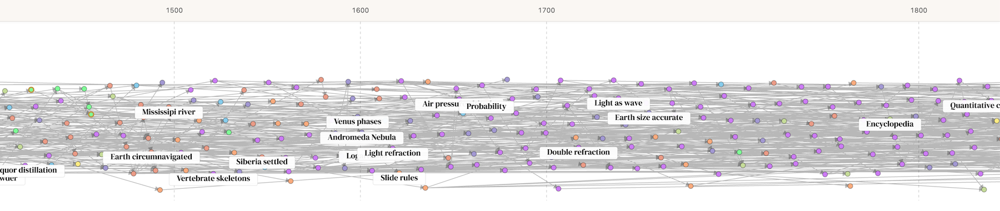
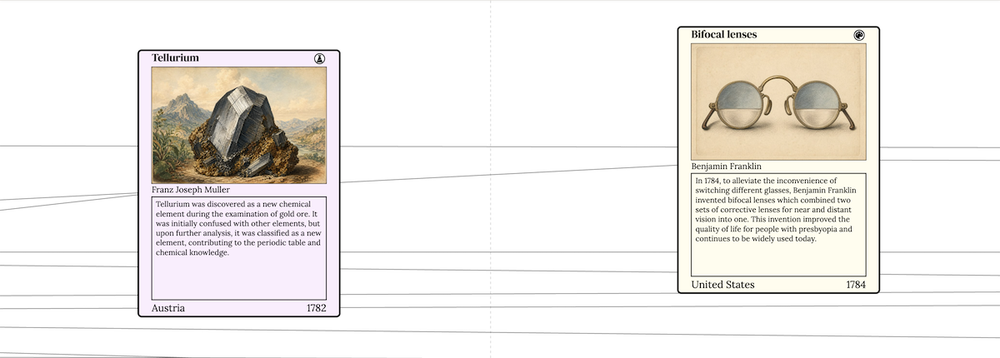
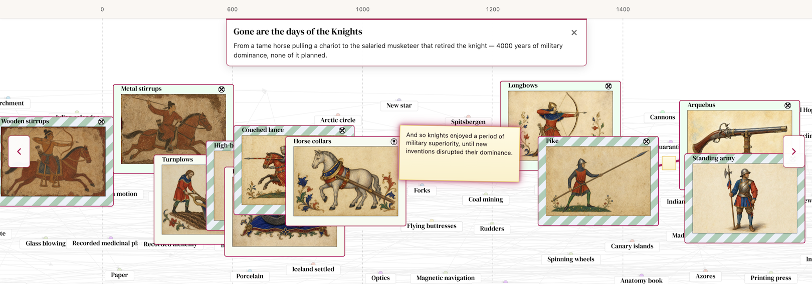

Invention Cards 3.0: Stories
===
posted: May 19, 2026

Last month, after a long hiatus, I showed [invention.cards](/visual-chronology-science-discovery-v2/) to a friend in SF and came away unsatisfied. Indeed, the work was [not yet done](/notes/2025/invention-discovery-cards-work-complete/). Three things drove this revision:

1. It felt incomplete. The old experience was built around T-shaped navigation. You'd land on a card, then branch up and down the dependency tree. In practice that was confusing. It was hard to see where you were in time, hard to feel the shape of history, and ultimately was far removed from the way a tech tree should *feel*.
2. The images weren't doing their job. The cards were pretty, but felt to me like decorative slop with little educational or descriptive value. I've regenerated artwork with a tighter brief, leaning on as much context as possible, so the image supports the invention or discovery and not the other way around.
3. The connections matter more than the nodes. What's most interesting to me was not "ooh metal stirrup" in isolation, but how stirrups, saddles, and lances chained into something nobody planned. 

I've revised the project with a new visualizer, new images, and a story feature. There is enough meat here to rev to a major version: v3.0. 

<!--more-->

# Everything everywhere all at once
The main experience is now a zoomable tech tree of all inventions and discoveries. There are four zoom tiers as you move in:

1. Dots — far out are colored dots on the timeline with dependency arrows only.
2. Labels — density-controlled title pills which automatically expand as you zoom further in:
   
3. Half-cards — folded cards with only artwork and title. It helps to have evocative artwork that can stand on its own:
   

4. Full-cards — unfolded cards with image, description, inventor, and footer. This design is largely unchanged, still inspired by MTG:
   

# Stories: highlighting connections
A major new feature of V3 is Stories — authored paths with prose on the edges between cards.

I tried telling the rise and fall of knights arc in a blog post, chronicling [saddles, stirrups, collars, lances, the whole chain](/horse-invention-cards/). It worked ok as an essay, but the timeline disappeared. To follow the argument properly you had to abandon the graph and read linearly, losing the spatial sense of when things happened and what else was going on at the same time.

That's the problem Stories solve. A story is still a curated path with authored prose, but the path stays on the graph situated in the bigger tech tree. You see the ribbon, the years, and the neighbors. In addition to the circuitous weave of the story, you can zoom out and notice that two inventions you never linked in your head were in fact contemporaneous. The graph is full of those unexpected surprises: "wait, that was happening at the same time as that?"

I've authored three stories so far:

- [Gone are the days of the knights](https://invention.cards/story/knights) — From a tame horse pulling a chariot to the salaried musketeer that retired the knight
- [Steam diffusion over seventeen centuries](https://invention.cards/story/steam-diffusion) — Hero’s toy → Watt’s engines: a two-millennia ping-pong match between the laboratory and the coal mine
- [Toward a Republic of Letters](https://invention.cards/story/republic-of-letters) — Sumerian ledgers → the printing press and scientific societies

# Fit and finish
Card art is now backed by ~1,500 era-styled 3:2 JPGs generated by gpt-image-2. This results in images that are far less abstract, more accurate, and more stylistically meaningful.

The universe view swaps to a dedicated mobile bundle for narrow devices. Instead of a large spread, you are given a card deck with live drag. Cards rise, scale, and dim as you pull; backward swipes bring the previous card back from the left.

<video autoplay muted loop src="invention-cards-v3-mobile.mp4"></video>

Explore the full graph and new stories at [invention.cards](https://invention.cards/).