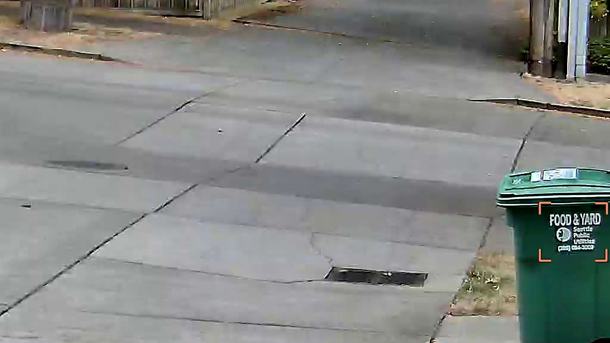
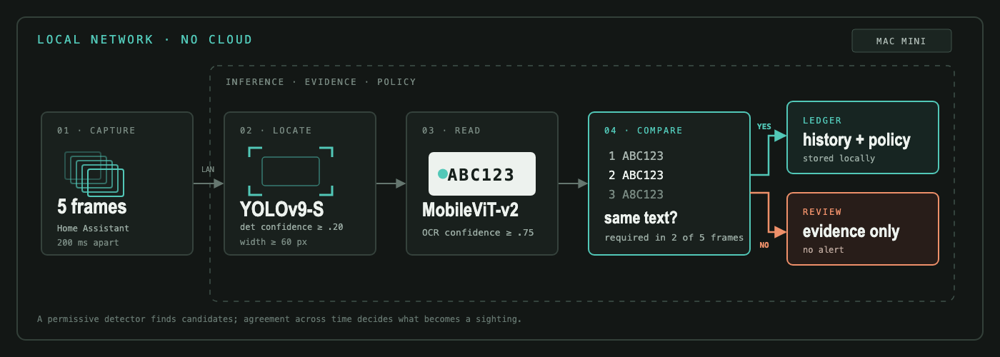

My compost bin had 38 license plates
===
posted: Sep 9, 2026
type: draft

# How it started

Although we live in a beautiful part of a beautiful city, our alley is not immune from petty theft. Thieves usually arrive in the summer and smash their way into detached garages in the early morning. They drive through a shared alley, attempt some break-ins and then drive off. Since it's petty crime, the police hardly care, we often have scant evidence to help find the culprits. Last time this happened, we didn't even have camera footage to capture their license plate.

Determined not to repeat mistakes of the past, I installed an affordable alley camera, hooked it up to Home Assistant, and built an on-device license plate recognition system using off-the-shelf [`fast-alpr`](https://github.com/ankandrew/fast-alpr) models. I built a Home Assistant automation: when the camera emits vehicle detection events, it captures five snapshots per event 200 ms apart. These images are then processed locally and never leave my local network. Camera frames, plate history, and vibe coded UI all run live on my Mac Mini, and alert us when new plates are detected entering the alley.

# Garbage in, garbage out

The Reolink camera I bought produces "vehicle detected" events. I started with the simplest possible thing: when a vehicle is detected, run the plate recognizer and tell me what the plates are. Most of the vehicle detection were of cars passing by on the street. Their plate was not visible, but the plate recognition model was still producing high confidence readings of gibberish plates. The model was finding text on the compost bin:

...and producing garbage results.

# Detecting license plates reliably

The pipeline I arrived at works pretty well:

One key insight is to detect the license plate boundary itself. This is a good filter for eliminating cars that are crossing in the street rather than driving through the alley. It's also a good filter for filtering out non-license plate text like the Food & Yard compost label. Critically, this entire pipeline runs locally on the Mac. Plates are stored in a local SQLite ledger and notifications for strange plates are only issued after a period of familiarization.
