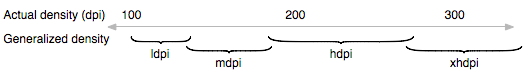

Let's get physical (units)
==========================
posted: 2012-05-02

There's an increasing variety of devices in use today. Even generally
rectangular touch enabled devices vary hugely in their physical sizes,
aspect ratios, pixel densities, etc.

One thing that remains constant across these devices are their users.
Technologies come and go every year, but people stay the same. Existing
form factors: [pads, tabs and boards][ubicomp] still make sense, and
will continue to do so for the forseeable future. As a result,
ergonomic considerations like touch target sizing, readable text and
image size remain constant. Fingers will be fingers and eyes will be
eyes! Our bodies are firmly rooted in the physical world, and the
interfaces we create should reflect that.

<!--more-->

Take touch targets, for example. Apple's [human interface guidelines
recommend][apple-hig] minimum touch target size of 44x44pt for iOS. On
an iPhone, 44pt is about 0.25in. On an iPad, 44pt is about 0.3in, physically
larger because of different device pixel density. Even Apple has such
discrepancies despite a very simple device landscape. Apple devices only
come in two configurations: iPhone and iPad (and their retina
counterparts).

The situation gets far more complex when we look at mobile devices in
general, which is the world of mobile web developers. In an ideal world,
images and fonts should be scalable and all units should be physical.
I built a [prototype][physical-units] that illustrates roughly how this
model would work. Onward for the gory details.

[apple-hig]: http://developer.apple.com/library/ios/#DOCUMENTATION/UserExperience/Conceptual/MobileHIG/Characteristics/Characteristics.html
[ubicomp]: http://en.wikipedia.org/wiki/Smart_device

## Device variance

Here's a brief sampling of pixel density and aspect ratio for a few
popular devices (data [from wikipedia][aspect]):

    Device          DPI   Aspect
    ============================
    iPhone*         163      3:2
    iPad*           132      4:3
    Nexus S*        117      5:3
    Galaxy Nexus*   158     16:9
    Galaxy Note*    142      8:5
    Galaxy Tab      149      8:5
    T-Prime         149      8:5
    Lumia 900       217     10:6

The ones with a `*` denote double density devices. In other words, the
physical pixel density is double the value indicated, but the browser
generally reports the resolution to be this halved value. For more
information about this practice, read [a pixel is not a pixel][csspx].

Thus, in practice, a 44x44px button rendered with a reasonable viewport:
`<meta name="viewport" content="width=device-width">` will vary in
dimensions between 0.20in on the Lumia 900 to nearly double, 0.38in on
the Nexus S.

Further complicating things is a somewhat obscure fact that pixels might
not be square at all. The term for it is [pixel aspect
ratio][pixel-aspect]. As far as I can tell, this is only a concern when
displays aren't using their native resolutions, which luckily is a
rarity in mobile devices.

[aspect]: http://en.wikipedia.org/wiki/List_of_displays_by_pixel_density
[pixel-aspect]: http://en.wikipedia.org/wiki/Pixel_aspect_ratio
[csspx]: http://www.quirksmode.org/blog/archives/2010/04/a_pixel_is_not.html

## The problem with pixels

[Many HIGs][touch-target] recommend minimum touch target sizes in
pixels. What really matters is the size of human fingers, which as we
established earlier, don't grow and shrink as a function of the device
you happen to be using.

Microsoft, anticipating a more fragmented ecosystem of devices with
varied densities and screen sizes, is recommending a physical size
approach instead, which makes more sense for touch targets. They suggest
a 9x9mm recommended lower bound, and an absolute minimum of 7x7mm. This
jives well with established research, such as MIT's [Touch Lab study of
Human Fingertips to Investigate the Mechanics of Tactile Sense][mit],
which found that the average human finger pad is 10-14mm and the average
fingertip is 8-10mm in diameter.

[touch-target]: http://www.lukew.com/ff/entry.asp?1085
[mit]: http://touchlab.mit.edu/publications/2003_009.pdf

## Benefits of physical units

As a developer, I'd like to just say "this button is 40x9mm" and have
that actually map to real physical dimensions. If I could ensure usable
sizes for all of my touch targets, that solve this problem across all
devices, once and for all!

Physical units also make feature-based device detection far more
reliable. Currently, the best we can do is basically guess what sort of
device is visiting your site, using heuristics like device resolution
(in magic CSS pixels that automatically get scaled). Using this
approach, it's hard to distinguish between laptops and tablets, for
example. It's even more challenging to distinguish phones from 7"
tablets, or 7" tablets from 10" ones. Approaches like [device.js][] would
benefit greatly.

Finally, as you saw, using pixels results in a huge variance in font
size, resulting in bad text readability in general. With physical units,
you can set a good default baseline size for text to ensure readability.

Of course, in all of these cases, it's possible to manually rescale the
view in order to get the desired zoom level that's readable and
touchable, but the whole point is to have a system that behaves well by
default.

[device.js]: https://github.com/borismus/device.js

## Scaling well

So, in this world of physical sizes for everything, virtually everything
needs to be scaled to the appropriate size. This includes text, images,
and general layout (eg.  sizes, coordinates, etc). This means having
assets, fonts and a layout engine that's capable of scaling well,
without loss of visual fidelity.

General layout is pretty easy to do - all you need is to convert real
units into pixels for actually rendering. Text gets a bit tricker, since
most fonts are defined only at certain key-sizes, and scaling to
fractional sizes might not work perfectly. Scaling images, of course, is
a whole separate topic. Rasters are very difficult to scale down without
compromising quality, and scaling up creates a blurry or pixelated
looking image. The obvious solution is to use scalable image formats. On
the web, this basically means SVG, which is [quite well
supported][svg-support] across browsers, but does have its own
idiosyncrasies.

### Vectors and rasters

Still, even with vector images, there are potential arguments to be made
about the superiority of pixel-perfect assets, since the designer has
absolute control to decide their assets at the pixel level.
Unfortunately, the pixel-perfect approach causes a lot of pain for
designers, who are routinely forced to create multiple versions of the
same asset. On iOS, you specify both the regular and retina asset. On
Android, you specify four: `ldpi`, `mdpi`, `hdpi` and `xhdpi`. These
don't actually get scaled, but the closest one gets served based on the
device DPI. This means that it's impossible to create assets in an exact
physical size. Here's an excerpt from the [Android docs][android-dpi]:

On the web, you can't realistically hope for pixel perfection because of
the vast variety of devices and browsers. Designers need to embrace the
medium, and do as well as they can given the constraints of the web.
Scaling the same image (vector or raster) may not be adequate for other
reasons. In some cases, especially with icons, you want to specify
assets with different levels of detail depending on the physical size.
Check out a few [great][icon1] [posts][icon2] on this subject.

> It’s simply not possible to create excellent, detailed icons which can
> be arbitrarily scaled to very small dimensions while preserving clarity.

![Varying levels of details depending on size][icon-scale]

That said, there's no reason why icons with appropriate levels of detail
for smaller and larger sized screens shouldn't use the same scalable,
physical approach. In the above example, using scaled assets would let
the designer create 4 instead of 5 separate assets, since the 128px and
64px versions are the same, just scaled.

It's not all flowers and sausages, though. Vectors are inherently less
efficient to deal with, since they require the intermediate step of
rasterization before they can be blitted to the screen buffer. This is
expensive, but not a show stopper. Optimizing this issue is a topic that
probably warrants a whole article on its own, but one major win could be
to rasterize once depending on your device DPI, and then cache the
rasterized asset so that you don't need to rasterize the vector every
time you render.

[svg-support]: http://caniuse.com/#search=svg
[icon1]: http://mrgan.tumblr.com/post/708404794/ios-app-icon-sizes
[icon2]: http://www.pushing-pixels.org/2011/11/04/about-those-vector-icons.html
[icon-scale]: http://farm7.static.flickr.com/6224/6311957505_6f15b6f925.jpg
[android-dpi]: http://developer.android.com/guide/practices/screens_support.html

## Doing it on the web

If you want to figure out your phone's exact physical dimensions in a
browser based application, you're out of luck. Even units that share a
name with physical units (like `inch`, `cm`, etc) don't actually render
that way. Here's a [test page][test-page] that renders some text with
CSS inches. If you measure the actual output on your laptop or phone,
you'll notice that it's not a real inch.

Now, you could imagine doing some monkey patching to enable physical
units using JavaScript, but that's also impossible to do cleanly since
you need to know either the true device DPI or the physical size of
the screen, neither of which is queriable in any way on the web.
JavaScript does provide `window.devicePixelRatio`, but that only reports
the scale factor for pixel density, which is used for retina and other
displays where CSS pixels differ from physical pixels.

## How does it feel?

Even though it's impossible to get physical size or DPI from a browser,
I wanted to try it out, to see if this would work in practice. Here's a
[prototype library][physical-units] that uses entirely physical units
for everything, and fully scalable assets. All objects shown on [this
controls page][controls] should render to the correct physical size on
the following devices: iPhone, Galaxy Nexus, iPad, MacBook Air 13". Go
ahead and pull out a ruler (I did) and measure - the sizes should be
exact across the supported devices.

Here's a screenshot of a [basic phone UI][sample] built with only physical
units and percentages on an iPhone 4S and Galaxy Nexus:

![Phones with a UI built using physical units][phones]

[sample]: http://borismus.github.com/physical-units/sample.html
[controls]: http://borismus.github.com/physical-units/controls.html
[test-page]: http://lewisnyman.github.com/Where-are-our-absolute-units--Demo/
[phones]: android-ios-physical.png

### Implementation details

As mentioned, there's no way to get DPI in the browser. My prototype
works because I've hard-coded the physical DPI for each supported device
based on user agent matching. It's a terrible hack and not a great
option for production, even with more complete coverage.

The prototype currently only works by specifying sizes in absolute
units. It currently only supports inline styles, and not CSS rules. For
example, one can now write the DOM like:

    <button style="width: 9mm;">Nice touch target</button>

I ran into a few small implementation details along the way that I
thought might be worth mentioning.

Firstly, by default, nginx doesn't serve SVG with the correct mime type.
So, visiting the asset URL just downloads the asset rather than
rendering it, and embedding the asset in an `img` tag doesn't work. The
fix is [simple and documented][nginx-svg]: add the correct mime type to an nginx
configuration file.

Secondly, I was a bit disappointed not to find many pre-downloadable SVG
icon sets, but did discover [this resource][svg-icons] which has SVG
icons as pathes. To use them it's just a matter of pasting the path
specification into an SVG `path` element, as follows:

    <svg width="32" height="32" xmlns="http://www.w3.org/2000/svg">
      <path d="your-pathspec-goes-here" />
    </svg>

Though unstated, the icons on the above site seem to all be 32x32 units
(Note: not pixels).

Lastly, since CSS has units that look like physical ones (cm, mm, in,
etc), I wanted to create a new unit, say truemm, truein, etc.
Unfortunately, Chrome (and perhaps other browsers, haven't tested)
doesn't support units that it doesn't recognize. As a result, I had to
piggyback and override existing units. This approach would break the
behavior of sites that use for some unknown-to-me reason, but
introducing new units prefixed by `true` is verbose and confusing for
beginners. If you know of any reasons why a developer today would be
using CSS mms/inches, please let me know.

[nginx-svg]: http://stackoverflow.com/questions/3695409/nginx-offers-of-downoload-svg-instead-of-showing-it
[svg-icons]: http://raphaeljs.com/icons/

## Angular units

Rob [writes][rob]:

> The only use-cases for truemm are when you need content matching the
> size of some real-world object, e.g. a ruler, or a life-size image, or
> a human fingertip. That's it.

I disagree. It so happens that generally touch devices are used at a
relatively fixed distance from screen to user. This makes physical units
useful for not just touch targets, but also text and image readability.

But in the same breath, Rob makes a great point:

> Ask yourself, "do I really want this content to be the same physical
> size on a phone and a wall projector?" If the answer is yes, use
> truemm, otherwise don't.

Indeed, there are cases where physical units aren't ideal. The
conditions for this are roughly:

1. Unknown distance from viewer to screen.
2. Unknown screen size.

In this case, the reasonable thing to do is adopt an angular unit, which
would be able to scale depending on viewing distance from the screen
(and of course DPI too).  This might mean that you use degrees, [minutes
of arc][arc], or some arbitrary angular unit "au" (not to be confused
with [AU][au]).

The idea of angular units isn't new. In fact, surprisingly, the CSS spec
features it quite prominently in the definition of CSS pixels. A [recent
article][anglepx] on this topic reminded that pixels are actually
specified to be angular in nature.

> The reference pixel is the visual angle of one pixel on a device with
> a pixel density of 96dpi and a distance from the reader of an arm's
> length. For a nominal arm's length of 28 inches, the visual angle is
> therefore about 0.0213 degrees. For reading at arm's length, 1px thus
> corresponds to about 0.26 mm (1/96 inch). -- [CSS spec][spec]

There are a couple of problem with this.

1. Poor naming: calling such a unit a pixel is incredibly confusing.

2. Lack of flexibility: this approach assumes a 96dpi display and a
fixed viewing distance. As previously discussed, the former is a bad
assumption, and in the case of large format viewing, so is the latter.

Introducing true angular units that can be configured based on display
distance from the observer would be a boon for designers and engineers
working on software for TVs and other large-format devices. Some default
viewing distance could be provided, but developers should have a means
of specifying a custom viewing distance (potentially inferred from
device hardware, as described in [this research][lean]).

[rob]: http://lists.w3.org/Archives/Public/www-style/2012Feb/0948.html
[lea]: http://lists.w3.org/Archives/Public/www-style/2012Feb/0627.html
[anglepx]: http://inamidst.com/stuff/notes/csspx
[arc]: http://en.wikipedia.org/wiki/Minute_of_arc
[au]: http://en.wikipedia.org/wiki/Astronomical_unit
[spec]: http://www.w3.org/TR/CSS21/syndata.html#length-units
[lean]: http://www.chrisharrison.net/index.php/Research/LeanAndZoom
[physical-units]: https://github.com/borismus/physical-units

## Next steps

Browser vendors need to start supporting true physical units. One path
might be creating all new units (eg. `truemm`, `truein`) or redefining
the old ones to be use absolute values, which in many cases may be what
the developers actually intended.

These units should also be usable in media queries, so that it's
possible to do things like:

    (max-device-width: 4in)

This will enable a more robust way to do device detection via media
queries a la [device.js][djs].

There appear to be some efforts from Mozilla to have a media query for
DPI, via [resolution][moz-dpi]. This is a good start, but there should
also be a way to get DPI directly via JavaScript, otherwise enterprising
developers will need to resort to binary searching through possible DPIs
via `window.matchMedia`, which is just ridiculous.

The introduction of a true angular unit with a configurable viewing
distance would be amazing for a web that works well on large-format
displays.

Ultimately, UI developers need to understand the serious problems with
pixels because this problem isn't going away any time soon.

[djs]: https://github.com/borismus/device.js
[moz-dpi]: https://developer.mozilla.org/en/CSS/resolution
