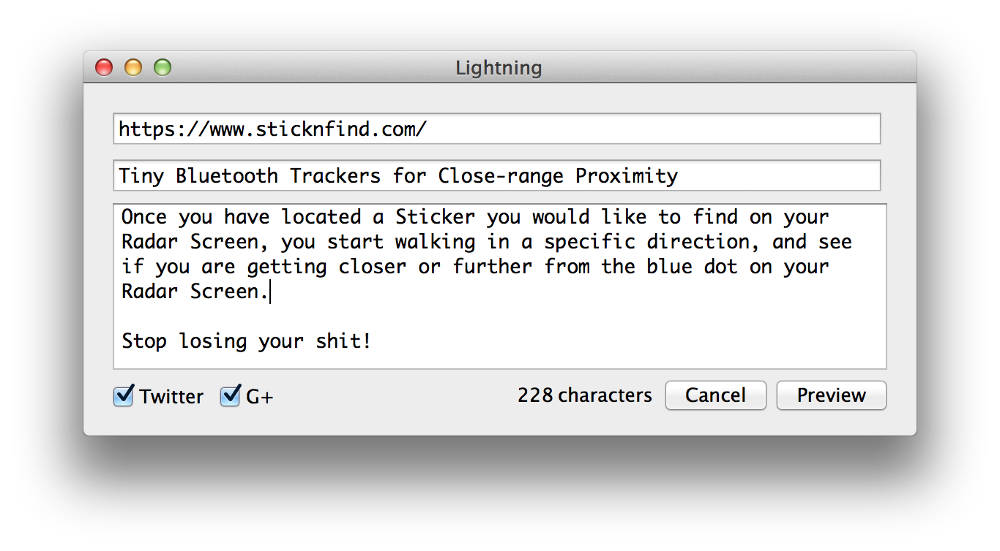

Easier link blogging
====================
posted: 2013-07-29

As usual, I want two conflicting things. Firstly, I want to own the
content I write, and control how it is authored. My weapon of choice is
MacVim and [Lightning][lightning], a static blog engine I wrote to
address my [very specific requirements][site]: 

Secondly, I want people to read the things I write and follow the
stories that I link to, since it feels good, and sometimes generates
interesting discussions. I wrote a Mac GUI that automates link blogging
and [POSSE style][posse] cross-posting to social networks.

<!--more-->

Before I carry on, let me take you back to a simpler time. A time before
Justin Bieber, Black Eyed Peas and social networks. Here's how blogging
used to work: writers wrote to their blogs, and readers subscribed to
them. They would read blog posts from RSS feed readers. Some people ran
link blogs that were kind of like twitter -- short updates discussing a
link. It's was a very clean, federated model. Unfortunately that's not
how things work today. I have already lamented this fact in a [previous
blog post][last].

For this site, RSS feed readership is a tiny fraction of the inbound
traffic for new posts. Most of non-search traffic comes from social
networks. As it turns out, the value of these networks is (wait for it)
in their network effect! It only takes a few prominent reshares to have
a post become relatively widely read. By not seeding your content to
social networks, you lose that benefit.

[lightning]: https://github.com/borismus/lightning
[site]: http://smus.com/site/
[posse]: http://indiewebcamp.com/POSSE
[last]: http://smus.com/really-simple-social-syndication/

## Cross-posting to social networks is hard

To seed content to social networks, we look to POSSE. From the
[indiewebcamp.com][posse] definition:

> POSSE is an acronym/abbreviation for Publish (on your) Own Site,
> Syndicate Elsewhere. It's a Syndication Model where the flow involves
> posting your content on your own domain first, then syndicating out
> copies to 3rd party services with perma(short)links back to the
> original version.

The problem is that posting to social networks is a pain in the rear.
Each network has its own limitations (eg. 140 characters on Twitter,
network-specific markup on G+). There are services which cross-post to
these networks, but they tend to sweep the subtle differences between
the networks under the carpet. For example, services like
[ManageFlitter][mf] and [Friends+Me][fpm] can cross-post from G+ to
Twitter, but if the post is too long to fit in 140 chars, they include a
link back to the original G+ post. I find cross-linking between social
networks to be questionable, so I have stopped using such tools.

[mf]: http://manageflitter.com/
[fpm]: http://friendsplus.me/

## Making link-style updates easier

A while ago, I realized that my use of social networks is remarkably
close to a link blog. While I'll sometimes @reply/comment and +1/star
things, I hardly ever post broadcast-style updates without a URL.

About a year ago, I added a special "link" type of content on this blog,
specially for this purpose. This type of content is just like a post,
except one link is prominently shown as the title of the post, and the
post itself is focused on commentary about the link. My plan is to use
this type of content more, whenever I want to broadcast a URL and have
something to say about it.

So to scratch my itch, I made a little GUI that automates creating a
link entry on the local static blog (with commentary). After the link is
posted and deployed publicly, it also broadcasts the content to
supported social networks, sometimes linking back to the link page on
this site.

As you can see, there are three fields: the URL, a title (pre-populated
from the `<body><title>` of the URL), and the body of the post (in
Markdown), all of which are clearly visible in the link page.
Technically, posting to social networks is easy enough. If they provide
a write API, it's just a matter of doing the OAuth dance and hanging on
to an access token to authorize requests. A more interesting question is
how to re-arrange the above three fields to form social network updates.

## Posting to other networks

Once the link is posted on the site, Lightning Link has a set of
heuristics to decide what to post to each supported social network. This
can be quite challenging if you are faced with a strict character limit.

Here are some options I considered for Twitter:

1. Truncated plaintext body, followed by the URL
2. Title colon space, the truncated plaintext body, and then the URL
3. Title and URL

With Option 1, the truncated plaintext body doesn't necessarily reflect
the main idea of the commentary on the link, since the body can be much
longer than 140 chars, and I might just be warming up :) Option 2 leaves
very little room for the body at all, except for about half of a
sentence. I went with Option 3, which lends itself well to short,
Twitter-style updates.

Posting to G+ is relatively easy: take the title and slap on the
plaintextified (from markdown) body, while attaching the URL. 

The other question is about URLs. There are two URLs of relevance in
each link blog post:

1. The one on the link blog (eg. <http://smus.com/link/2013/not-terrible-javascript-modules/>), and
2. The linked material (eg. <http://github.com/substack/node-browserify>).

My approach is to use the linked material directly (2) if the comments
can fit entirely into the space alotted by the social network, falling
back to the link blog URL (1).

The Lightning Link app isn't general enough for me to recommend unless
you either like pain, use lightning already, or have a static blog very
setup similar to mine, with a "link" type of post. If you'd still like
to try it, the [code is on github][ll]. If you have a similar
link-blogging approach with automatic syndication to social networks,
tell me about it!

[pyobjc-xcode4]: https://github.com/gregneagle/Xcode4CocoaPythonTemplates
[ll]: https://github.com/borismus/lightning/tree/master/link
