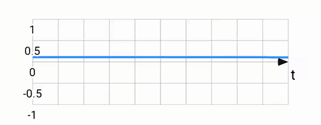
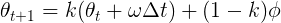
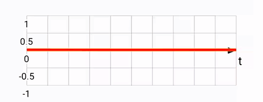
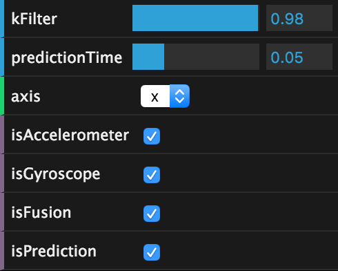

Sensor fusion and motion prediction
===================================
posted: 2015-11-05

A major technical challenge for VR is to make head tracking as good as possible.
The metric that matters is called **motion-to-photon latency**. For mobile VR
purposes, this is the time that it takes for a user's head rotation to be fully
reflected in the rendered content.

The simplest way to get up-and-running with head tracking on the web today is
to use the `deviceorientation` events, which are generally well supported across
most browsers. However, this approach suffers from several drawbacks which can
be remedied by implementing our own sensor fusion. We can do even better by
predicting head orientation from the gyroscope.

I'll dig into these techniques and their open web implementations.  Everything
discussed in this post is implemented and available open source as part of the
[WebVR Polyfill][webvr-polyfill] project. If you want to skip ahead, check out
the [latest head tracker][ht-demo] in action, and play around with this [motion
sensor visualizer][plots].

[webvr-polyfill]: https://github.com/borismus/webvr-polyfill
[ht-demo]: http://borismus.github.io/webvr-boilerplate/

<!--more-->

## The trouble with device orientation

The web provides an easy solution for head tracking through the
`deviceorientation` event, which gives Euler angles corresponding to your
phone's 3-DOF orientation in space. This orientation is calculated through an
undisclosed algorithm. Until very recently, [the spec][deviceorientation] didn't
even specify whether or not these events should give your phone's orientation in
relation to north or not. However, recently [accepted spec
changes][deviceorientation-change] make this behavior more standard across
browsers.

In Android, the JavaScript `deviceorientation` event was implemented using
`Sensor.TYPE_ORIENTATION` in Android, which fuses accelerometer, gyroscope and
magnetometer sensors together to give a North-aligned orientation. The trouble
is that the magnetometer's estimate of magnetic North is easily affected by
external metallic objects. On many devices, the North estimate continually
changes, even when you are not looking around. This breaks the correspondence
between motion and display, a recipe for disaster.

Another issue in some implementations is that the `deviceorientation` sensor
ramps up and down in firing rate depending on the speed of the phone's rotation.
Try opening up [this diagnostic page][imu-diag] on Android. This variation in
sensor update rate is not good for maintaining a reliable head track.

To top it off, a [recent regression in Android M][nexus5-bug] broke
`deviceorientation` for Nexus 5s. Why do bad bugs happen to good people?

[nexus5-bug]: http://crbug.com/540629

### What is to be done?

We implement our own sensor fusion with `devicemotion`, which provides lower
level accelerometer & gyroscope events. These fire at a regular rate. When you
search for "sensor fusion", jumping into the rabbit hole will quickly take you
into the realm of Kalman Filters. This is a bit more firepower than we will need
for the moment, although I did finally get a better sense of the concept with
the help of a [boring but understandable explanation][kalman-video].

Luckily, there are simpler alternatives such as the Complementary Filter, which
is what we'll talk about next.

[deviceorientation]: http://w3c.github.io/deviceorientation/spec-source-orientation.html
[deviceorientation-change]: https://github.com/w3c/deviceorientation/pull/22
[imu-diag]: http://jsbin.com/device-inertial-sensor-diagnostics
[kalman-video]: https://www.youtube.com/watch?v=18TKA-YWhX0

## Your sensing smartphone

Let us start with the basics: sensors. There are three fundamental motion
tracking sensors in your smartphone. 

Accelerometers measure any acceleration, returning a vector in the phone's
reference frame. Usually this vector points down, towards the center of the
earth, but other accelerations (eg. linear ones as you move your phone) are also
captured. The output from an accelerometer is quite noisy by virtue of how the
sensor works. Here's a plot of the rotation around the X-axis according to an
accelerometer:

Gyroscopes measure rotations, returning an angular rotation vector also in the
phone's reference frame. Output from the gyro is quite smooth, and very
responsive to small rotations. The gyro can be used to estimate pose by keeping
track of the current pose and adjusting it every timestep, with every new gyro
reading. This integration works well, but suffers from drift. If you were to
place your phone flat and capture it's gyro-based position, then pick it up,
rotate it a bunch, and place it flat again, its integrated gyro position might
be quite different from what it was before due to the accumulation of errors
from the sensor. Rotation around the X-axis according to a gyroscope:

Magnetometers measure magnetic fields, returning a vector corresponding to the
cumulative magnetic field due to any nearby magnets (including the Earth). This
sensor acts like a compass, giving an orientation estimate of the phone. This is
incredibly useful combined with the accelerometer, which provides no information
about the phone's yaw. Magnetometers are affected not by the Earth, but by
anything with a magnetic field, including [strategically placed permanent
magnets][cb] and also ferromagnetic metals which are often found in substantial
quantities in certain environments.

[cb]: http://smus.com/magnetic-input-mobile-vr/

## Intuition: why do we need sensor fusion?

Each sensor has its own strengths and weaknesses. Gyroscopes have no idea where
they are in relation to the world, while accelerometers are very noisy and can
never provide a yaw estimate. The idea of sensor fusion is to take readings from
each sensor and provide a more useful result which combines the strengths of
each. The resulting fused stream is greater than the sum of its parts. 

There are many ways of fusing sensors into one stream. Which sensors you fuse,
and which algorithmic approach you choose should depend on the usecase.
The accelerometer-gyroscope-magnetometer sensor fusion provided by the
system tries really hard to generate something useful. But as it turns out, it
is not great for VR head tracking. The selected sensors are the wrong ones, and
the output is not sensitive enough to small head movements.

In VR, drifting away from true north is often fine since you aren't looking at
the real world anyway. So there's no need to fuse with magnetometer. Reducing
absolute drift is, of course, still desirable in some cases. If you are sitting
in an armchair, maintaining alignment with the front of your chair is critical,
otherwise you will find yourself having to crank your neck too much just to
continue looking forward in the virtual world. For the time being, we ignore
this problem.

## Building a complementary filter

The complementary filter takes advantage of the long term accuracy of the
accelerometer, while mitigating the noise in the sensor by relying on the
gyroscope in the short term. The filter is called complementary because
mathematically, it can be expressed as a weighted sum of the two sensor streams:

This approach relies on the gyroscope for angular updates to head orientation,
but corrects for gyro drift by taking into account where measured gravity is
according to the accelerometer.

Initially inspired by [Pieter's explanation][pieter], I built this filter by
calculating roll and pitch from the accelerometer and gyroscope, but quickly ran
into issues with [gimbal lock][gimbal]. A better approach is to use quaternions
to represent orientation, which do not suffer from this problem, and are ideal
for thinking about rotations in 3D. Quaternions are complex (ha!) so I won't go
into much detail here beyond linking to a [decent primer][quaternions] on the
topic. Happily, quaternions are a useful tool even without fully understanding
the theory, and many implementations exist. For this filter, I used [the
one][three-quaternion] found in THREE.js.

[gimbal]: https://en.wikipedia.org/wiki/Gimbal_lock
[quaternions]: http://www.3dgep.com/understanding-quaternions/
[three-quaternion]: http://threejs.org/docs/#Reference/Math/Quaternion

The first task is to express the accelerometer vector as a quaternion rotation,
which we use to initialize the orientation estimate (see
[`ComplementaryFilter.accelToQuaternion_`][impl]).

    quat.setFromUnitVectors(new THREE.Vector3(0, 0, -1), normAccel);

Every time we get new sensor data, calculate the instantaneous change in
orientation from the gyroscope. Again, we convert to a quaternion, as follows
(see: [`ComplementaryFilter.gyroToQuaternionDelta_`][impl]):

    quat.setFromAxisAngle(gyroNorm, gyro.length() * dt);

Now we update the orientation estimate with the quaternion delta. This is a
quaternion multiplication:

    this.filterQ.copy(this.previousFilterQ);
    this.filterQ.multiply(gyroDeltaQ);

Next, calculate the estimated gravity from the current orientation and compare
it to the gravity from the accelerometer, getting the quaternion delta.

    deltaQ.setFromUnitVectors(this.estimatedGravity, this.measuredGravity);

Now we can calculate the target orientation based on the measured gravity, and
then perform a [spherical linear interpolation (SLERP)][slerp]. How much to
slerp depends on that constant I mentioned before. If we don't slerp at all, we
will end up only using the gyroscope. If we slerp all the way to the target, we
will end up ignoring the gyroscope completely and only using the accelerometer.
In THREE parlance:

    this.filterQ.slerp(targetQ, 1 - this.kFilter);

Sanity checking the result, we expect the filter output to be roughly parallel
to the gyroscope readings, but to align with the accelerometer reading over the
long term. Below, you can see the accelerometer and gyroscope (green and blue)
and compare them to the fused output (orange):

[impl]: https://github.com/borismus/webvr-polyfill/blob/master/src/complementary-filter.js
[pieter]: http://www.pieter-jan.com/node/11
[slerp]: https://en.wikipedia.org/wiki/Slerp

## Predicting the future

As your program draws each frame of rendered content, there is delay between
the time you move your head and the time the content actually appears on the
screen. It takes time for the sensors to fire, for firmware and software to
process sensor data, and for a scene to be generated based on that sensor data.

In Android, this latency is often on the order of 50-100 ms with sensors firing
on all cylinders (the technical term for 200 Hz) and some nice graphics
optimizations. The web suffers a strictly worse fate since sensors often fire
slower (60 Hz in Safari and Firefox), and there are more hoops of abstraction to
jump through. Reducing motion-to-photon latency can be done by actually reducing
each step in the process, with faster sensor processing, graphics optimizations,
and better algorithms. It can also be reduced by cheating!

We can rely on a [dead reckoning][dead-reckoning] inspired approach, but rather
than predicting position based on velocity, we predict in the angular domain.
Once we predict the orientation of the head in the (near) future, use that
orientation to render the scene. We predict based on angular velocity, assuming
that your head will keep rotating at the same rate. More complex schemes are
possible to imagine too, using acceleration (2nd order) or Nth order prediction,
but these are more complex, and so more expensive to calculate, and don't
necessarily yield better results.

    var deltaT = timestampS - this.previousTimestampS;
    var predictAngle = angularSpeed * this.predictionTimeS;

The way this works is pretty straight forward, using angular speed from the
gyroscope, we can predict a little bit into the future to yield results like
this:

Notice that the predicted signal (in red) is somewhat ahead of the fused one (in
orange). This is what we'd expect based on the motion prediction approach taken.
The downside of this is that there is noticeable noise, since sometimes we
over-predict, and are forced to return back to the original heading.

[dead-reckoning]: https://en.wikipedia.org/wiki/Dead_reckoning#Directional_dead_reckoning

## Plotting graphs

Although still in very active development, [Mathbox2][mathbox] is already a
formidable visualization toolkit. It is especially well suited to output in 3D,
which I used actively to debug and visualize the filter.

I also used Mathbox2 to generate plots featured earlier in this blog post. I
wrote a live-plotting tool that can compare gyroscope, accelerometer, fused and
predicted streams on each axis, and also let you tweak the filter coefficient
and how far into the future to predict.

You too can [try the plots live on your phone][plots]. After all, it's just a
mobile webpage! Many thanks to [Pierre
Fite-Georgel](https://twitter.com/pierregeorgel) and [Julius
Kammerl](https://github.com/jkammerl) for lending their incredible
filter-building skills to this project.

[mathbox]: https://gitgud.io/unconed/mathbox/
[plots]: http://borismus.github.io/sensor-fusion/
