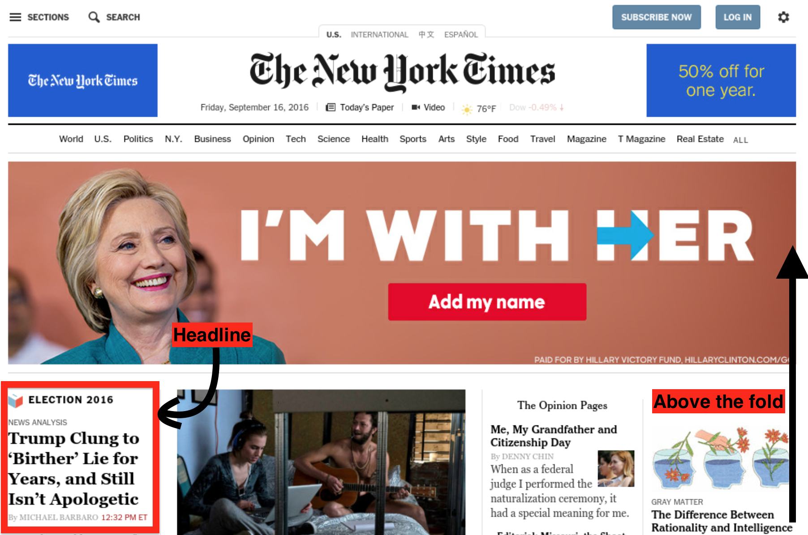

Front page blues
================
posted: 2016-12-07

According to the [American Press Institute][api],

> News is that part of communication that keeps us informed of the changing
> events, issues, and characters in the world outside.

There are many ways for news to be uninformative or even outright misleading.
Two trends in particular have received a lot of attention recently. The first is
social recommendation systems and selective unfollowing, which creates a
reality-distorting echo chamber. The second is fake news, which sure is in vogue
these days, and is obviously a problem that we should tackle.

This post is about a different trend: [real news presented with misleading
frequency][twt]. The issue at stake is the media's ability to inform its readers
and serve the public interest.

[api]: https://www.americanpressinstitute.org/journalism-essentials/what-is-journalism/purpose-journalism/
[twt]: https://twitter.com/hamandcheese/status/801893793540796416

<!--more-->

# Real news, dubious frequency

If you are a New York Times reader, you may have noticed a certain individual
prominently mentioned in the newspaper over the last several months. I wanted to
know just how much, and started daily screenshots on August 3rd, 2016. To my
great surprise, this was exactly one hundred days before the announcement of the
45th president-elect. My analysis was very simple.

1. Does the lead story (that is, top-left corner article) include "Trump" in the
   title? **(50 / 100 days)**
2. Does the "Trump" appear in any headline above the fold? **(86 / 100 days)**.

I should note some limitations of this approach. This process itself was more
manual than I would have liked. My script took screenshots only, so I did not
have access to the markup of the page. I tried auto-reconstructing the images using
`tesseract`, but the results were not perfect, `pdfgrep` had only limited use,
and I had to visually inspect the page to get my data analyzed. The data are [in
this spreadsheet][spreadsheet], and I've made the [raw screenshots][screenshots]
available too.  There are non-technical problems too. The web version of the New
York Times is updated on a more frequent than daily basis, so my screenshots
missed some versions. Also, notions of "lead story" and "above the fold" don't
really make sense online. I arbitrarily defined "the fold" to be 1280 px, as in
this example:

As for the results? Half of the NYT's headlines had "Trump" in the name, and the
frequency matched my intuition. It sure did feel like this dude was getting a
whole lot of coverage. In fact, he got far more coverage than my method reveals,
since many lead articles without explicit mention of his name in the title were
still mostly about him.

I was amused to see long runs of adjacent days of headlines about the
president-elect-to-be followed by many days of respite. For example, from August
9th to 17th, "Trump" was featured consecutively, only to be broken by the
news of Zika having spread to Florida.  The longest respite took place between
September 19th and 27th, when the nation's focus switched to the Manhattan bomb
scare. Things heated back up on October 8th, and stayed hot until the 18th, when
his boasts about groping women were released to the public.

Just for fun, I looked through some [other news][wiki] that lost the
contest for most important story of the day. Here are three randomly chosen
examples:

- On August 14th, the NYT focused on G.O.P. politics rather than the Russian and
  Syrian jets which conducted 26 airstrikes across the Idlib province, killing
  122 civilians.

- On September 8th, the NYT decided that the future potential president's vows
  to bolster military capacity and raise spending were more important than Wells
  Fargo's agreement to pay $190 million to settle a case involving deceptive
  sales that pushed customers into fee-generating accounts they never requested.

- On October 21st, the NYT featured a story about a presidential candidate
  threatening to reject the election result rather than the Watts Bar Nuclear
  Plant, which was the first U.S. nuclear reactor to enter commercial operation
  in 20 years.

I claim that the distribution of coverage in the days running up to the election
did a bad job of keeping us informed of significant events, and went against the
public interest.

[spreadsheet]: https://docs.google.com/spreadsheets/d/e/2PACX-1vT-7Cz1s9YpvlXDz9ejuJa_0JP9pV6coeAMA2j_R0KxEZZpnZ4daMsNOdI86qWgDIwUyZhy8rUAs-2Y/pubhtml
[screenshots]: https://drive.google.com/open?id=0B4Nj-yDXjBs_S3kwZXVqanZNdEU

### On not being well informed

Only 15 reporters were present when Harry Truman announced the use of nuclear
weapons against Japan. [By 1990][6pres], nearly 2000 reporters held
passes to the White House pressroom. The presidency has become an increasingly
important focal point for the media. But as I write here in 2016, the coverage
of a mere presidential candidate has come to eclipse absolutely everything else.
Reasons why this is bad:

- **Opportunity cost**: People have limited attention. By devoting half of the
  headlines to one issue, we are inevitably less well informed about other
  things.

- **Reporting on outrage**: The majority of the headlines were about his
  Rump's outrageous statements: "twitter barage taunts Ryan as weak and ineffective",
  "clung to birther lie for years, and still isn't apologetic", "assails his
  accusers as liars and unattractive", "failing efforts to tame his tongue". Is
  that truly newsworthy?

[6pres]: https://www.amazon.com/Six-OClock-Presidency-Presidential-Television/dp/0275935981

### On not serving the public interest

In one interpretation, "public interest" taken literally means providing the
public with what they are interested in. And if the object of interest is a
particular individual, so be it! That's how YouTube works: you watch a lot of
cat videos, YouTube learns you are into cat videos and gives you more cat
videos. This is problematic [in and of itself][tws]. But capital-J journalism
that the New York Times is associated with is held to a different standard.

The literal definition leaves a lot to be desired. My view of public interest is
more paternalistic and centers on that which is beneficial for a [well
functioning democracy][pub]. In that view, here are a few reasons why focusing
so heavily on Cheeto Jesus is counterproductive:

- **General fairness**: No individual is important enough to have half of
  all stories in a newspaper be about them.

- **Playing into his little hands**: The NYT gave a person widely regarded as
  "remarkably narcissistic" fifty percent of all headlines. Thanks guys!

- **Conditioning effects**: By reporting so heavily on a single topic,
  people become morbidly obsessed with it. People wonder, "What's going to
  happen next?" instead of moving on to more important stories.

Events have a timeline, but if the object of obsession is an individual, it's
the gift that keeps on giving.

[pub]: http://reutersinstitute.politics.ox.ac.uk/publication/journalism-democracy-and-public-interest

# Engagement, clicks, and the bottom line

Why did the New York Times cover that despicable man to the extent that they
did? I venture a couple of guesses:

1. Genuine fear of him being elected, and thus a desire to warn the people of
   his evil ways.
2. A desire to increase views, catering in part to the morbid fascination
   of their readers.

All things considered, I lean more towards the second possibility. While I can't
rule out the first guess completely, it seems to be contradicted by the
[explicit confidence][nyt-polls] the NYT had in a Democratic win. Back in March,
Vox [asked the same question][vox] and answered it simply:

> The media covers him a lot because his campaign is fascinating and people are
> interested in it.

Notably, at the time, 13 percent of Vox stories were about the short fingered
vulgarian, but generated 26 percent of their readership. With statistics like
that, guess what topic gets covered more? As for public interest, the author of
the piece doubted that his attention-getting tactics would continue to work in
the candidate's favor. Carte blanche justifying continued coverage? How
convenient!

The internet has changed the media in a fundamental way. Even great publications
like the New York Times haven't quite figured out how to balance their
(understandable) corporate need for profit with their journalistic
responsibility to the public's interests. Our culture of not paying for news
content leads to media companies to seek other sources of income, mostly in the
form of ads. But you get what you pay for! Rather than covering the world in a
balanced way, the world is covered in a way that more people will want to read.

The result is a killer combination of consumer driven demand (oh my god, what is
he going to say next?), and a desire for publications to maximize ad revenue.
The term is "engagement", and [Joe Edelman][joe] does a great job of explaining
why this is a dangerous thing to maximize.

If newspapers did not need to maximize engagement to be profitable, there would
be room to make decision that are aligned with actual public interest.

[joe]: https://medium.com/@edelwax/is-anything-worth-maximizing-d11e648eb56f#.bt1ua0z6g
[nyt-polls]: http://www.nytimes.com/interactive/2016/upshot/presidential-polls-forecast.html
[vox]: http://www.vox.com/2016/3/3/11148296/donald-trump-media
[tws]: http://www.timewellspent.io/

# Problems of novelty

What makes a story newsworthy? Two ingredients at the very least,

1. It must have happened recently, and
2. it must be of sufficient interest to the public.

The thing is, it takes time and effort to decide whether something is of
sufficient interest to the public. So there is an inverse tradeoff between the
ability to deliver both. The faster you deliver news, the more shortcuts must be
taken to measure public interestingness.

The general trend in the media is one of spacetime compression. Before the
telegraph, it would take months for transatlantic news to travel. The fastest
way to get information across was a slow moving frigate. Before Gutenberg, it
would take weeks more for the newly arrived information to spread. Over the last
three centuries, the news cycle shrunk down to a daily basis. Today, since
everyone has a mini-printing press in their pocket, the news period is
arbitrarily small. According to [Tristan Harris][tristan], the average
person checks their phone 150 times a day.

With people checking the news every 10 minutes, there is a lot of pressure for
journalists to produce more content, more often. And indeed, there's a
lot of content online. But more does not mean better. Increasingly, news is
re-aggregated and re-published. Commentary is cheap and can be attached to a
brand or personality, which means more clicks. Investigative journalism takes
time. Unfortunately, by the time your investigation is finished... oh look a
squirrel!

It's tempting to blame the media for this, but the media is a reflection of our
collective psyche magnified by modern technology. We need to value novelty less
and learn how to delay gratification. Take a lesson from wine tasting and
meditation. Accept that news happens and let it breathe undisturbed for a period
of time. After all, hindsight is 20/20.

[tristan]: http://www.tristanharris.com/2016/05/how-technology-hijacks-peoples-minds%E2%80%8A-%E2%80%8Afrom-a-magician-and-googles-design-ethicist/

# Any publicity is good publicity

Systematic flaws with today's media (see above) make it easy for cynical
operators to exploit. Fake news happens when the media-savvy operator runs a
news website. Stories are completely fictional, but negatively resonate with the
public, creating pure click bait. *Oh my god, [Hillary sold weapons to
ISIS][fakenews]!*

In another, even more cynical and dangerous variant, the media-savvy operator
mostly says and does outrageous things that may or not be true, purely for
attention. *Oh my god, he said he would date his daughter*! Minor celebrities
like [M][milo] have perfected this technique, but the Orange One is a true
master. Sometime in July, his wife gave a speech which was [blatantly
plagiarized][melania]. His response to the controversy?

> “Good news is Melania’s speech got more publicity than any in the history of
> politics,” he said, “especially if you believe that all press is good press!”

Straight from the horse's mouth. On the internet, we have an expression: ["don't
feed the troll"][troll]. I guess the New York Times didn't get the memo?
Whatever the case may be, the news media just helped feed the United States of
America to the biggest troll ever.

[fakenews]: https://www.buzzfeed.com/craigsilverman/viral-fake-election-news-outperformed-real-news-on-facebook?utm_term=.rwlPqdb6Po#.ds5Yo0mwYE
[milo]: https://swagbymilo.com/
[melania]: http://www.politico.com/magazine/story/2016/07/donald-trump-2016-convention-melania-trump-speech-dark-art-of-pr-214083
[troll]: http://rationalwiki.org/wiki/Don't_feed_the_Troll

# This is bad, what do we do?

Here are some possible things to try:

1. Switch to a weekly news digest. At least this way events that happened early
   in the week will have had time to settle. The Guardian has a [weekly
   version][guardian], but I struggled to find a subscribable [weekly news
   digest for the New York Times][nyt-sub].

2. Read a more balanced news source that is not driven by engagement. My new
   favorite source for daily news is [Wikipedia's Current Events][wiki]. News
   via Wikipedia has a nice side benefit: context for the story is readily
   available in the form of other Wikipedia articles!

3. Focus on more international content. The US is a special snowflake, but it's
   not *that* special. The world is increasingly global, but papers like the NYT
   tend to weigh US politics very heavily. [BBC World Service][bbc] may be a
   remedy.

4. Support your favorite news source through a subscription. This will reduce
   their dependency on ads, which hopefully means less click-bait.

5. Don't give Demagogues a platform. In this post, I have taken the Voldemort
   tactic: avoid mentioning their name.

[wiki]: https://en.wikipedia.org/wiki/Portal:Current_events
[guardian]: https://www.theguardian.com/weekly
[nyt-sub]: http://www.nytimes.com/newsletters
[bbc]: http://www.bbc.co.uk/worldserviceradio
