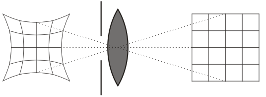

Three approaches to VR lens distortion
======================================
posted: 2016-04-20

Immersion requires a large field of view. This could be achieved by putting a
large curved spherical display on your face, but alas such technology is
prohibitively expensive. A more affordable solution to increasing the field of
view is to look at small ubiquitous rectangular displays through lenses:

Lenses placed close to your eyes greatly increase your field of view, but there
is a cost: the image becomes spherically distorted. The larger the field of
view, the more distorted the image. This post is a quick summary of three
different approaches to undistorting the image, all of which have been
implemented in JavaScript for various WebVR-related projects.

<!--more-->

Here is a closer look at the lens distortion of a typical head mounted display.
The lenses cause a pincushion effect:

The solution is to apply barrel distortion to the image. When we look at it through
the distorting lenses, the image looks neutral:

Lens distortion is well understood mathematically, governed by equations [like
these][wp], with distortion coefficients corresponding to the particular lens.
To undo the distortion properly, we also need to calculate the centers of the
eyes, which requires knowing a bit about the geometry of the display and the
enclosure itself. This can all be done, even on the web! I summarize a few
implementation options below.

[wp]: https://en.wikipedia.org/wiki/Distortion_(optics)#Software_correction

# 1. Fragment based solution (bad)

The simplest way to using two pass rendering. First, we render the left and
right eyes onto a texture, and then process that texture with a fragment (pixel)
shader, moving each pixel inward in relation to the centroid of the eye:

This is the first and simplest method, which is also the least efficient, since
each pixel is processed separately. The [first version][boilerplate] of the
WebVR Boilerplate implemented this method.

[boilerplate]: https://github.com/borismus/webvr-boilerplate/blob/d91cc2866bd54e65d59022800f62c7e160dc9fee/src/cardboard-distorter.js

# 2. Mesh based solution (better)

Rather than processing each pixel separately, we distort the vertices of a
relatively sparse mesh (40x20 works well). 

This can save some direct computation and let the GPU do a fair amount of
interpolation. Rather than having to apply to every single pixel (`1920 * 1080 ~=
2e6`), we do the calculation for every vertex in the mesh (`40 * 20 = 800`). The
result is a significant reduction (3 magnitudes or so) of computation, and a
nice boost in performance. The [WebVR Polyfill][polyfill] currently implements
this approach.

Applying distortion isn't the only expensive part in this rendering method. A
lot of time is wasted copying the whole scene to an intermediate texture.

[polyfill]: https://github.com/borismus/webvr-polyfill/blob/master/src/cardboard-distorter.js

# 3. Vertex displacement based solution (best)

This brings us to the most efficient method of the three, which eliminates the
need to render to an intermediate texture in the first place. In this approach,
the geometry itself is distorted using a custom vertex shader. The idea is that
knowing the position of the camera, we can displace vertices in such a way that
the resulting 2D render is already barrel distorted. In this case, no shader
pass is needed, and we save the expensive step of copying the rendering into a
texture. 

This method does require a certain vertex density on every mesh that is being
deformed. Imagine the simple case of a large, 4-vertex rectangle being
rendered very close to the camera. Distorting these vertices would still yield a
4-vertex flat rectangle, and clearly there's no barreling effect. Because of
this, this is method does not generalize without extra work on the
developer's part.

This approach is used in the [Cardboard Design Lab][cdl] and in the open sourced
[VR View project][vrview]. Geometry-based distortion can also result in sharper
looking renderings, since the two pass approach can cause aliasing, especially
if the intermediate texture is small. You can read more about this distortion
method in [this helpful explainer][gamasutra].

[vrview]: https://github.com/google/vrview/blob/master/src/vertex-distorter.js
[cdl]: https://github.com/googlesamples/cardboard-unity/tree/master/Samples/CardboardDesignLab
[gamasutra]: http://www.gamasutra.com/blogs/BrianKehrer/20160125/264161/VR_Distortion_Correction_using_Vertex_Displacement.php
