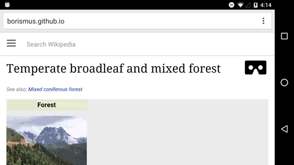

Browsing Wikipedia in VR
========================
posted: 2016-05-26

WebVR provides a solid technical foundation on which to build compelling VR
experiences. But it does not answer a critical question, which is the topic of
this post:

>> What could the web become in a Virtual Reality environment?

Gear VR provides a simple and straightforward answer: same same. The fundamental
unit is still a page, but you use the immersion of VR to increase your effective
screen size. The input constraints result in a worse experience for the user.
Scrolling with your finger on your temple is tiring and head-based typing is a
massive pain. Given the input constraints, we need to beef up the output and
make it better matched to what VR excels at. A responsive design inspired
solution would involve deconstructing the page to better suit the nature of the
immersive environment.

Another approach is to make a clean break from legacy web content. What if
certain web pages had parallel content tailored for virtual reality? In this
post, I'll explore this idea with an example focused on Wikipedia.

<!--more-->

# Navigating the VR Forest

The web in general and Wikipedia specifically covers a vast amount of
information &mdash; nearly everything. Everything is a daunting place to start,
so we will begin with something specific: a forest.

To begin, navigate to a (fake) [wikipedia article about a moose][demo], and hit
the VR button. This takes you to a forest meadow, with a life sized moose in front of
you. You are free to move inside the forest (focus on the grass and click) and
interact with other animals in it. Looking at an animal gives you some basic
Wikipedia-inspired information about it.  Clicking it focuses you in on
it and presents options. If you leave VR when focused on an animal, you end up
on the associated Wikipedia article. This closes the navigation loop: you can
start from one webpage, enter VR mode, navigate to another entity inside VR,
leave VR and end up on another webpage.

Try out this [Wikipedia VR sample][demo] on your mobile phone in Cardboard. It
also works on desktop using the spacebar to simulate the Cardboard click.

VR and education are naturally matched. As [Ben explains eloquently in an I/O
talk][ben], "VR is a chance to scale experiential learning". Remembering what
you learned in class is much harder than remembering your favorite vacation. In
this Wikipedia example, you immediately get a sense of the animal's grandeur,
which is hard to convey in words and images. You can get a feeling for quickly
it runs, and what it sounds like. 

[demo]: http://borismus.github.io/wikipedia-vr/pages/moose
[ben]: https://youtu.be/UuceLtGjDWY?t=1m40s

# Closing thoughts

**Tip of the iceberg**. The entities in this Wikipedia demo (in green) represent
a tiny subgraph of Wikipedia:

All of the above are positioned in a much bigger subgraph of Wikipedia which
might can be represented in VR. Of course, many Wikipedia pages are really
difficult to imagine in VR. Could [Wikipedia's Philosophy][phil] article have a
compelling VR version?

**Changing scale**. The ability to change scale would make it possible to place
every entity from the above graph into VR Wikipedia. Imagine diving into the
hide of the moose, learning about symbiotic insects and hair folicles, then
going deeper to learn about the structure of hair on a molecular level. Or vice
versa, zooming out to look at planet Earth to see where moose live, or going
into an abstract view to explore Family Cervidae. It's easy to lose an hour or
two in Wikipedia's hyperlink maze. One day, it may be even easier to do this in
VR.

**Content is king**. The big open question is how to generate this content. Even a
scoped down project to VR-ify categories of Wikipedia pages (say, only forest
animals), is incredibly ambitious. Where do you get all of the models? How do
you animiate them to run, jump, stand around, sleep, play, eat and be eaten? How
do you place them in a the forest in a meaningful way? Doing this automatically
seems, at a glance, AI-hard.

**Limited knowledge graphs**. Even if you imagine that we have a series of animated
models, how do we compose them together? Do moose and canaries live in the same
environment? Can you find fire ants in the bark of a Sequoia? How many? How big
are hyenas, and how quickly do they run? This information is missing from even
the best known knowledge graph.

**3D modeling is difficult**. Wikipedia's giant corpus of quality content exists
because it's easy for many people to collaborate. Wikipedians need to be good
writers, well versed in their topic, and motivated to contribute. There is a
technical barrier - learning Wikipedia markup - but it is not incredibly
difficult. For a Wikipedia in VR, the technical barriers are much higher. Even
with a good collaborative editor, it seems inevitable that contributors would
need to have some sense of 3D modelling, and a far more specialized skillset.

**Artistic considerations**. One of the challenges for a large community project
like Wikipedia is establishing a consistent style. Imagine if every Wikipedia
image was hand drawn. Artistic abilities vary wildly, and you can imagine a
funny and chaotic result. Aaron Koblin's now classic [Sheep Market][sheep]
experiment comes to mind:

[sheep]: http://www.thesheepmarket.com/
[phil]: https://en.wikipedia.org/wiki/Philosophy
