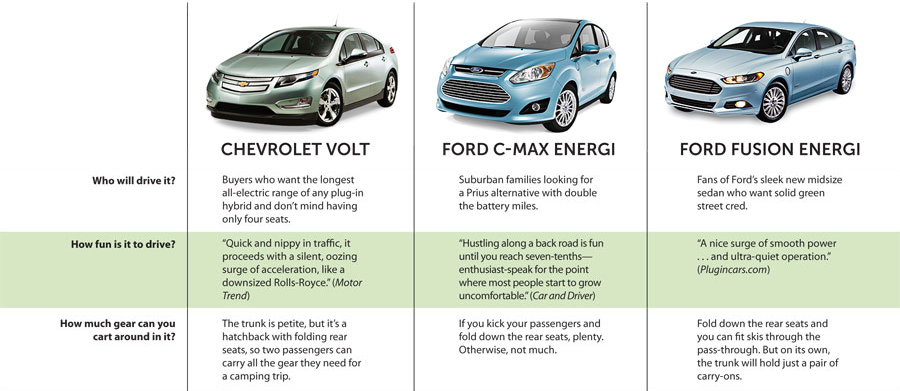
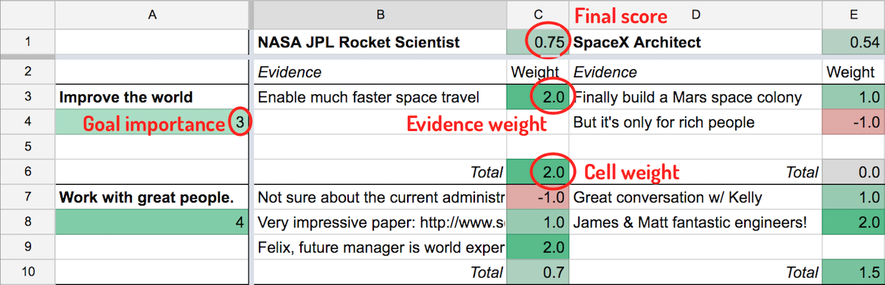

Tools for making better decisions
=================================
posted: 2017-02-01

In a famous letter dating back to 1772, Benjamin Franklin described how he made
decisions to a friend who was facing a dilemma. Franklin's method involved
enumerating pros and cons of an argument, and then attempting to weigh one
against the other to ultimately decide which of the two possibilities to pursue.
Franklin wrote:

> My way is to divide half a sheet of paper by a line into two columns; writing
over the one Pro, and over the other Con. Then, during three or four days
consideration, I put down under the different heads short hints of the different
motives, ... I endeavor to estimate their respective weights.

This post attempts to modernize Franklin's method to attempt to overcome some of
its shortcomings. Once we have gathered our thoughts in one place using this
spreadsheet format, we can, with the help of others or using (aspirational) AI,
assist the decision maker to help them combat common mistakes.

<!--more-->

## Modern tools for decision making

Franklin's method is explicitly qualitative: "...the weight of the reasons
cannot be taken with the precision of algebraic quantities". Of course, this has
not stopped many scientists and engineers from attempting to create quantitative
tools that assist in decision making, called [decision support systems][dss].
However these are mostly targeted at companies and not individuals. I
[tried][1000] [a couple][meenymo] and failed to find one that was simple enough
for my purposes.

As a result, it seems that the state of the art for individuals hasn't advanced
much beyond Franklin's method. Product comparisons are one notable exception:

What if we could take product comparison charts, but make them a bit more
quantitative, and then apply the technique to decision making?

[meenymo]: https://meenymo.com/
[1000]: https://1000minds.com
[dss]: https://en.wikipedia.org/wiki/Decision_support_system

## Decision support spreadsheets

Simply stated, a topic is controversial (or a decision is difficult) if:

> ...there are good arguments on all sides. Good thinking involves balancing these
arguments in a quantitative way, taking into account their relative strengths
and weaknesses.

Inspired by this and other parts of Jon Baron's [Thinking and
Deciding][baron-book], I made [a spreadsheet][ss1] attempting to codify what he
describes as the "search-inference" process. Here's an example of an imaginary
rocket scientist deciding between two job offers based on two goals, resulting
in a 2x2 sheet:

Structurally, it works like this:

- Columns are possible courses of action (eg. NASA vs SpaceX).
- Rows are goals that you are trying to achieve (eg. improve the world, work
  with great people).
- Cells contain evidence pertaining to the associated possibility (row) and goal
  (column). In this case, the NASA job would improve the world by enabling much
  faster space travel.

There are also numbers involved:

- Each goal (row) has a number between 1 and 5 under it, corresponding to how
important the goal is to you. The higher the number, the more important.
- Each piece of evidence (sub-cell) has a weight to the right between -2 and 2.
Positive weights are pros, negative ones are cons.

A [second sheet][ss2] does all of the calculations. Each cell reduces to a weight in a
decision matrix. Ultimately, each possibility (column) is given a score between
0 and 1. The recommended course of action is the possibility with the highest
score. So the above 2x2 spreadsheet is converted into this decision matrix.

Then, given these weights, we do a simple calculation for each possibility
(column): a normalized, weighted sum. So for the first possibility, we calculate:

    (0.6 * 0.9 + 0.8 * 0.63) / (0.6 + 0.8) = 0.75

We do the same for each possibility, and the one with the highest resulting
score is the "best" course of action.

[ss1]: https://docs.google.com/spreadsheets/d/1HBjUBa1NaD2jGr4QzN1prIbQgCBFqcjtHnRkXuenIHs/edit#gid=0
[ss2]: https://docs.google.com/spreadsheets/d/1HBjUBa1NaD2jGr4QzN1prIbQgCBFqcjtHnRkXuenIHs/edit#gid=374695355
[baron]: https://www.sas.upenn.edu/~baron/
[baron-book]: https://www.amazon.com/Thinking-Deciding-4th-Jonathan-Baron/dp/0521680433

### Advantages of this method

Even geniuses like Franklin have a limited capacity for holding multiple
thoughts in their heads at once. After laying out all of the arguments, Franklin
wrote, "the whole lies before me, I think I can judge better". With all of the
possibilities, goals and evidence in one place, you too can be like Franklin.

As for the specifics of my spreadsheet above, I can't claim that this method is
optimal or even particularily good (though feedback on this would be
appreciated). I created it as a placeholder, loosely inspired by Baron,
Franklin, and other less rigorous approaches I've tried in the past. As it
turns out, this method is essentially an example of [Analytic Hierarchy Process
(AHP)][ahp].

Rather than sticking to Franklin's two column split, this spreadsheet is
somewhat more complex, but there are some advantages:

1. Most decisions [aren't actually binary][third], and this is captured by
having multiple columns.
2. The method makes the notion of your goals and their relative importance
explicit.
3. Rather than pros and cons, we collect evidence that helps you decide about a
goal and a possibility, which can then be graded numerically.

Despite the mechanistic appearance of this approach, Baron emphasizes the
nonlinearity of the thinking process. As you collect evidence, you may uncover
new possibilities and goals. With all of the evidence laid out, you can begin
asking better questions, attempting to fight known failure modes in human
thinking.

[ahp]: https://en.wikipedia.org/wiki/Analytic_hierarchy_process

### Reducing and increasing complexity

One significant challenge with the above approach is that of assigning weights.
At the moment, my method involves coming up with two kinds of weights: goal
weights (eg. how important is it for you improve the world, really?), and
evidence weights (eg. is space travel really such a world improving thing?).
This method is flexible enough to be easily simplified. For example:

1. Evidence weights can be simplified by scoring pros as +1, and cons as -1.
2. Goal weights can be simplified by binary ranking (eg. 1 is critical, 0 is
nice-to-have).

A potentially better approach is known as [PAPRIKA][paprika], which establishes
weights based on a bunch of pair-wise comparisons. This might work well, and
could actually be useful for capturing additional points of evidence. To get a
feeling for it, there's a consumer-oriented decision support system [called
MeenyMo][meenymo] that does this. The process is quite tedious though, involving
tens of comparisons like this:

The other downside of PAPRIKA is that it requires discrete categories (eg. cost
of living: cheap, moderate, expensive).

[third]: http://lesswrong.com/lw/hu/the_third_alternative/
[paprika]: https://en.wikipedia.org/wiki/Potentially_all_pairwise_rankings_of_all_possible_alternatives

## Thinkos: inevitable irrationality

People aren't perfect, and neither is our thinking. Biases are sort of like
thinking bugs that make our thoughts less rational. Irrational thinking leads to
conclusions that are further from the actual objective truth. This is, as I
hope you'll agree, undesirable.

Now that we're on the same page, Baron suggests that certain tactics that can
help us make better decisions by improve thinking and reducing bias. These he
broadly describes as "active open mindedness":

- Seek alternative possibilities. Anchoring bias tends to favor the first
  possibilities you generate, but it is entirely possible that you haven't
  searched enough.
- Formulate goals better. What are you actually trying to achieve? (eg. "protect
  walls from child's scribbling" vs. "prevent child from scribbling on walls").
- Look for counterevidence (eg. if there are strong pros, see if there are some
  cons too).
- Avoid belief overkill, which happens when there is a strong correlation
  between different goals (eg. most people are against capital punishment because
  it is both ineffective and immoral, whereas those *for* capital punishment are in
  favor because it's effective and moral. But why do both go together? They
  should be unrelated.)
- Allocate time that is proportionate to the importance of the decision.
  Franklin's method suggests to take "three or four days consideration" to
  capture evidence, and then "a day or two of further consideration" to let it
  all settle.

There are [many other biases][biases] that can lead to bad decisions. The above
serves as an example of some thinkos that can be reduced with external help:
other people or software.

[biases]: https://en.wikipedia.org/wiki/List_of_cognitive_biases
[spe]: https://en.wikipedia.org/wiki/Serial_position_effect

## Summing up...

In some facets of life, it is impossible to apply this level of rigor.
Quantifying your love for a person, for example, feels cold hearted and
calculating, and I try to avoid it. Ironically, one of the most famous uses of
Franklin's method was used by Charles Darwin in deciding whether or not to marry
Emma Wedgwood. For what it's worth, the method appears to have worked, with
Darwin emphatically scribbling "Marry, Marry, Marry, QED" after his
calculations.

It is hard to fully discount the role of feeling. The quality of the
rational decision making process depends heavily on your ability to formulate
your true goals and possibilities, and collect all of the evidence and score it
correctly. Gut feeling, (or as Kahneman says, System 1 thinking), can actually
incorporate many arguments that one might not even be able to formulate, and yet
those intangibles may end up being incredibly important.

And lastly, there is the question of practicality. Life is dynamic and
circumstances can change quickly. For the spreadsheet-powered decision maker,
this means constant revision, which can be complicated and time consuming. I
experienced this first hand, attempting to use this method to help make a career
move. Just when I thought I had established the teams that would have me,
another one emerged, and I had to re-enter additional evidence, remove options
that seemed appealing, but in retrospect were duds, and re-calibrate weights.

Thinking cannot be reduced to a spreadsheet, but when used in moderation, I hope
that this method can be useful for some.
